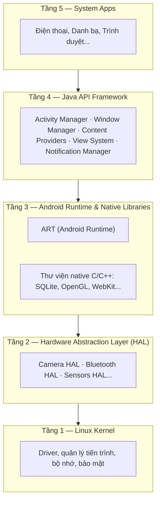
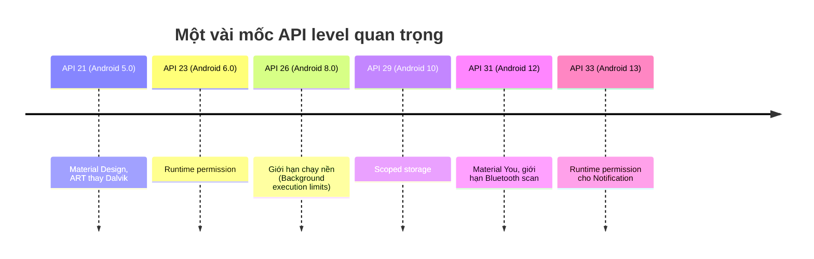
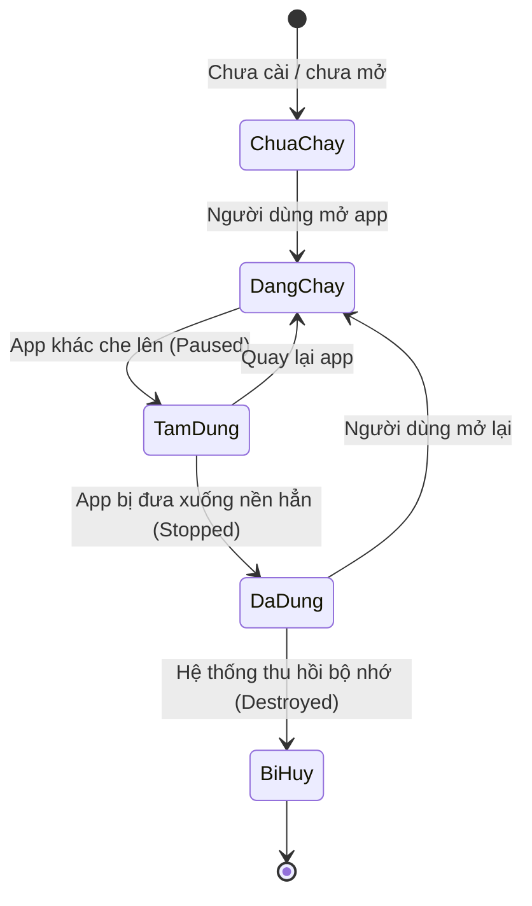

# Chương 1: Giới thiệu Android

## Mục tiêu học

Sau chương này, bạn sẽ:

- Giải thích được Android là gì và vị trí của nó trong hệ sinh thái thiết bị di động.
- Mô tả được các tầng kiến trúc của hệ điều hành Android và vai trò từng tầng.
- Hiểu khái niệm **API level** và vì sao nó quan trọng khi viết ứng dụng.
- Có cái nhìn tổng quan (chưa đi sâu) về vòng đời một ứng dụng Android, để làm nền cho Chương 6.

Bạn đã biết Java/OOP nhưng chưa cần biết gì về Android — chương này không có code, chỉ có khái niệm và sơ đồ. Từ Chương 4 trở đi bạn sẽ bắt đầu gõ code thật.

## 1.1 Android là gì?

Android là hệ điều hành mã nguồn mở (dựa trên nhân Linux) do Google phát triển, dùng chủ yếu cho điện thoại, máy tính bảng, TV (Android TV), đồng hồ (Wear OS), và cả một số thiết bị nhúng (Android Things/Android Automotive).

Điểm khác biệt lớn nhất so với lập trình Java "thông thường" mà bạn đã quen:

- Ứng dụng **không có hàm `main()`** chạy tuyến tính. Hệ điều hành gọi vào các **thành phần** (Activity, Service, BroadcastReceiver, ContentProvider) theo vòng đời riêng của từng loại.
- Mỗi ứng dụng chạy trong **sandbox** riêng (tiến trình Linux riêng, user ID riêng) — chi tiết ở Chương 26.
- Tài nguyên (chuỗi, hình ảnh, layout...) tách khỏi code, quản lý qua hệ thống **resource** — chi tiết ở Chương 11.

## 1.2 Kiến trúc hệ điều hành Android

Android được xếp thành các tầng, tầng trên dùng dịch vụ của tầng dưới:



Ứng dụng bạn viết chạy trên tầng **Java API Framework**, được ART biên dịch và thực thi. Bạn hầu như không cần đụng tới HAL hay Linux Kernel trực tiếp — nhưng biết chúng tồn tại giúp bạn hiểu tại sao có khái niệm **permission** (Chương 26) hay vì sao truy cập phần cứng như Bluetooth/NFC (Chương 35–36) phải đi qua framework API thay vì gọi thẳng driver.

## 1.3 API level và vòng đời phiên bản

Mỗi phiên bản Android có một **API level** (số nguyên tăng dần). Khi viết ứng dụng, bạn khai báo:

- `minSdkVersion`: phiên bản thấp nhất máy người dùng phải có để cài được app.
- `targetSdkVersion`: phiên bản bạn đã test và tối ưu hành vi cho nó.



Đây là lý do vì sao nhiều chương sau (lưu trữ file, chạy nền, Bluetooth...) đều phải nói rõ "hành vi này khác nhau theo API level" — Android không "đứng yên", và sách sẽ luôn ghi chú mốc phiên bản liên quan.

## 1.4 Nhìn trước: vòng đời một ứng dụng

Bạn chưa cần nhớ chi tiết sơ đồ dưới đây — đây chỉ là bức tranh toàn cảnh để bạn thấy trước khi vào Chương 6:



Khác với ứng dụng desktop, **hệ điều hành có quyền tự ý huỷ tiến trình ứng dụng của bạn** khi thiết bị thiếu bộ nhớ — kể cả khi người dùng không chủ động thoát app. Đây là lý do Android bắt buộc bạn thiết kế app theo tư duy "trạng thái có thể mất bất cứ lúc nào", chứ không phải chi tiết vặt vãnh.

## 1.5 Ví dụ minh hoạ: một AndroidManifest.xml thực tế

Mọi ứng dụng Android đều có một file khai báo trung tâm là `AndroidManifest.xml`. Đây là ví dụ rút gọn (bạn sẽ tự tạo file này ở Chương 4, giờ chỉ cần đọc hiểu):

```xml
<manifest xmlns:android="http://schemas.android.com/apk/res/android"
    package="vn.example.helloandroid">

    <uses-permission android:name="android.permission.INTERNET" />

    <application
        android:label="Hello Android"
        android:icon="@mipmap/ic_launcher">

        <activity android:name=".MainActivity" android:exported="true">
            <intent-filter>
                <action android:name="android.intent.action.MAIN" />
                <category android:name="android.intent.category.LAUNCHER" />
            </intent-filter>
        </activity>
    </application>
</manifest>
```

Ba điều đáng chú ý ngay từ bây giờ:

1. `package` là định danh duy nhất của app trên máy (và trên Google Play).
2. `<uses-permission>` là nơi bạn **khai báo trước** những gì app cần quyền truy cập — hệ quả trực tiếp của mô hình sandbox (Chương 26).
3. `<intent-filter>` với `MAIN`/`LAUNCHER` là cách hệ thống biết "đây là màn hình khởi động khi người dùng bấm icon app" — một ví dụ cụ thể của cơ chế Intent (Chương 8).

## Bài tập

1. Vẽ lại sơ đồ kiến trúc 5 tầng ở mục 1.2 theo cách hiểu của riêng bạn, thêm chú thích ví dụ thực tế cho mỗi tầng (không cần đúng thuật ngữ, miễn giải thích được vai trò).
2. Tra cứu (tìm trên tài liệu chính thức của Android) xem thiết bị bạn đang dùng chạy phiên bản Android nào, tương ứng API level bao nhiêu.
3. Từ sơ đồ vòng đời 1.4, dự đoán: nếu bạn đang nhập một đoạn văn bản dài trong app, rồi có cuộc gọi đến làm app bị che khuất, dữ liệu bạn gõ có khả năng bị mất không? Ghi lại dự đoán — Chương 6 sẽ giải thích chính xác.

## Lỗi thường gặp

- **Nhầm "phiên bản Android" với "API level"**: Android 13 không phải lúc nào cũng là API 33 trên mọi thiết bị (một số thiết bị OEM có thể chậm cập nhật). Khi viết code, luôn dựa vào **API level**, không dựa vào tên phiên bản.
- **Cho rằng app của mình sẽ luôn chạy nền vô hạn định**: từ API 26 trở đi, hệ thống giới hạn mạnh việc chạy nền (xem Chương 16–18). Nhiều lỗi "tại sao thông báo của tôi không đến" bắt nguồn từ đây.

## Tóm tắt & tiếp theo

Bạn đã có bức tranh tổng quan về Android: kiến trúc hệ thống, khái niệm API level, và một cái nhìn sơ bộ về vòng đời ứng dụng. Chương 2 sẽ bắt đầu phần thực hành: cài đặt JDK, Android Studio và SDK để chuẩn bị viết dòng code Android đầu tiên.
