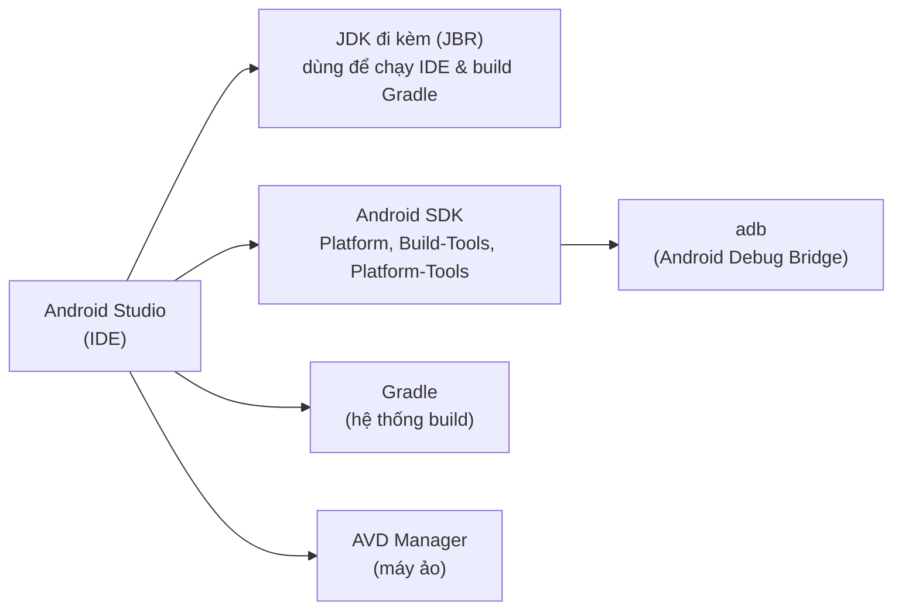

# Chương 2: Cài đặt JDK, Android Studio, SDK/SDK Manager

## Mục tiêu học

- Cài đặt được Android Studio trên Windows và hoàn tất setup wizard lần đầu.
- Hiểu vai trò của JDK, Android SDK, SDK Manager, Gradle trong bộ công cụ — cái nào Android Studio đã tự lo, cái nào bạn cần biết để tự xử lý khi có lỗi.
- Cấu hình biến môi trường để dùng được `adb` từ dòng lệnh (ngoài Android Studio).
- Xác nhận cài đặt thành công bằng vài lệnh kiểm tra cụ thể.

## 2.1 Bộ công cụ gồm những gì?



Điểm nhiều tài liệu cũ còn nhầm: **từ các bản Android Studio gần đây, bạn không cần tự cài JDK riêng** — Android Studio đi kèm sẵn một bản JDK (JetBrains Runtime, dựa trên OpenJDK) và tự dùng nó để chạy IDE lẫn build Gradle. Bạn chỉ cần cài JDK riêng nếu:

- Build project bằng dòng lệnh (`gradlew`) mà không mở Android Studio, trên máy chưa từng cài Android Studio.
- Cần một phiên bản JDK cụ thể khác với bản đi kèm vì lý do riêng của dự án.

Ở sách này, mặc định dùng JDK đi kèm Android Studio — đủ cho toàn bộ nội dung.

## 2.2 Cài đặt Android Studio (Windows)

1. Tải bộ cài từ trang chính thức của Android Studio (bản Windows).
2. Chạy installer, giữ nguyên các lựa chọn mặc định: cài **Android SDK**, **Android Virtual Device**, và **performance (Intel HAXM)** — nếu máy dùng CPU Intel; máy AMD/ARM sẽ có lựa chọn tương ứng cho tăng tốc ảo hoá.
3. Chọn thư mục cài đặt Android SDK (nhớ đường dẫn này — dùng ở bước 2.4). Mặc định thường là `C:\Users\<tên-bạn>\AppData\Local\Android\Sdk`.
4. Sau khi cài xong, Android Studio mở **Setup Wizard** lần đầu: chọn kiểu cài "Standard" — wizard sẽ tự tải về:
   - SDK Platform mới nhất ổn định (API level cao nhất hiện tại).
   - SDK Build-Tools tương ứng.
   - Một bản system image để tạo máy ảo (chi tiết ở Chương 3).
   - Android Emulator, Platform-Tools (chứa `adb`).

Bước này cần mạng ổn định — SDK component khá nặng (vài GB nếu tải nhiều API level).

## 2.3 SDK Manager — nơi quản lý mọi phiên bản Android

Mở qua **Tools → SDK Manager** trong Android Studio. Ba tab quan trọng:

- **SDK Platforms**: từng phiên bản Android (API level) bạn muốn build/test. Cài ít nhất phiên bản `targetSdkVersion` bạn dự định dùng (sách này khuyến nghị compileSdk/targetSdk 34 — Android 14).
- **SDK Tools**: `Android SDK Build-Tools`, `Android SDK Platform-Tools` (chứa `adb`), `Android Emulator`, `Android SDK Command-line Tools`.
- **SDK Update Sites**: danh sách nguồn cập nhật, thường không cần đổi.

Mỗi API level cài thêm tốn khoảng 500MB–1.5GB — không cần cài hết tất cả, chỉ cài phiên bản bạn thật sự target và test.

## 2.4 Cấu hình biến môi trường (để dùng `adb` ngoài Android Studio)

Android Studio tự biết đường dẫn SDK, nhưng terminal ngoài IDE (PowerShell, Command Prompt) thì không, trừ khi bạn khai báo:

1. Mở **System Properties → Environment Variables** (gõ "environment variables" vào Windows Search).
2. Thêm biến hệ thống mới: `ANDROID_HOME` = đường dẫn SDK (vd `C:\Users\<tên-bạn>\AppData\Local\Android\Sdk`).
3. Thêm vào biến `Path` hai mục:
   - `%ANDROID_HOME%\platform-tools`
   - `%ANDROID_HOME%\emulator`
4. Mở lại terminal (PowerShell) để biến môi trường có hiệu lực.

## 2.5 Ví dụ thực hành: xác nhận cài đặt

Sau khi cài xong, mở PowerShell và chạy lần lượt:

```powershell
adb --version
```

Kết quả mong đợi: in ra phiên bản Android Debug Bridge, ví dụ `Android Debug Bridge version 1.0.41`.

```powershell
sdkmanager --list_installed
```

(Nếu lệnh `sdkmanager` chưa nhận, dùng đường dẫn đầy đủ: `%ANDROID_HOME%\cmdline-tools\latest\bin\sdkmanager.bat --list_installed`.) Kết quả liệt kê các package SDK đã cài — dùng để đối chiếu khi gặp lỗi thiếu component.

## Bài tập

1. Sau khi cài đặt, ghi lại: đường dẫn `ANDROID_HOME` trên máy bạn, API level bạn đã cài qua SDK Manager.
2. Chạy `adb --version` — nếu báo lỗi "not recognized", tự tra lại bước 2.4 và sửa cho đến khi chạy được (đây là bài tập bắt buộc — Chương 3 giả định `adb` đã dùng được).
3. Mở SDK Manager, thử cài thêm một API level cũ hơn (ví dụ API 26) — quan sát dung lượng tải về.

## Lỗi thường gặp

- **`'adb' is not recognized as an internal or external command`**: biến môi trường `Path` chưa trỏ đúng tới `platform-tools`, hoặc terminal đang mở từ trước khi bạn cập nhật biến môi trường — đóng và mở lại terminal.
- **Setup Wizard tải rất chậm hoặc treo**: thường do mạng chặn domain tải SDK — thử đổi mạng, hoặc cấu hình proxy trong `Settings → Appearance & Behavior → System Settings → HTTP Proxy`.
- **Không thấy tuỳ chọn Intel HAXM khi cài**: máy dùng CPU AMD hoặc đã bật Hyper-V/WSL2 (Windows) — không sao, Chương 3 sẽ nói rõ ảnh hưởng của việc này tới tốc độ máy ảo và cách xử lý.
- **Cài nhiều API level "cho chắc"**: mỗi API level tốn dung lượng đáng kể — chỉ cài các phiên bản bạn thực sự cần test.

## Tóm tắt & tiếp theo

Bạn đã có Android Studio, SDK, và `adb` chạy được từ dòng lệnh. Chương 3 sẽ dùng đúng những thứ này để tạo máy ảo (AVD) và/hoặc kết nối thiết bị Android thật — chuẩn bị nơi để chạy ứng dụng đầu tiên ở Chương 4–5.
