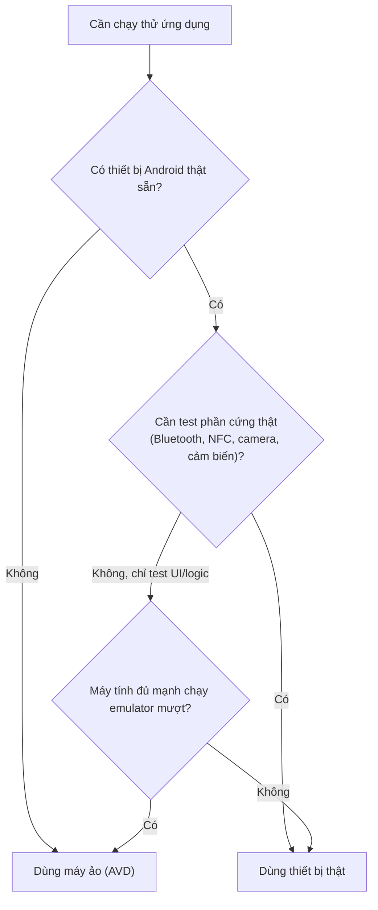
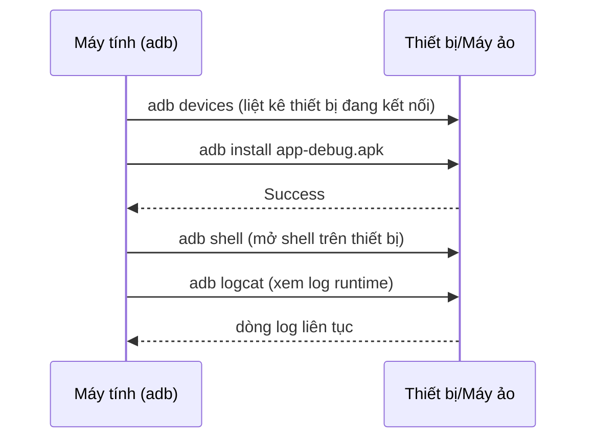

# Chương 3: Tạo và cấu hình máy ảo (AVD), kết nối thiết bị thật

## Mục tiêu học

- Tạo được một máy ảo Android (AVD) chạy được trong Android Studio.
- Bật Developer Options và USB debugging để kết nối thiết bị Android thật.
- Dùng được các lệnh `adb` cơ bản để kiểm tra thiết bị/máy ảo đang kết nối.
- Biết chọn máy ảo hay thiết bị thật tuỳ tình huống.

## 3.1 Máy ảo hay thiết bị thật?



Máy ảo tiện cho việc test nhanh, nhiều cấu hình màn hình/API level khác nhau mà không cần nhiều máy thật. Nhưng một số phần cứng (Bluetooth thật, NFC, cảm biến chuyển động thật) **bắt buộc phải test trên thiết bị thật** — nội dung này sẽ quan trọng trở lại ở Chương 35–36.

## 3.2 Tạo máy ảo (AVD)

1. Mở **Tools → Device Manager** trong Android Studio.
2. Chọn **Create Device**.
3. Chọn một **Device definition** (ví dụ Pixel 6) — quyết định kích thước màn hình, mật độ điểm ảnh.
4. Chọn **System Image** — đây là phiên bản Android sẽ chạy trong máy ảo:
   - Ưu tiên bản có nhãn **x86_64** (chạy nhanh hơn nhiều so với ARM trên máy Windows/Intel thông qua ảo hoá phần cứng).
   - Chọn API level trùng với `targetSdkVersion` bạn định dùng (Chương 2 đã cài).
5. Đặt tên AVD, có thể chỉnh thêm RAM/dung lượng lưu trữ nếu cần test app nặng.
6. Bấm **Finish** — lần đầu chạy máy ảo sẽ hơi chậm (khởi tạo), các lần sau nhanh hơn nhiều nhờ snapshot.

## 3.3 Thao tác cơ bản trên máy ảo

Khi máy ảo đã chạy, thanh công cụ bên cạnh cho phép:

- Xoay màn hình (rotate).
- Giả lập vị trí GPS (Extended controls → Location) — hữu ích khi học các chương liên quan tới vị trí (Chương 37).
- Giả lập cuộc gọi/SMS đến.
- Chụp ảnh màn hình, quay video màn hình.
- Giả lập mức pin yếu, mất mạng — để test app trong điều kiện bất lợi.

## 3.4 Kết nối thiết bị Android thật

1. Trên điện thoại: vào **Settings → About phone**, bấm liên tục 7 lần vào **Build number** để mở khoá **Developer options**.
2. Vào **Settings → System → Developer options**, bật **USB debugging**.
3. Cắm điện thoại vào máy tính bằng cáp USB (ưu tiên cáp hỗ trợ truyền dữ liệu, không phải cáp chỉ sạc).
4. Trên điện thoại sẽ hiện hộp thoại "Allow USB debugging?" kèm vân tay RSA của máy tính — chọn **Allow** (có thể tick "Always allow from this computer" để khỏi hỏi lại).
5. Xác nhận từ máy tính:

```powershell
adb devices
```

Kết quả mong đợi:

```
List of devices attached
R58N60XXXXX    device
```

Nếu cột thứ hai hiện `unauthorized` thay vì `device`, quay lại điện thoại và xác nhận lại hộp thoại cho phép ở bước 4.

## 3.5 ADB cơ bản — bạn sẽ dùng lại nhiều lần trong sách



Vài lệnh dùng thường xuyên:

```powershell
adb devices              # liệt kê thiết bị/máy ảo đang kết nối
adb install app.apk      # cài 1 file APK vào thiết bị đang chọn
adb uninstall vn.example.helloandroid   # gỡ theo package name
adb logcat                # xem log runtime (Ctrl+C để dừng)
adb shell                 # mở shell Linux trên thiết bị (gõ exit để thoát)
```

Nếu có nhiều thiết bị/máy ảo cùng kết nối, thêm `-s <device-id>` (lấy từ `adb devices`) vào trước lệnh để chỉ định đích.

## Bài tập

1. Tạo một AVD Pixel 6, API level trùng với bản bạn đã cài ở Chương 2, khởi động thành công.
2. Nếu có điện thoại Android thật: bật Developer options + USB debugging, chạy `adb devices` cho tới khi thấy trạng thái `device` (không phải `unauthorized` hay trống).
3. Thử `adb shell`, gõ `exit` để thoát — xác nhận bạn vào được shell của máy ảo/thiết bị.

## Lỗi thường gặp

- **Máy ảo chạy cực chậm / bị treo khi khởi động**: thường do chưa bật ảo hoá phần cứng (Intel VT-x/AMD-V) trong BIOS, hoặc xung đột với Hyper-V/WSL2 đang bật sẵn trên Windows. Cân nhắc dùng thiết bị thật nếu máy không hỗ trợ tốt.
- **`adb devices` không thấy thiết bị thật**: thiếu driver USB (một số hãng máy Android cần driver riêng trên Windows), hoặc cáp chỉ hỗ trợ sạc không truyền dữ liệu.
- **Thiết bị hiện `unauthorized`**: chưa xác nhận hộp thoại "Allow USB debugging" trên điện thoại, hoặc vân tay RSA cũ bị đổi — vào lại Developer options, chọn **Revoke USB debugging authorizations**, rút và cắm lại cáp.
- **Máy ảo mất kết nối mạng bên trong**: thường do phần mềm VPN/firewall trên máy tính chặn — tắt thử VPN rồi khởi động lại máy ảo.

## Tóm tắt & tiếp theo

Bạn đã có nơi để chạy ứng dụng: một máy ảo và/hoặc một thiết bị thật đã kết nối qua `adb`. Chương 4 sẽ tạo project Android đầu tiên và giải thích từng phần trong cấu trúc project đó.
