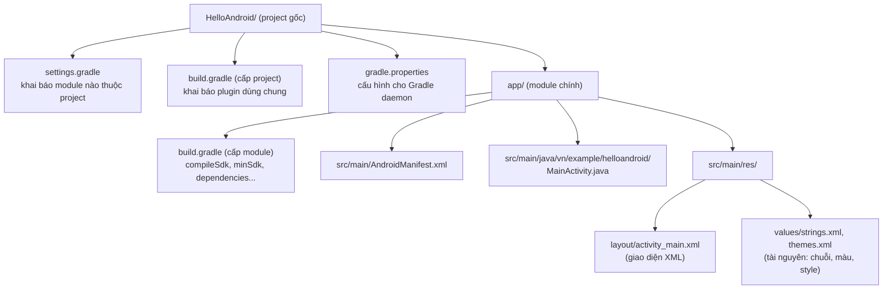

# Chương 4: Tạo project đầu tiên — cấu trúc project, Gradle, AndroidManifest.xml

## Mục tiêu học

- Tạo được một project Android mới trong Android Studio.
- Đọc hiểu cấu trúc thư mục mặc định của project — biết file nào để làm gì.
- Hiểu vai trò của `build.gradle` (cấp project và cấp module) trong việc build ứng dụng.
- Đọc hiểu sâu hơn `AndroidManifest.xml` so với cái nhìn sơ bộ ở Chương 1.

> Code mẫu đầy đủ của chương này (và Chương 5) nằm ở `code/ch04-05-hello-world/` trong repo — mở
> bằng Android Studio để chạy trực tiếp thay vì gõ lại từng file.

## 4.1 Tạo project mới

Trong Android Studio: **File → New → New Project → Empty Views Activity**, sau đó điền:

- **Name**: `HelloAndroid`
- **Package name**: `vn.example.helloandroid` (định danh duy nhất, xem lại 1.5)
- **Language**: Java
- **Minimum SDK**: API 24 trở lên (đủ để dùng gần hết API hiện đại mà vẫn tương thích máy cũ)

Android Studio sinh ra project theo đúng cấu trúc chuẩn dưới đây.

## 4.2 Cấu trúc thư mục project



Ba điều quan trọng cần phân biệt ngay:

1. **`build.gradle` cấp project** (nằm ở thư mục gốc) khai báo plugin dùng chung cho toàn bộ project — bạn hiếm khi sửa file này.
2. **`build.gradle` cấp module** (`app/build.gradle`) mới là nơi bạn thường sửa: thêm dependency (thư viện), đổi `minSdk`/`targetSdk`, cấu hình build type (debug/release).
3. **`settings.gradle`** khai báo project gồm những module nào (`include ':app'`) — một app lớn có thể tách nhiều module, sách này dùng 1 module `app` xuyên suốt cho đơn giản.

## 4.3 Đọc `app/build.gradle`

```groovy
android {
    namespace 'vn.example.helloandroid'
    compileSdk 34              // phiên bản SDK dùng để BIÊN DỊCH code

    defaultConfig {
        applicationId "vn.example.helloandroid"  // ID duy nhất khi phát hành (Chương 39)
        minSdk 24                                 // phiên bản THẤP NHẤT máy người dùng cần có
        targetSdk 34                               // phiên bản bạn đã test hành vi
        versionCode 1                              // số nguyên tăng dần mỗi lần phát hành
        versionName "1.0"                          // chuỗi hiển thị cho người dùng
    }
}

dependencies {
    implementation 'androidx.appcompat:appcompat:1.7.0'
    implementation 'com.google.android.material:material:1.12.0'
    implementation 'androidx.constraintlayout:constraintlayout:2.1.4'
}
```

`compileSdk` khác `minSdk`/`targetSdk` — đây là điểm hay gây nhầm cho người mới:

- `compileSdk`: bộ API bạn được PHÉP DÙNG khi viết code (luôn nên là bản mới nhất bạn có).
- `minSdk`/`targetSdk`: hành vi RUNTIME trên máy người dùng (đã nói ở 1.3).

Phần `dependencies` khai báo thư viện ngoài — cú pháp `implementation 'group:artifact:version'`. Các chương sau (Room, Retrofit, Hilt...) đều thêm dòng vào đúng khối này.

## 4.4 Đọc lại `AndroidManifest.xml` — sâu hơn Chương 1

```xml
<manifest xmlns:android="http://schemas.android.com/apk/res/android">

    <application
        android:allowBackup="true"
        android:icon="@android:drawable/sym_def_app_icon"
        android:label="@string/app_name"
        android:theme="@style/Theme.HelloAndroid">

        <activity
            android:name=".MainActivity"
            android:exported="true">
            <intent-filter>
                <action android:name="android.intent.action.MAIN" />
                <category android:name="android.intent.category.LAUNCHER" />
            </intent-filter>
        </activity>
    </application>

</manifest>
```

Chú ý `android:exported="true"` trên `<activity>` — **bắt buộc phải khai báo rõ từ Android 12 (API 31)** cho bất kỳ Activity/Service/Receiver nào có `<intent-filter>`, nếu không app sẽ không build được. Đây là ví dụ cụ thể của việc "API level ảnh hưởng tới cách bạn viết manifest" đã nói ở Chương 1.

`android:label` và các chuỗi hiển thị không viết cứng trong manifest mà tham chiếu tới `@string/...` — định nghĩa trong `res/values/strings.xml`. Đây là quy ước bắt buộc cho đa ngôn ngữ (chi tiết Chương 11), nên làm quen từ bây giờ thay vì viết chuỗi cứng.

## Bài tập

1. Mở code mẫu `code/ch04-05-hello-world/` bằng Android Studio, để Gradle sync xong (chưa cần Run).
2. Trong `app/build.gradle`, thử đổi `minSdk` xuống 21 rồi sync lại — quan sát Android Studio có cảnh báo API nào không dùng được ở API 21 không (thử nếu có dùng API mới trong code, ở đây có thể chưa thấy vì code còn đơn giản).
3. Mở `AndroidManifest.xml`, thử xoá `android:exported="true"` rồi build — đọc thông báo lỗi Gradle đưa ra, đối chiếu với giải thích ở mục 4.4.

## Lỗi thường gặp

- **"SDK location not found"**: thiếu file `local.properties` (Android Studio tự tạo khi mở project lần đầu, không nên xoá hay commit file này lên git vì nó chứa đường dẫn máy cá nhân).
- **Gradle sync failed do version plugin không khớp**: phiên bản Android Gradle Plugin (khai báo ở `build.gradle` cấp project) cần tương thích với phiên bản Android Studio đang dùng — Android Studio thường tự đề xuất bản phù hợp khi mở project cũ.
- **Quên `android:exported`**: build lỗi ngay với thông báo rõ ràng tên Activity thiếu khai báo — đọc kỹ thông báo lỗi Gradle thay vì đoán, phần lớn lỗi manifest đều chỉ đúng dòng.

## Tóm tắt & tiếp theo

Bạn đã hiểu cấu trúc project, vai trò từng file Gradle, và đọc sâu hơn AndroidManifest.xml. Chương 5 sẽ dùng chính project này: sửa giao diện, chạy lên máy ảo/thiết bị thật, và build APK bằng dòng lệnh.
