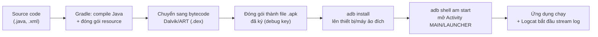

# Chương 5: Build & deploy ứng dụng "Hello World" đầu tiên

## Mục tiêu học

- Chạy được ứng dụng từ Chương 4 lên máy ảo hoặc thiết bị thật qua Android Studio.
- Hiểu được pipeline build & deploy diễn ra bên dưới nút **Run**.
- Build được file APK bằng dòng lệnh (`gradlew`) và cài thủ công bằng `adb`.
- Đọc được Logcat để quan sát ứng dụng đang chạy.

## 5.1 Chạy ứng dụng qua Android Studio

1. Mở lại `code/ch04-05-hello-world/` (hoặc project bạn tự tạo ở Chương 4).
2. Ở thanh công cụ, chọn thiết bị đích: máy ảo đã tạo (Chương 3) hoặc thiết bị thật đã kết nối.
3. Bấm **Run ▶** (hoặc Shift+F10).
4. Chờ build xong — ứng dụng tự mở trên thiết bị đích, hiển thị dòng chữ "Xin chào, Android!" (định nghĩa ở `strings.xml`, hiển thị qua `activity_main.xml`).

## 5.2 Điều gì xảy ra khi bạn bấm Run?



Nút **Run** trong Android Studio thực chất chỉ là giao diện gói gọn lại đúng các bước trên — mọi bước đều có thể tự làm bằng dòng lệnh, như mục 5.3 dưới đây. Hiểu rõ pipeline này giúp bạn tự debug khi Android Studio báo lỗi mơ hồ, vì bạn biết lỗi đang xảy ra ở bước nào (compile? đóng gói? cài đặt? khởi chạy?).

## 5.3 Build & cài bằng dòng lệnh

Từ thư mục project (PowerShell):

```powershell
.\gradlew.bat assembleDebug
```

Lệnh này chạy đúng 3 bước đầu của sơ đồ trên (compile → dex → đóng gói APK), không cần Android Studio. Kết quả nằm ở:

```
app\build\outputs\apk\debug\app-debug.apk
```

Cài thủ công lên thiết bị/máy ảo đang kết nối (Chương 3):

```powershell
adb install app\build\outputs\apk\debug\app-debug.apk
```

Mở ứng dụng thủ công bằng `adb` (không cần chạm vào màn hình):

```powershell
adb shell am start -n vn.example.helloandroid/.MainActivity
```

## 5.4 Đọc Logcat

Logcat là dòng log runtime của toàn hệ thống Android, lọc theo ứng dụng của bạn để dễ theo dõi:

```powershell
adb logcat --pid=$(adb shell pidof -s vn.example.helloandroid)
```

Trong Android Studio, tab **Logcat** ở dưới màn hình làm việc này tự động, có ô lọc theo package name hoặc theo mức log (Verbose/Debug/Info/Warn/Error). Thói quen nên có: khi app "không có phản ứng gì", luôn mở Logcat trước khi đoán nguyên nhân.

## Bài tập

1. Sửa `strings.xml` trong code mẫu, đổi `hello_message` thành một câu khác, Run lại — quan sát Android Studio chỉ build lại phần cần thiết (nhanh hơn lần đầu).
2. Build APK bằng `gradlew assembleDebug`, cài bằng `adb install`, mở app bằng lệnh `adb shell am start` ở mục 5.3 — không chạm tay vào thiết bị.
3. Cố tình gây lỗi (ví dụ sửa sai tên resource trong `activity_main.xml`), Run lại, đọc thông báo lỗi Gradle và tự sửa.

## Lỗi thường gặp

- **`INSTALL_FAILED_UPDATE_INCOMPATIBLE`**: máy đã cài một bản app cùng `applicationId` nhưng ký bằng key khác (thường do trước đó cài bản build từ máy/IDE khác) — gỡ bản cũ (`adb uninstall vn.example.helloandroid`) rồi cài lại.
- **App cài xong nhưng bấm icon không mở được / crash ngay khi mở**: mở Logcat, tìm dòng `FATAL EXCEPTION` — stack trace luôn chỉ đúng dòng code gây lỗi.
- **`gradlew.bat` báo "not recognized" hoặc thiếu file**: thư mục project chưa có Gradle wrapper — mở project bằng Android Studio một lần để IDE tự sinh wrapper, hoặc chạy `gradle wrapper` nếu đã cài Gradle riêng.
- **Build rất chậm ở lần chạy đầu tiên**: bình thường — Gradle tải và cache dependency lần đầu; các lần sau nhanh hơn đáng kể nhờ cache.

## Tóm tắt & tiếp theo

Bạn đã hoàn thành cột mốc đầu tiên: viết, build, và chạy thành công một ứng dụng Android thật, cả qua Android Studio lẫn dòng lệnh thuần. Đây cũng là điểm kết thúc **Phần 0 — Chuẩn bị môi trường**. Chương 6 bắt đầu **Phần 1 — Nền tảng**, đi sâu vào vòng đời Activity mà Chương 1 mới chỉ giới thiệu sơ bộ.
