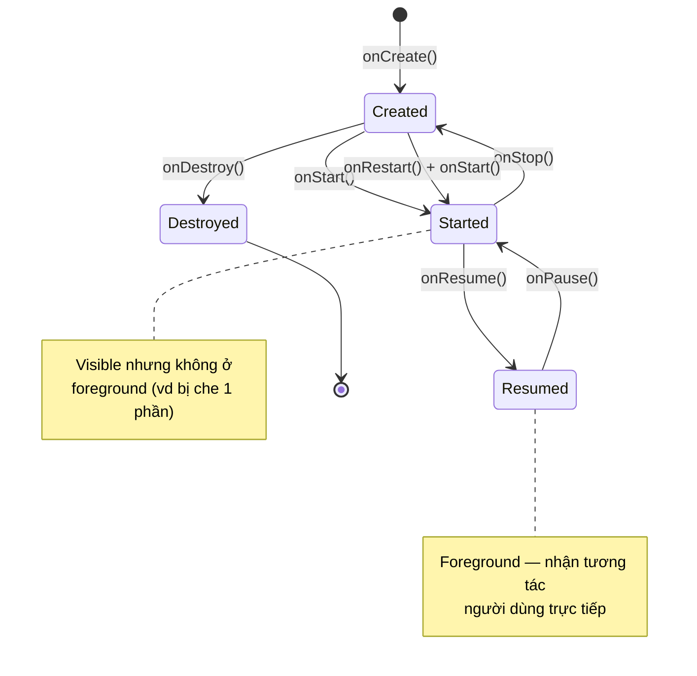
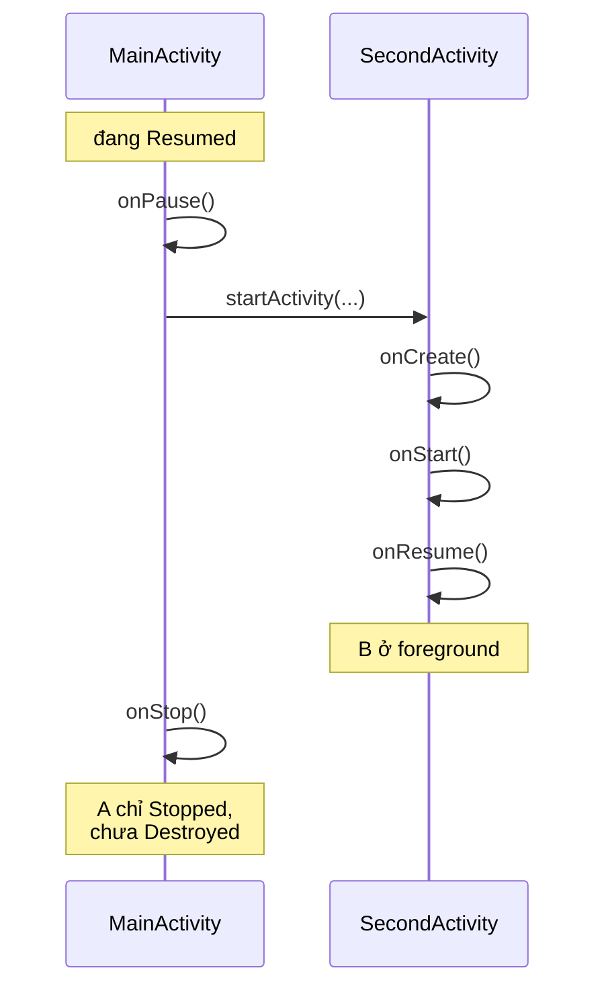

# Chương 6: Vòng đời Activity & Application

## Mục tiêu học

- Gọi tên chính xác và đúng thứ tự các callback vòng đời của Activity.
- Phân biệt "activity bị che khuất tạm thời" với "activity bị huỷ hẳn" — và biết dùng đúng callback cho từng tình huống.
- Hiểu vì sao xoay màn hình lại tạo lại (recreate) Activity, và cách giữ dữ liệu qua `onSaveInstanceState`.
- Biết `Application` class dùng để làm gì và khi nào nên dùng.

> Code mẫu: `code/ch06-lifecycle-demo/` — mở bằng Android Studio, chạy và đọc Logcat song song với chương này sẽ dễ hiểu hơn nhiều so với chỉ đọc.

## 6.1 Sơ đồ đầy đủ

Chương 1 đã cho xem sơ đồ rút gọn. Đây là bản đầy đủ với tên callback thật:



Vài quy tắc cần nhớ, không cần học vẹt tên hàm:

- **`onPause()` luôn được gọi trước khi activity mất hoàn toàn tương tác** — kể cả khi chỉ bị che một phần (ví dụ có dialog nổi lên). Code trong `onPause()` phải cực nhanh, vì hệ thống có thể đang chờ nó xong để cho activity khác chạy tiếp.
- **`onStop()` nghĩa là activity không còn hiển thị chút nào**, nhưng vẫn còn tồn tại trong bộ nhớ — bấm nút Home rồi quay lại app sẽ thấy `onRestart()` → `onStart()` → `onResume()`, KHÔNG chạy lại `onCreate()`.
- **`onDestroy()` không phải lúc nào cũng được gọi** trước khi hệ thống giết tiến trình (Android có quyền kill tiến trình thẳng tay khi thiếu bộ nhớ, không đảm bảo gọi `onDestroy()`). Vì vậy đừng đặt logic "phải chạy" (như lưu dữ liệu quan trọng) vào `onDestroy()` — dùng `onPause()`/`onStop()` cho việc đó.

## 6.2 Configuration change: vì sao xoay màn hình lại "chạy lại app"?

Khi xoay màn hình, đổi ngôn ngữ hệ thống, hoặc bật/tắt chế độ tối, mặc định Android **huỷ và tạo lại Activity** — vì layout/resource phù hợp có thể khác (ví dụ layout riêng cho màn ngang, string riêng cho ngôn ngữ mới). Thứ tự:

```
onPause() → onStop() → onSaveInstanceState() → onDestroy() → onCreate() → onStart() → onResume()
```

`onSaveInstanceState(Bundle outState)` là nơi bạn lưu tạm dữ liệu UI (ví dụ nội dung đang gõ dở, vị trí cuộn) vào `Bundle`, để đọc lại trong `onCreate(Bundle savedInstanceState)` ngay sau đó. Đây **không phải chỗ lưu dữ liệu lâu dài** — chỉ sống sót qua configuration change, mất hẳn nếu người dùng thoát app hẳn (xem Chương 12–13 cho lưu trữ thật sự).

Code mẫu minh hoạ đúng cặp này:

```java
@Override
protected void onSaveInstanceState(Bundle outState) {
    super.onSaveInstanceState(outState);
    outState.putInt("counter", ++counter);
}

@Override
protected void onCreate(Bundle savedInstanceState) {
    super.onCreate(savedInstanceState);
    if (savedInstanceState != null) {
        counter = savedInstanceState.getInt("counter", 0);
    }
    ...
}
```

## 6.3 Hai Activity cùng lúc: ai onPause trước, ai onResume sau?



Thứ tự quan trọng cần nhớ: **`A.onPause()` chạy xong TRƯỚC KHI `B.onResume()` được gọi**, nhưng `A.onStop()` chỉ chạy SAU KHI `B` đã lên foreground. Đây là lý do việc chuyển màn hình mượt — activity cũ chưa "biến mất" ngay, nó chỉ dừng hẳn sau khi activity mới đã sẵn sàng.

## 6.4 Application class — chạy trước cả Activity đầu tiên

```java
public class DemoApplication extends Application {
    @Override
    public void onCreate() {
        super.onCreate();
        // Khởi tạo thư viện dùng chung toàn app ở đây
    }
}
```

Khai báo trong manifest bằng `android:name=".DemoApplication"` trên thẻ `<application>`. `Application.onCreate()` chạy đúng **một lần** khi tiến trình app khởi tạo — trước cả `MainActivity.onCreate()`. Dùng để khởi tạo thư viện toàn app (ví dụ crash reporting ở Chương 40), **không dùng để làm việc nặng** vì nó chặn toàn bộ quá trình khởi động app.

## Bài tập

1. Chạy code mẫu, mở Logcat lọc tag `Lifecycle`. Bấm nút mở màn hình 2, quan sát đúng thứ tự ở sơ đồ 6.3.
2. Bấm Home rồi mở lại app từ danh sách app gần đây — xác nhận `onCreate()` KHÔNG chạy lại, chỉ có `onRestart()/onStart()/onResume()`.
3. Nếu máy ảo bật được auto-rotate: xoay ngang rồi xoay dọc lại — quan sát toàn bộ chuỗi callback ở mục 6.2, và giá trị `counter` được giữ nguyên nhờ `onSaveInstanceState`.

## Lỗi thường gặp

- **Giữ tham chiếu Activity trong biến `static`**: gây rò rỉ bộ nhớ (memory leak) vì Activity không bao giờ được giải phóng dù đã `onDestroy()`. Nếu cần truyền dữ liệu sống lâu hơn Activity, dùng `Application` hoặc kiến trúc `ViewModel` (Chương 28).
- **Làm việc nặng (đọc file lớn, gọi mạng đồng bộ) trong `onCreate()`**: làm chậm hoặc treo màn hình khởi động — chuyển sang bất đồng bộ (Chương 19).
- **Tưởng `onDestroy()` luôn chạy để "dọn dẹp"**: sai — hệ thống có thể kill tiến trình mà không gọi `onDestroy()`. Dọn tài nguyên quan trọng (đóng kết nối, huỷ listener) nên đặt ở `onPause()`/`onStop()`.
- **Quên gọi `super.onXxx()`**: hầu hết callback vòng đời bắt buộc gọi `super` trước, quên sẽ gây `SuperNotCalledException` khi build debug.

## Tóm tắt & tiếp theo

Vòng đời Activity là nền tảng chi phối gần như mọi chương sau — từ chỗ lưu dữ liệu, chạy tác vụ nền, đến khi nào an toàn để cập nhật UI. Chương 7 tạm rời vòng đời để tập trung vào layout và các loại View — thứ bạn nhìn thấy trực tiếp trên màn hình.
