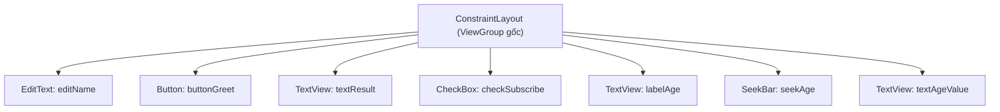

# Chương 7: Layout & Views (XML layout, ConstraintLayout, ViewGroup)

## Mục tiêu học

- Phân biệt `View` và `ViewGroup`, hiểu cây phân cấp (view hierarchy) của một layout.
- Dùng thành thạo `ConstraintLayout` — layout mặc định và khuyến nghị hiện nay.
- Đọc hiểu vì sao `findViewById` dễ gây lỗi runtime, và chuyển sang dùng `ViewBinding`.
- Biết một số View cơ bản: `TextView`, `EditText`, `Button`, `CheckBox`, `SeekBar`.

> Code mẫu: `code/ch07-layout-views/`.

## 7.1 View và ViewGroup

Mọi thứ hiển thị trên màn hình Android đều là một `View`. `ViewGroup` là một `View` đặc biệt có thể chứa các `View` khác bên trong (kể cả `ViewGroup` khác) — tạo thành cây phân cấp:



Cây càng sâu (ViewGroup lồng nhiều tầng), hệ thống càng tốn công đo đạc/vẽ lại (`measure`/`layout` pass) mỗi khi màn hình cập nhật — đây là lý do `ConstraintLayout` ra đời: cho phép tạo layout **phẳng** (ít lồng tầng) mà vẫn định vị được các View phức tạp tương đối với nhau.

## 7.2 ConstraintLayout — định vị bằng ràng buộc

Thay vì lồng nhiều `LinearLayout`, `ConstraintLayout` định vị mỗi View bằng các **ràng buộc (constraint)** tới cạnh của View khác hoặc của layout cha:

```xml
<Button
    android:id="@+id/buttonGreet"
    android:layout_width="wrap_content"
    android:layout_height="wrap_content"
    app:layout_constraintTop_toBottomOf="@id/editName"
    app:layout_constraintStart_toStartOf="parent" />
```

Đọc thành lời: "cạnh trên của `buttonGreet` nằm dưới cạnh dưới của `editName`; cạnh trái của `buttonGreet` thẳng với cạnh trái của layout cha". Bốn hướng ràng buộc cơ bản: `Top`, `Bottom`, `Start`, `End` (dùng `Start`/`End` thay vì `Left`/`Right` để tự động đổi chiều cho ngôn ngữ viết phải-sang-trái).

Quy tắc thực dụng: mỗi View cần **ít nhất một ràng buộc theo chiều ngang và một theo chiều dọc** để có vị trí xác định — thiếu sẽ khiến View "nhảy" về góc trên-trái (0,0) lúc chạy thật dù Preview trong Android Studio có thể vẫn hiển thị đúng.

## 7.3 `findViewById` và vì sao nên chuyển sang ViewBinding

Cách truyền thống:

```java
TextView textResult = findViewById(R.id.textResult);
textResult.setText("...");
```

Vấn đề: `findViewById` trả kiểu `View` (phải tự ép kiểu), và nếu bạn gõ sai `R.id.textResullt`, lỗi chỉ lộ ra **lúc chạy** (`NullPointerException`), không phải lúc biên dịch.

ViewBinding giải quyết cả hai: bật trong `app/build.gradle`:

```groovy
android {
    buildFeatures {
        viewBinding true
    }
}
```

Gradle tự sinh ra class `ActivityMainBinding` (tên suy từ `activity_main.xml`) với field cho mỗi View có `android:id`, đúng kiểu sẵn:

```java
private ActivityMainBinding binding;

@Override
protected void onCreate(Bundle savedInstanceState) {
    super.onCreate(savedInstanceState);
    binding = ActivityMainBinding.inflate(getLayoutInflater());
    setContentView(binding.getRoot());

    binding.buttonGreet.setOnClickListener(v -> { ... });  // gõ sai sẽ báo lỗi compile
}
```

Từ chương này trở đi, sách dùng ViewBinding mặc định cho mọi ví dụ có giao diện.

## 7.4 Một vài View cơ bản dùng trong code mẫu

| View | Vai trò | Sự kiện thường dùng |
|---|---|---|
| `TextView` | Hiển thị chữ (không cho sửa) | — |
| `EditText` | Ô nhập liệu | đọc qua `.getText().toString()` |
| `Button` | Nút bấm | `setOnClickListener` |
| `CheckBox` | Chọn có/không | `setOnCheckedChangeListener` |
| `SeekBar` | Thanh trượt chọn giá trị số | `setOnSeekBarChangeListener` |

Ví dụ đọc dữ liệu người dùng nhập và phản hồi lại — mẫu lặp lại rất nhiều lần trong các chương sau:

```java
binding.buttonGreet.setOnClickListener(v -> {
    String name = binding.editName.getText().toString().trim();
    binding.textResult.setText(name.isEmpty()
        ? getString(R.string.result_empty_name)
        : getString(R.string.result_greeting, name));
});
```

`getString(R.string.result_greeting, name)` minh hoạ chuỗi có tham số (`%1$s` trong `strings.xml`) — cách chuẩn để ghép chuỗi có dữ liệu động mà vẫn giữ được khả năng dịch đa ngôn ngữ (Chương 11), thay vì nối chuỗi bằng `+`.

## Bài tập

1. Chạy code mẫu, thử nhập tên rỗng rồi bấm Chào — xác nhận đúng thông báo lỗi hiển thị.
2. Thêm một `TextView` mới hiển thị trạng thái của `CheckBox` ("Đã đăng ký" / "Chưa đăng ký"), cập nhật qua `setOnCheckedChangeListener`.
3. Thử xoá ràng buộc `app:layout_constraintStart_toStartOf="parent"` của `buttonGreet`, build lại và quan sát vị trí nút bị lệch — đối chiếu với cảnh báo ở mục 7.2.

## Lỗi thường gặp

- **`Unresolved reference` khi dùng ViewBinding**: quên bật `viewBinding true` trong `build.gradle`, hoặc build cache cũ — thử **Build → Clean Project** rồi build lại.
- **View "biến mất" hoặc nằm sai vị trí dù XML trông đúng**: thiếu ràng buộc theo một chiều (ngang hoặc dọc) — xem lại mục 7.2.
- **Lồng quá nhiều `LinearLayout` bên trong nhau**: build được nhưng vẽ chậm hơn — cân nhắc chuyển sang `ConstraintLayout` phẳng nếu layout phức tạp.
- **Gọi `.getText().toString()` khi `EditText` là `null`**: xảy ra khi gọi trước `setContentView`/`binding.inflate` — luôn đảm bảo binding đã khởi tạo trước khi truy cập.

## Tóm tắt & tiếp theo

Bạn đã biết dựng giao diện bằng `ConstraintLayout`, thao tác với View qua ViewBinding an toàn hơn `findViewById`. Chương 8 sẽ dùng chính những kỹ năng này để xây 2 màn hình và học cách điều hướng, truyền dữ liệu giữa chúng bằng Intent.
