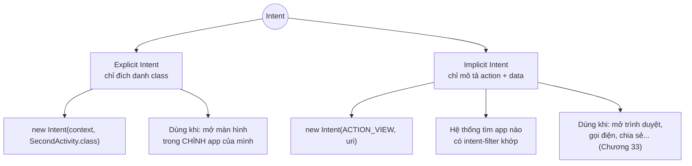
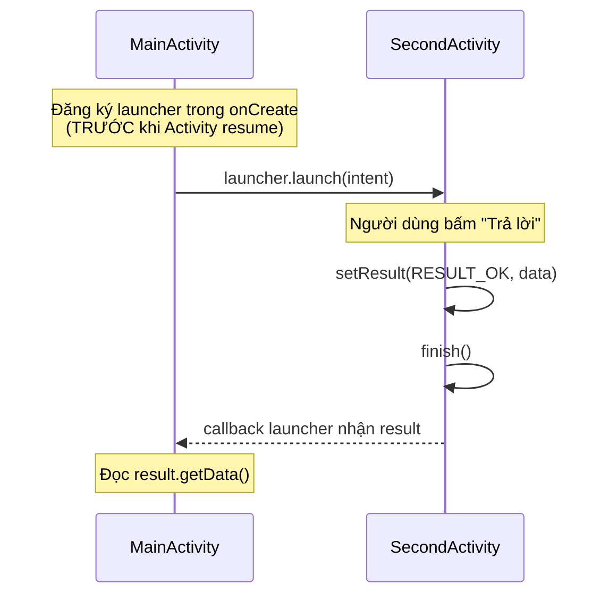

# Chương 8: Sự kiện, Intent (explicit/implicit), điều hướng giữa các màn hình

## Mục tiêu học

- Phân biệt explicit Intent (mở màn hình cụ thể trong app mình) và implicit Intent (nhờ hệ thống tìm app phù hợp xử lý).
- Truyền dữ liệu giữa hai Activity, và nhận lại kết quả bằng Activity Result API.
- Hiểu vì sao `startActivityForResult()` cũ đã lỗi thời và không nên dùng trong code mới.

> Code mẫu: `code/ch08-intent-navigation/`.

## 8.1 Intent là gì?

`Intent` là một "thông điệp" mô tả một hành động cần thực hiện — có thể là mở một Activity, khởi động một Service (Chương 16), hoặc gửi broadcast (Chương 17). Có hai kiểu:



## 8.2 Explicit Intent — truyền dữ liệu bằng `putExtra`

```java
Intent intent = new Intent(MainActivity.this, SecondActivity.class);
intent.putExtra(EXTRA_MESSAGE, message);
startActivity(intent);
```

Phía nhận đọc lại bằng `getIntent()`:

```java
String message = getIntent().getStringExtra(EXTRA_MESSAGE);
```

Lưu ý dùng **hằng số `public static final String`** cho key của extra (như `EXTRA_MESSAGE` trong code mẫu) thay vì viết chuỗi `"message"` trực tiếp ở cả hai nơi — tránh gõ sai key giữa Activity gửi và nhận, một lỗi runtime rất khó phát hiện vì không có cảnh báo lúc build.

## 8.3 Nhận kết quả trả về — Activity Result API

Tài liệu cũ hay dạy `startActivityForResult()` + override `onActivityResult()` — cách này **đã lỗi thời**, Google khuyến nghị thay bằng Activity Result API:



```java
private final ActivityResultLauncher<Intent> secondActivityLauncher =
        registerForActivityResult(new ActivityResultContracts.StartActivityForResult(), result -> {
            if (result.getResultCode() == RESULT_OK && result.getData() != null) {
                String reply = result.getData().getStringExtra(EXTRA_REPLY);
                // cập nhật UI với reply
            }
        });
```

`registerForActivityResult(...)` **phải gọi ở cấp field hoặc trong `onCreate` trước khi Activity resume** — gọi trễ hơn (ví dụ trong `onClickListener`) sẽ ném lỗi runtime. Đây là điểm khác biệt quan trọng nhất so với cách cũ, và cũng là lỗi người mới hay gặp nhất khi mới chuyển qua API này.

Phía `SecondActivity` trả kết quả:

```java
Intent result = new Intent();
result.putExtra(EXTRA_REPLY, "Đã nhận, cảm ơn!");
setResult(RESULT_OK, result);
finish();
```

## 8.4 Implicit Intent — nhờ hệ thống tìm app xử lý

```java
Intent intent = new Intent(Intent.ACTION_VIEW, Uri.parse("https://developer.android.com"));
startActivity(intent);
```

Bạn không cần biết (và không nên quan tâm) máy người dùng cài trình duyệt nào — hệ thống tự tìm app có khai báo `<intent-filter>` khớp với `ACTION_VIEW` + scheme `https`. Nếu nhiều app cùng khớp, hệ thống hiện hộp thoại "Open with" cho người dùng chọn. Cơ chế này sẽ quay lại chi tiết hơn ở Chương 33 khi bàn về App Links và chia sẻ dữ liệu giữa các app.

## Bài tập

1. Chạy code mẫu, thử luồng gửi tin nhắn → nhận phản hồi đầy đủ như mô tả ở README.
2. Thêm một extra thứ hai (ví dụ giờ gửi tin, dùng `putExtra` với kiểu `long`), hiển thị nó ở `SecondActivity`.
3. Đổi implicit intent ở mục 8.4 sang `Intent.ACTION_DIAL` với `Uri.parse("tel:0123456789")` — quan sát hệ thống mở app quay số thay vì trình duyệt.

## Lỗi thường gặp

- **Gọi `registerForActivityResult` bên trong `onClickListener`**: ném `IllegalStateException`, phải đăng ký ở cấp field/`onCreate` như mục 8.3.
- **Quên `android:exported="false"` cho Activity không cần app khác gọi tới** (như `SecondActivity` trong code mẫu) — từ Android 12 phải khai báo rõ giá trị này, không có mặc định ngầm.
- **Đọc `getStringExtra()` mà không kiểm tra `null`**: nếu Activity được mở theo cách khác (không qua đúng luồng bạn nghĩ), extra có thể không tồn tại — luôn có nhánh xử lý `null`.
- **Implicit intent không tìm được app xử lý**: gây crash `ActivityNotFoundException` nếu máy không cài app nào khớp — nên bọc trong `try/catch` hoặc kiểm tra bằng `intent.resolveActivity()` trước khi gọi `startActivity`.

## Tóm tắt & tiếp theo

Bạn đã biết điều hướng giữa các màn hình bằng Intent theo cả hai chiều (gửi dữ liệu đi, nhận kết quả về), và cách nhờ hệ thống mở app khác. Chương 9 giới thiệu `Fragment` — đơn vị giao diện có thể tái sử dụng bên trong một Activity, cùng Navigation Component để quản lý điều hướng giữa nhiều Fragment gọn gàng hơn so với việc tạo nhiều Activity.
