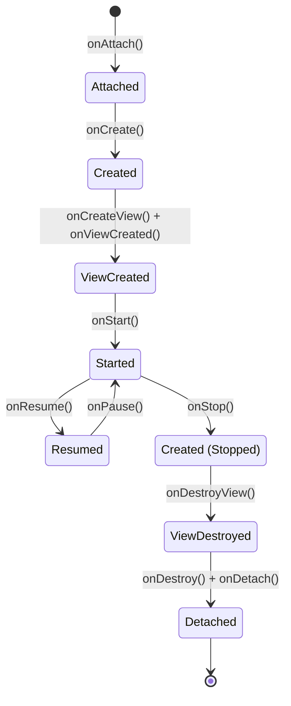
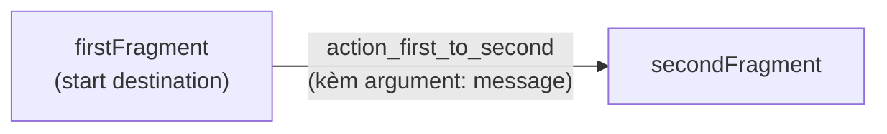

# Chương 9: Fragment & Navigation Component

## Mục tiêu học

- Hiểu `Fragment` là gì, khác `Activity` ở điểm nào, và vì sao vòng đời của nó phức tạp hơn.
- Dựng được mô hình "single-activity" — một Activity chứa nhiều Fragment.
- Dùng Navigation Component để điều hướng và truyền dữ liệu an toàn kiểu (Safe Args) giữa các Fragment.

> Code mẫu: `code/ch09-fragment-navigation/`.

## 9.1 Vì sao cần Fragment nếu đã có Activity?

Ở Chương 8, mỗi màn hình là một Activity riêng. Cách này có hai giới hạn:

- Muốn hiển thị 2 màn hình cạnh nhau (ví dụ layout máy tính bảng: danh sách bên trái, chi tiết bên phải) — không làm được nếu mỗi màn hình là một Activity độc lập.
- Chuyển màn hình bằng Activity luôn kèm chi phí tạo mới cửa sổ hệ thống, nặng hơn cần thiết cho những màn hình đơn giản chỉ là "một phần nội dung thay đổi".

`Fragment` giải quyết việc này: là một **mảnh giao diện có vòng đời riêng, nhưng sống bên trong một Activity**. Nhiều app hiện đại dùng đúng **một Activity duy nhất**, mọi màn hình còn lại đều là Fragment — mô hình dùng trong code mẫu chương này.

## 9.2 Vòng đời Fragment — phức tạp hơn Activity một bậc



Điểm khác biệt quan trọng nhất so với Activity: **Fragment có `onCreateView()`/`onDestroyView()` tách riêng khỏi `onCreate()`/`onDestroy()`**. Lý do: View của Fragment có thể bị huỷ và tạo lại (ví dụ khi Fragment tạm thời không hiển thị trong `ViewPager`) trong khi bản thân đối tượng Fragment vẫn còn sống. Đây là lý do code mẫu luôn **null hoá `binding` trong `onDestroyView()`**:

```java
@Override
public void onDestroyView() {
    super.onDestroyView();
    binding = null;  // View đã chết — giữ tham chiếu là rò rỉ bộ nhớ
}
```

## 9.3 NavHostFragment — nơi chứa các Fragment điều hướng qua lại

```xml
<!-- activity_main.xml -->
<fragment
    android:id="@+id/navHostFragment"
    android:name="androidx.navigation.fragment.NavHostFragment"
    android:layout_width="match_parent"
    android:layout_height="match_parent"
    app:defaultNavHost="true"
    app:navGraph="@navigation/nav_graph" />
```

`app:navGraph` trỏ tới file định nghĩa sơ đồ điều hướng — mở bằng Android Studio sẽ thấy giao diện kéo-thả trực quan (Navigation Editor):



`app:defaultNavHost="true"` để `NavHostFragment` tự xử lý nút Back của hệ thống — bấm Back sẽ tự quay lại Fragment trước đó trong back stack, không cần code tay.

## 9.4 Safe Args — truyền dữ liệu có kiểm tra kiểu

Ở Chương 8, `putExtra`/`getStringExtra` không có gì đảm bảo hai bên dùng đúng cùng một key và đúng kiểu — sai chỉ lộ ra lúc chạy. Navigation Component giải quyết bằng **Safe Args**: khai báo tham số ngay trong `nav_graph.xml`:

```xml
<fragment android:id="@+id/secondFragment" ...>
    <argument
        android:name="message"
        app:argType="string" />
</fragment>
```

Plugin Safe Args (`id 'androidx.navigation.safeargs'`, khai báo ở `build.gradle`) sinh ra class `FirstFragmentDirections` và `SecondFragmentArgs` lúc build:

```java
// Gửi đi — FirstFragment
NavDirections action = FirstFragmentDirections.actionFirstToSecond(message);
NavHostFragment.findNavController(this).navigate(action);

// Nhận — SecondFragment
SecondFragmentArgs args = SecondFragmentArgs.fromBundle(requireArguments());
String message = args.getMessage();
```

Nếu bạn đổi `app:argType="string"` thành `"integer"` mà quên sửa code Java tương ứng, **lỗi lộ ra ngay lúc biên dịch** — không phải khi chạy thử mới phát hiện, khác hẳn cách làm ở Chương 8.

## Bài tập

1. Chạy code mẫu, xác nhận luồng nhập tin nhắn → chuyển Fragment → hiển thị đúng dữ liệu → bấm Back quay lại.
2. Mở `nav_graph.xml` bằng Navigation Editor trong Android Studio, thử kéo thêm một Fragment thứ ba, nối action từ `secondFragment` tới nó.
3. Thêm một `argument` kiểu `integer` (ví dụ độ ưu tiên tin nhắn), truyền và hiển thị nó ở `SecondFragment`.

## Lỗi thường gặp

- **Quên null hoá `binding` trong `onDestroyView()`**: rò rỉ bộ nhớ, đặc biệt nghiêm trọng nếu Fragment nằm trong danh sách vuốt qua lại nhiều lần.
- **Gọi thao tác trên `binding` sau khi View đã bị huỷ** (ví dụ trong callback bất đồng bộ hoàn thành trễ) → `NullPointerException`. Luôn kiểm tra Fragment còn "alive"/View còn tồn tại trước khi cập nhật UI.
- **Không thấy class `FirstFragmentDirections` dù đã khai báo action**: quên áp dụng plugin Safe Args trong `app/build.gradle`, hoặc chưa build lại project sau khi sửa `nav_graph.xml`.
- **`IllegalArgumentException: Required argument "message" is missing`**: điều hướng tới `secondFragment` mà không qua action đã khai báo argument (ví dụ gọi thẳng `navigate(R.id.secondFragment)`), khiến Safe Args không có dữ liệu để truyền.

## Tóm tắt & tiếp theo

Bạn đã biết tách một Activity thành nhiều Fragment, điều hướng và truyền dữ liệu giữa chúng an toàn kiểu. Chương 10 sẽ dùng Fragment/Activity để hiển thị **danh sách** dữ liệu hiệu quả bằng `RecyclerView` — thứ gần như mọi ứng dụng thực tế đều cần.
