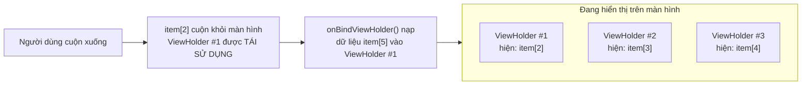
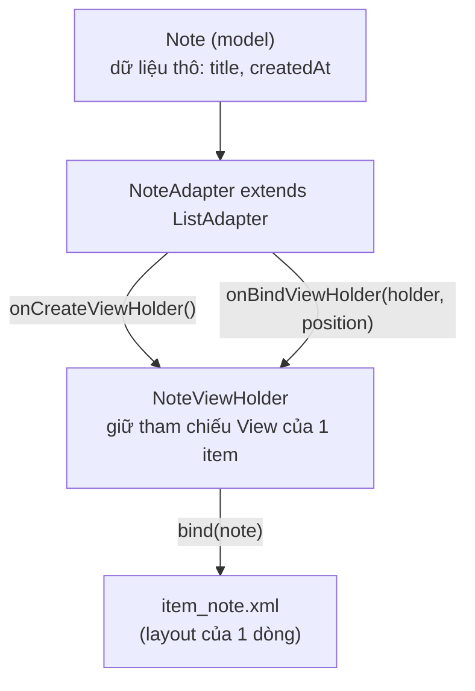

# Chương 10: RecyclerView & Adapter (danh sách, hiệu năng)

## Mục tiêu học

- Hiểu vì sao `RecyclerView` "tái sử dụng" View thay vì tạo mới cho mỗi item — và tại sao điều đó quan trọng với hiệu năng.
- Viết được `Adapter` + `ViewHolder` theo đúng mẫu chuẩn.
- Dùng `ListAdapter` + `DiffUtil` để cập nhật danh sách hiệu quả, có animation, thay vì `notifyDataSetChanged()`.

> Code mẫu: `code/ch10-recyclerview-adapter/`.

## 10.1 Vì sao gọi là "Recycler"?

Tưởng tượng một danh sách 10.000 ghi chú nhưng màn hình chỉ hiển thị được 8 item cùng lúc. Nếu tạo mới 10.000 View, gần như toàn bộ sẽ không bao giờ hiển thị — lãng phí bộ nhớ và thời gian. `RecyclerView` chỉ tạo ra vừa đủ View để lấp đầy màn hình (cộng thêm vài cái đệm), rồi **tái chế (recycle)** — khi một item cuộn ra khỏi màn hình, View của nó không bị huỷ mà được nạp lại (bind) dữ liệu của item mới sắp cuộn vào.



Đây cũng là lý do `ViewHolder` **luôn phải gán lại toàn bộ dữ liệu cần thiết** trong `onBindViewHolder()` — kể cả những trường hợp "trông giống mặc định" (ví dụ ẩn/hiện một icon) — vì ViewHolder có thể đang mang trạng thái sót lại từ item trước đó nó từng hiển thị.

## 10.2 Ba mảnh ghép: Model — ViewHolder — Adapter



```java
static class NoteViewHolder extends RecyclerView.ViewHolder {
    private final ItemNoteBinding binding;

    NoteViewHolder(ItemNoteBinding binding) {
        super(binding.getRoot());
        this.binding = binding;
    }

    void bind(Note note, OnNoteClickListener listener) {
        binding.textTitle.setText(note.getTitle());
        binding.textTimestamp.setText(note.getCreatedAt());
        binding.getRoot().setOnClickListener(v -> listener.onNoteClick(note));
    }
}
```

Ba phương thức bắt buộc override trong `Adapter` truyền thống: `onCreateViewHolder()` (tạo ViewHolder mới, chỉ gọi khi CHƯA đủ View để tái sử dụng), `onBindViewHolder()` (gán dữ liệu, gọi RẤT NHIỀU LẦN khi cuộn), và `getItemCount()`. Code mẫu dùng `ListAdapter` (mục 10.3) nên `getItemCount()` đã có sẵn.

## 10.3 `ListAdapter` + `DiffUtil` — cập nhật danh sách đúng cách

Cách cũ hay thấy: `notifyDataSetChanged()` — báo cho RecyclerView "toàn bộ danh sách có thể đã đổi, vẽ lại hết đi". Cách này **luôn đúng nhưng luôn kém hiệu quả** và mất animation (thêm/xoá/di chuyển item mượt mà).

`ListAdapter` (kế thừa thay vì `RecyclerView.Adapter`) cùng `DiffUtil.ItemCallback` tự so sánh danh sách cũ và mới, chỉ báo đúng phần thay đổi:

```java
private static final DiffUtil.ItemCallback<Note> DIFF_CALLBACK = new DiffUtil.ItemCallback<Note>() {
    @Override
    public boolean areItemsTheSame(@NonNull Note oldItem, @NonNull Note newItem) {
        return oldItem.getId() == newItem.getId();      // có phải "cùng một" item không?
    }

    @Override
    public boolean areContentsTheSame(@NonNull Note oldItem, @NonNull Note newItem) {
        return oldItem.getTitle().equals(newItem.getTitle())
                && oldItem.getCreatedAt().equals(newItem.getCreatedAt());  // nội dung có đổi không?
    }
};
```

Khi có danh sách mới, chỉ cần gọi:

```java
adapter.submitList(new ArrayList<>(notes));
```

`ListAdapter` tự chạy `DiffUtil` trên một thread nền, tính toán chính xác item nào thêm/xoá/đổi vị trí, rồi gọi đúng các hàm `notifyItemInserted()`/`notifyItemRemoved()`/... tương ứng — có animation mượt, hiệu năng tốt hơn hẳn `notifyDataSetChanged()` với danh sách lớn.

> Lưu ý luôn **truyền một `List` MỚI** vào `submitList()` (code mẫu bọc lại bằng `new ArrayList<>(notes)`) — nếu truyền cùng một tham chiếu List đã sửa đổi tại chỗ, `DiffUtil` sẽ không phát hiện được gì khác biệt vì nó so sánh dựa trên tham chiếu/nội dung tại 2 thời điểm.

## Bài tập

1. Chạy code mẫu, bấm nhiều lần **Thêm ghi chú ngẫu nhiên**, quan sát animation item mới chèn vào đầu danh sách.
2. Thêm chức năng xoá: vuốt một item để xoá khỏi `notes`, gọi lại `submitList()` — quan sát animation xoá tự động từ `DiffUtil` (gợi ý: dùng `ItemTouchHelper`, có thể tự tìm hiểu thêm ngoài phạm vi chương này).
3. Thử đổi tạm `areContentsTheSame` để luôn trả `true` — quan sát item không cập nhật giao diện dù dữ liệu đã đổi, để thấy rõ vai trò của hàm này.

## Lỗi thường gặp

- **Không override `getItemCount()` khi dùng `RecyclerView.Adapter` thuần** (không áp dụng nếu dùng `ListAdapter` như code mẫu): danh sách hiển thị trống dù có dữ liệu.
- **Sửa dữ liệu trực tiếp trong `List` đang hiển thị rồi gọi `notifyDataSetChanged()` tuỳ tiện**: hoạt động nhưng đánh mất toàn bộ lợi ích hiệu năng của `DiffUtil` — nên chuyển hẳn sang `submitList()`.
- **Giữ state UI (như trạng thái checkbox) trong `ViewHolder` mà không đồng bộ với model**: vì ViewHolder bị tái sử dụng, checkbox "được tích" có thể tự nhảy sang item khác khi cuộn — luôn lưu state vào model (`Note`), không lưu trong View.
- **`onNoteClick` bị gọi với dữ liệu item cũ sau khi danh sách đã cập nhật**: đảm bảo listener luôn lấy dữ liệu qua `getItem(position)` tại thời điểm bind, không cache riêng.

## Tóm tắt & tiếp theo

Bạn đã biết hiển thị danh sách hiệu quả — kỹ năng dùng lại ở hầu hết mọi màn hình danh sách trong các chương sau (từ SQLite/Room ở Chương 13 đến kết quả API ở Chương 21). Chương 11 khép lại Phần 1 với chủ đề resource: string/dimens/style, và cách làm app hỗ trợ đa ngôn ngữ, đa kích thước màn hình.
