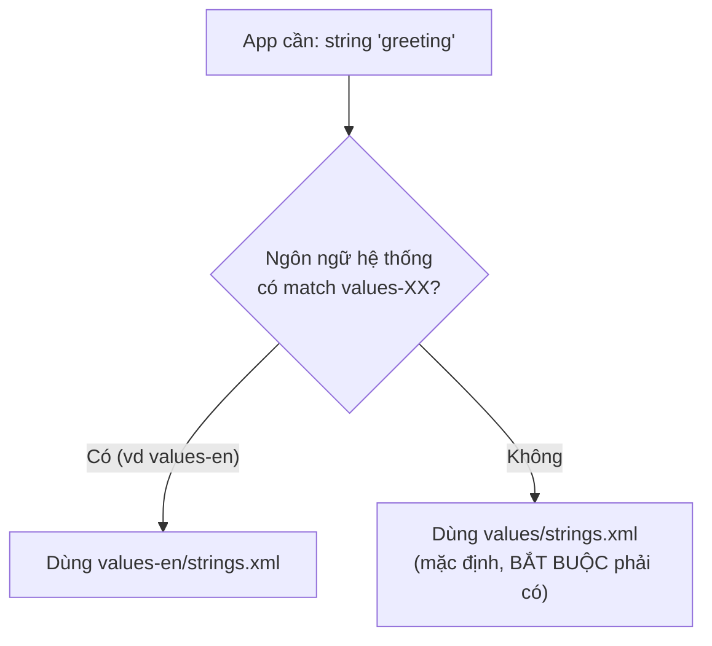

# Chương 11: Resource: string/dimens/style, đa ngôn ngữ, đa kích thước màn hình

## Mục tiêu học

- Hiểu cơ chế **resource qualifier** — cách Android tự chọn đúng file resource theo ngôn ngữ, chế độ sáng/tối, kích thước màn hình.
- Tổ chức được `strings.xml`, `dimens.xml`, `colors.xml` hỗ trợ đa ngôn ngữ và đa kích thước màn hình mà không cần rẽ nhánh code Java.
- Biết vì sao **luôn phải có resource mặc định** (không có hậu tố qualifier) làm phương án dự phòng.

> Code mẫu: `code/ch11-resources-i18n/`.

## 11.1 Resource qualifier là gì?

Tên thư mục con trong `res/` có thể mang thêm hậu tố (qualifier) để chỉ báo "chỉ dùng file này khi điều kiện X đúng":



Một vài qualifier thường dùng:

| Qualifier | Ý nghĩa | Ví dụ thư mục |
|---|---|---|
| Ngôn ngữ | Mã ngôn ngữ theo chuẩn ISO | `values-en`, `values-ja` |
| Chế độ tối | Dark theme đang bật | `values-night` |
| Chiều rộng màn hình tối thiểu | dp, không phụ thuộc mật độ điểm ảnh | `values-sw600dp` |
| Hướng màn hình | Ngang/dọc | `layout-land` |
| Mật độ điểm ảnh | ldpi/mdpi/hdpi/xhdpi... | `drawable-xhdpi` |

Android tự chọn thư mục khớp nhất với thiết bị hiện tại tại **thời điểm chạy** (không phải lúc build) — cùng một file APK, cài trên máy tiếng Việt và máy tiếng Anh sẽ tự hiển thị đúng ngôn ngữ tương ứng.

## 11.2 `values/` mặc định — bắt buộc phải đầy đủ

Đây là lỗi người mới hay gặp nhất: chỉ định nghĩa string mới trong `values-en/strings.xml` mà quên định nghĩa nó trong `values/strings.xml` (mặc định). Kết quả: app chạy bình thường trên máy tiếng Anh, nhưng **crash** trên máy có ngôn ngữ khác (không phải Anh, không khớp bất kỳ qualifier nào bạn có) vì không tìm thấy resource nào cả.

Quy tắc: `values/` (không qualifier) phải luôn chứa **đầy đủ mọi string/dimen/color** app cần — coi nó là "sự thật cuối cùng", các thư mục có qualifier khác chỉ **ghi đè một phần**.

## 11.3 Ví dụ áp dụng trong code mẫu

```xml
<!-- res/values/strings.xml (mặc định — tiếng Việt) -->
<string name="greeting">Xin chào!</string>

<!-- res/values-en/strings.xml (ghi đè khi hệ thống English) -->
<string name="greeting">Hello!</string>
```

```xml
<!-- res/values/dimens.xml (mặc định — điện thoại) -->
<dimen name="screen_padding">24dp</dimen>

<!-- res/values-sw600dp/dimens.xml (ghi đè khi màn hình ≥ 600dp — tablet) -->
<dimen name="screen_padding">64dp</dimen>
```

```xml
<!-- res/values/colors.xml (mặc định — nền sáng) -->
<color name="screen_background">#FFFFFF</color>

<!-- res/values-night/colors.xml (ghi đè khi Dark theme bật) -->
<color name="screen_background">#14171C</color>
```

Layout chỉ tham chiếu resource bằng tên, không quan tâm giá trị cụ thể đến từ thư mục nào:

```xml
<TextView
    android:text="@string/greeting"
    android:textSize="@dimen/greeting_text_size" />
```

## 11.4 Vì sao không nối chuỗi bằng `+`?

```java
// SAI — không dịch được, và sai ngữ pháp với nhiều ngôn ngữ
String msg = "Xin chào, " + name + "!";
```

```xml
<!-- ĐÚNG — placeholder %1$s, dịch tự nhiên theo từng ngôn ngữ -->
<string name="greeting_name">Xin chào, %1$s!</string>
```

```java
String msg = getString(R.string.greeting_name, name);
```

Đã dùng cách này từ Chương 7 (`result_greeting`) — lý do sâu xa chính là để bản dịch tiếng Anh/ngôn ngữ khác có thể sắp xếp lại vị trí tham số nếu ngữ pháp yêu cầu (`%1$s` cho phép đổi thứ tự bằng cách đổi vị trí `%1$s` trong chuỗi dịch, code Java không cần đổi gì).

## Bài tập

1. Chạy code mẫu, đổi ngôn ngữ hệ thống sang English trong Settings, mở lại app — xác nhận nội dung đổi theo `values-en/`.
2. Bật Dark theme của hệ thống, xác nhận màu nền/chữ đổi theo `values-night/`.
3. Thêm một string mới CHỈ trong `values-en/strings.xml` mà không thêm vào `values/strings.xml` — build và chạy thử trên thiết bị/máy ảo có ngôn ngữ khác English lẫn tiếng Việt hệ mặc định (ví dụ đổi máy ảo sang tiếng Nhật) để tự chứng kiến lỗi ở mục 11.2.

## Lỗi thường gặp

- **Thiếu resource trong `values/` mặc định**: app crash trên ngôn ngữ không được hỗ trợ tường minh — luôn kiểm tra `values/` có đủ mọi key trước khi thêm bản dịch khác.
- **Viết cứng chuỗi/kích thước trong code Java hoặc layout** (`android:padding="24dp"` thay vì `@dimen/...`): mất khả năng điều chỉnh tập trung, tablet và điện thoại buộc dùng chung một giá trị.
- **Nối chuỗi bằng `+` thay vì placeholder**: khó dịch đúng ngữ pháp, một số ngôn ngữ cần đổi thứ tự từ.
- **Quên rằng qualifier áp dụng theo TÊN THƯ MỤC, không phải theo tên file**: `values-en/string.xml` (thiếu "s") sẽ không được Android nhận diện đúng cách nếu đặt sai tên thư mục, dù nội dung file đúng.

## Tóm tắt & tiếp theo

Bạn đã hoàn thành **Phần 1 — Nền tảng**: vòng đời, layout, Intent, Fragment, RecyclerView, và hệ thống resource. Đây là bộ kỹ năng đủ để xây một ứng dụng có giao diện hoàn chỉnh. Phần 2 bắt đầu từ Chương 12, chuyển sang chủ đề lưu trữ dữ liệu — bắt đầu với `SharedPreferences`.
