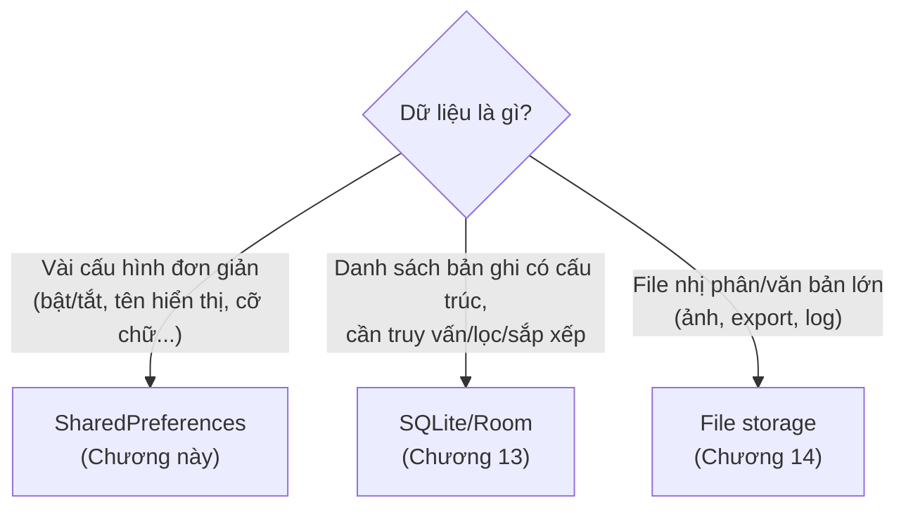
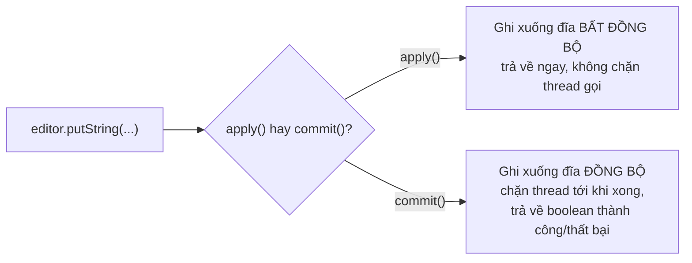

# Chương 12: SharedPreferences (cấu hình, trạng thái đơn giản)

## Mục tiêu học

- Hiểu `SharedPreferences` phù hợp cho loại dữ liệu nào, không phù hợp cho loại nào.
- Đọc/ghi được các kiểu dữ liệu cơ bản, phân biệt `apply()` và `commit()`.
- Biết gom logic đọc/ghi vào một class quản lý riêng thay vì rải key khắp nơi.
- Lắng nghe thay đổi bằng `OnSharedPreferenceChangeListener` và biết khi nào phải huỷ đăng ký.

> Code mẫu: `code/ch12-shared-preferences/`.

## 12.1 SharedPreferences là gì, dùng khi nào?

`SharedPreferences` lưu dữ liệu dạng **key-value** đơn giản (chuỗi, số, boolean, tập hợp chuỗi) xuống một file XML riêng của app, tồn tại **qua mọi lần khởi động lại tiến trình** — khác hẳn `onSaveInstanceState` ở Chương 6 (chỉ sống qua configuration change, mất khi app bị đóng hẳn).



Dùng đúng chỗ: cờ "đã xem hướng dẫn lần đầu chưa", tên hiển thị người dùng, cỡ chữ, trạng thái bật/tắt tính năng. **Không dùng** cho danh sách lớn hay dữ liệu cần truy vấn phức tạp — đó là việc của Room (Chương 13).

## 12.2 Đọc và ghi cơ bản

```java
SharedPreferences prefs = context.getSharedPreferences("app_settings", Context.MODE_PRIVATE);

// Đọc — luôn kèm giá trị mặc định cho lần đầu chưa từng lưu
String name = prefs.getString("display_name", "");
boolean notificationsEnabled = prefs.getBoolean("notifications_enabled", true);
int fontSize = prefs.getInt("font_size", 16);

// Ghi — phải qua Editor
SharedPreferences.Editor editor = prefs.edit();
editor.putString("display_name", "Chi");
editor.putBoolean("notifications_enabled", true);
editor.apply();
```

`Context.MODE_PRIVATE` là chế độ **duy nhất nên dùng** — chỉ app của mình đọc/ghi được file này (các mode khác cho phép app khác đọc/ghi đã bị Android loại bỏ từ lâu vì lý do bảo mật).

## 12.3 `apply()` và `commit()` — khác nhau ở đâu?



**Mặc định luôn dùng `apply()`** — code mẫu chương này dùng `apply()` cho mọi trường hợp. Chỉ cân nhắc `commit()` khi bạn thật sự cần biết ngay lập tức việc ghi đã thành công hay chưa trước khi làm bước tiếp theo (hiếm gặp, và gọi trên main thread có thể gây giật UI vì bị chặn).

## 12.4 Gom logic vào một class quản lý riêng

Rải chuỗi key (`"display_name"`, `"font_size"`...) khắp các Activity là nguồn lỗi gõ sai (typo) rất khó phát hiện — sai một ký tự, `getString()` âm thầm trả về giá trị mặc định thay vì báo lỗi. Cách làm tốt hơn — class `PrefsManager` bọc toàn bộ:

```java
public class PrefsManager {
    private static final String PREFS_NAME = "app_settings";
    private static final String KEY_DISPLAY_NAME = "display_name";
    private final SharedPreferences prefs;

    public PrefsManager(Context context) {
        prefs = context.getApplicationContext().getSharedPreferences(PREFS_NAME, Context.MODE_PRIVATE);
    }

    public String getDisplayName(String defaultValue) {
        return prefs.getString(KEY_DISPLAY_NAME, defaultValue);
    }
    // ...
}
```

Lưu ý dùng `context.getApplicationContext()` khi lấy `SharedPreferences` bên trong một class không phải Activity — tránh giữ tham chiếu tới `Context` của Activity (rò rỉ bộ nhớ nếu `PrefsManager` sống lâu hơn Activity tạo ra nó).

## 12.5 Lắng nghe thay đổi

```java
private final SharedPreferences.OnSharedPreferenceChangeListener changeListener =
        (sharedPreferences, key) -> Log.d(TAG, "Preference đã đổi: " + key);

@Override
protected void onStart() {
    super.onStart();
    prefsManager.registerOnChangeListener(changeListener);
}

@Override
protected void onStop() {
    super.onStop();
    prefsManager.unregisterOnChangeListener(changeListener);  // bắt buộc, xem 12.6
}
```

Hữu ích khi nhiều màn hình cùng cần biết một cấu hình vừa đổi (ví dụ đổi ngôn ngữ ở màn hình cài đặt, màn hình khác cần refresh lại UI ngay).

## Bài tập

1. Chạy code mẫu, lưu vài giá trị, đóng hẳn app rồi mở lại — xác nhận dữ liệu còn nguyên.
2. Thêm một `CheckBox` mới (ví dụ "Tự động đồng bộ"), lưu và đọc lại giá trị boolean tương ứng qua `PrefsManager`.
3. Thử comment dòng `unregisterOnChangeListener` trong `onStop()`, xoay màn hình nhiều lần (tạo lại Activity nhiều lần) — dùng Android Studio Profiler (Memory) quan sát số lượng Activity instance không được giải phóng tăng dần.

## Lỗi thường gặp

- **Quên `unregisterOnChangeListener`**: mỗi Activity mới đăng ký thêm một listener nhưng listener cũ (trỏ tới Activity đã destroy) không bao giờ được gỡ — rò rỉ bộ nhớ tích luỹ dần.
- **Dùng `SharedPreferences` cho danh sách lớn** (ví dụ tự chuyển một `List<Note>` thành JSON rồi nhét vào một key string): hoạt động được ở quy mô nhỏ nhưng không truy vấn/lọc được, không hiệu quả khi dữ liệu lớn dần — nên chuyển sang Room (Chương 13) ngay khi có dấu hiệu này.
- **Rải key trực tiếp trong nhiều Activity thay vì qua một class quản lý**: chỉ cần gõ sai `"display_name"` thành `"displayname"` ở một chỗ, dữ liệu coi như "biến mất" (thực ra vẫn nằm ở key cũ) mà không có lỗi nào báo.
- **Đọc SharedPreferences trên main thread trong vòng lặp lớn**: bản thân việc đọc/ghi thường nhanh, nhưng thao tác dồn dập không cần thiết trên main thread vẫn nên tránh — cân nhắc thực hiện trên thread nền nếu logic phức tạp hơn ví dụ trong chương này.

## Tóm tắt & tiếp theo

Bạn đã biết lưu cấu hình đơn giản bền vững qua các lần mở app. Chương 13 chuyển sang bài toán lớn hơn: lưu trữ danh sách bản ghi có cấu trúc, truy vấn được — bằng SQLite thông qua thư viện Room.
