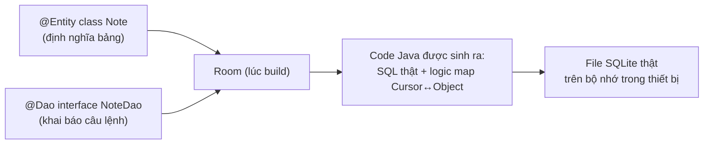
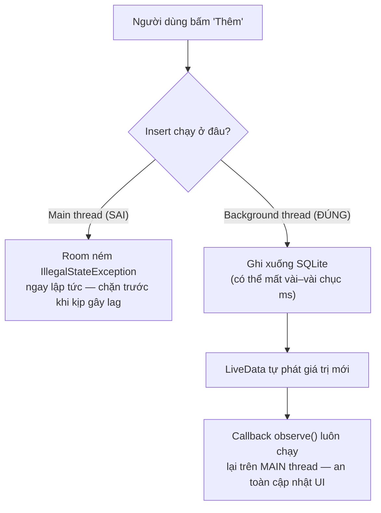

# Chương 13: SQLite & Room (cơ sở dữ liệu quan hệ)

## Mục tiêu học

- Hiểu vì sao Room ra đời để thay thế việc dùng SQLite trực tiếp bằng tay.
- Định nghĩa được bảng dữ liệu (`@Entity`), câu truy vấn (`@Dao`), và điểm truy cập database (`RoomDatabase`).
- Hiểu vì sao Room bắt buộc thao tác off main thread, và cách xử lý bằng `Executor`.
- Dùng `LiveData` để UI tự cập nhật mỗi khi dữ liệu trong database thay đổi.

> Code mẫu: `code/ch13-sqlite-room/`.

## 13.1 Vì sao không viết SQL tay như trước đây?

Android có sẵn `SQLiteOpenHelper` để làm việc trực tiếp với SQLite — cách làm truyền thống, nhưng có ba vấn đề:

- Phải tự viết chuỗi SQL (`"CREATE TABLE notes (id INTEGER PRIMARY KEY, title TEXT)"`) — gõ sai chỉ phát hiện lúc chạy.
- Phải tự map thủ công giữa `Cursor` (kết quả truy vấn) và object Java — code lặp lại, dễ quên field.
- Phải tự quản lý version migration khi đổi cấu trúc bảng.

**Room** (thư viện chính thức của Google, thuộc Jetpack) giải quyết cả ba: bạn khai báo bảng bằng annotation trên class Java, Room tự sinh SQL và code map dữ liệu lúc build, **kiểm tra câu truy vấn ngay lúc biên dịch** (gõ sai tên cột sẽ báo lỗi compile, không phải runtime).



## 13.2 `@Entity` — định nghĩa một bảng

```java
@Entity(tableName = "notes")
public class Note {

    @PrimaryKey(autoGenerate = true)
    public long id;

    @NonNull
    @ColumnInfo(name = "title")
    public String title;

    @ColumnInfo(name = "created_at")
    public long createdAt;

    public Note(@NonNull String title, long createdAt) {
        this.title = title;
        this.createdAt = createdAt;
    }
}
```

`@PrimaryKey(autoGenerate = true)` tương đương `INTEGER PRIMARY KEY AUTOINCREMENT` trong SQL thuần — Room tự gán `id` khi insert, bạn không cần tự sinh giá trị.

## 13.3 `@Dao` — khai báo câu lệnh, không viết logic

```java
@Dao
public interface NoteDao {

    @Query("SELECT * FROM notes ORDER BY id DESC")
    LiveData<List<Note>> getAll();

    @Insert
    void insert(Note note);

    @Delete
    void delete(Note note);
}
```

Đây là điểm khác biệt lớn nhất so với JDBC/SQLiteOpenHelper truyền thống: bạn **chỉ khai báo interface**, không viết thân hàm. Room đọc annotation (`@Query`, `@Insert`, `@Delete`) lúc build, tự sinh class triển khai thật (`NoteDao_Impl`) — kiểm tra được ngay lúc biên dịch nếu câu SQL trong `@Query` tham chiếu sai tên cột/bảng.

## 13.4 `RoomDatabase` — điểm truy cập duy nhất

```java
@Database(entities = {Note.class}, version = 1, exportSchema = false)
public abstract class AppDatabase extends RoomDatabase {

    public abstract NoteDao noteDao();

    private static volatile AppDatabase instance;

    public static AppDatabase getInstance(Context context) {
        if (instance == null) {
            synchronized (AppDatabase.class) {
                if (instance == null) {
                    instance = Room.databaseBuilder(
                                    context.getApplicationContext(), AppDatabase.class, "notes.db")
                            .build();
                }
            }
        }
        return instance;
    }
}
```

**Luôn dùng một instance `RoomDatabase` duy nhất cho cả app** (mẫu singleton như trên) — tạo nhiều instance trỏ tới cùng file `.db` gây tốn tài nguyên và có thể xung đột khoá file.

## 13.5 Vì sao Room cấm chạy trên main thread?



I/O đĩa (đọc/ghi file `.db`) có thể mất từ vài đến vài chục mili-giây — đủ để làm khung hình bị giật nếu chạy trên main thread, nặng hơn có thể gây ANR (Application Not Responding). Room **chủ động chặn** việc này bằng cách ném lỗi ngay lúc gọi nhầm, thay vì để bạn tự phát hiện qua hiện tượng giật lag mơ hồ. Code mẫu dùng `ExecutorService` riêng cho việc này:

```java
private final ExecutorService dbExecutor = Executors.newSingleThreadExecutor();

binding.buttonAdd.setOnClickListener(v -> {
    Note note = new Note(title, System.currentTimeMillis());
    dbExecutor.execute(() -> database.noteDao().insert(note));
});
```

Chương 19 sẽ bàn kỹ hơn về các lựa chọn xử lý bất đồng bộ trong Android — `Executor` ở đây là cách đơn giản nhất phù hợp với những gì đã học tới thời điểm này.

## 13.6 `LiveData` — UI tự cập nhật khi dữ liệu đổi

```java
database.noteDao().getAll().observe(this, adapter::submitList);
```

Khi `NoteDao.getAll()` trả về `LiveData<List<Note>>`, Room tự động theo dõi bảng `notes` — **bất kỳ lúc nào** có insert/update/delete (kể cả từ một đoạn code khác trong cùng app), `observe()` callback sẽ tự chạy lại với danh sách mới nhất, luôn đảm bảo chạy trên main thread nên gọi thẳng `adapter::submitList` (từ Chương 10) an toàn, không cần tự runOnUiThread.

## Bài tập

1. Chạy code mẫu, thêm vài ghi chú, xoá thử một ghi chú, đóng hẳn app và mở lại — xác nhận dữ liệu còn nguyên trong SQLite thật (khác `SharedPreferences` ở chỗ đây là dữ liệu có cấu trúc, truy vấn được).
2. Thêm một cột mới vào `Note` (ví dụ `boolean isPinned`), thêm một `@Query` mới trong `NoteDao` để lấy riêng các ghi chú đã ghim (`WHERE is_pinned = 1`).
3. Mở **Database Inspector** trong Android Studio khi app đang chạy, tự viết một câu `SELECT` để kiểm tra dữ liệu trực tiếp trong bảng `notes`.

## Lỗi thường gặp

- **`IllegalStateException: Cannot access database on the main thread`**: gọi trực tiếp `dao.insert(...)` trong `onClickListener` mà không bọc qua `Executor`/thread nền — đúng như thiết kế bảo vệ của Room ở mục 13.5.
- **Đổi cấu trúc `@Entity` (thêm/xoá cột) mà không tăng `version` trong `@Database`**: app cũ cài trên máy thật sẽ crash khi mở vì Room phát hiện schema không khớp — cần tăng `version` và cung cấp `Migration` (nằm ngoài phạm vi chương này, nhưng bắt buộc phải biết tồn tại trước khi phát hành bản cập nhật đổi schema).
- **Tạo nhiều instance `RoomDatabase` thay vì dùng singleton**: lãng phí tài nguyên, có thể gây lỗi khoá file khó debug.
- **Quên `@NonNull` trên field kiểu tham chiếu bắt buộc có giá trị** (như `title`): Room cho phép cột đó nhận `NULL` trong SQL dù ý định của bạn là bắt buộc — khai báo rõ ràng giúp Room sinh đúng ràng buộc `NOT NULL`.

## Tóm tắt & tiếp theo

Bạn đã có một database SQLite thật hoạt động qua Room — đủ để lưu trữ danh sách dữ liệu có cấu trúc, truy vấn được, tự động cập nhật UI. Chương 14 chuyển sang một dạng lưu trữ khác: làm việc trực tiếp với file (văn bản, nhị phân) trên bộ nhớ trong và bộ nhớ ngoài của thiết bị.
