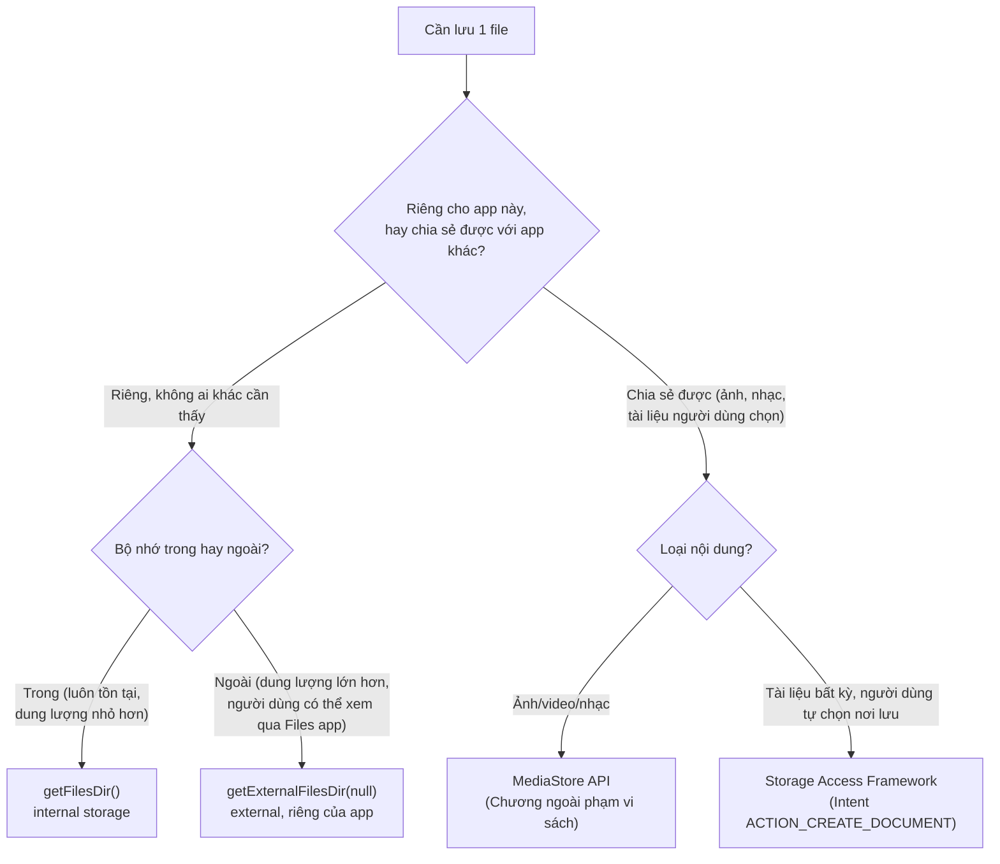
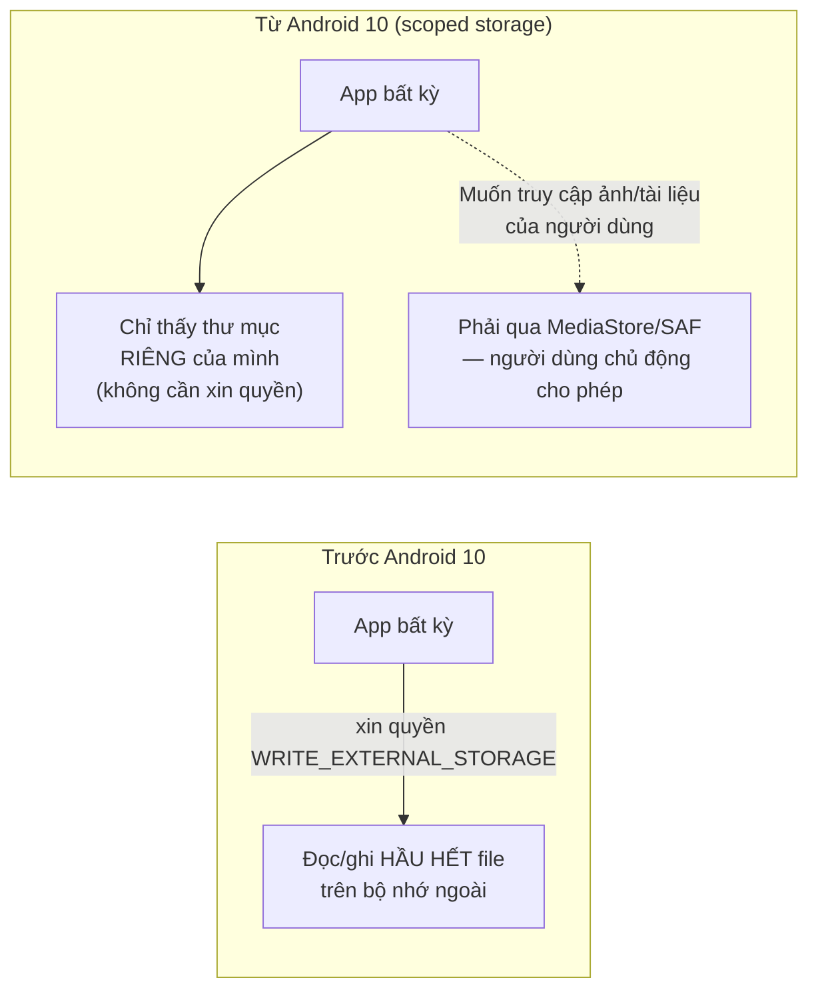

# Chương 14: File storage — internal vs external, scoped storage

## Mục tiêu học

- Phân biệt bộ nhớ trong (internal) và bộ nhớ ngoài (external), và thư mục "riêng của app" so với thư mục "dùng chung".
- Đọc/ghi file bằng API chuẩn (`FileInputStream`/`FileOutputStream`), chạy đúng cách trên background thread.
- Hiểu khái niệm **scoped storage** (từ Android 10/API 29) và vì sao nó ra đời.
- Biết khi nào cần dùng `MediaStore`/Storage Access Framework thay vì `File` trực tiếp (giới thiệu, không đi sâu).

> Code mẫu: `code/ch14-file-storage/`.

## 14.1 Bốn "nơi" lưu file khác nhau



Chương này tập trung vào hai ô **Internal** và **External riêng của app** — không cần xin bất kỳ quyền runtime nào (khác các chương liên quan tới Bluetooth/NFC/vị trí ở Phần 7). Hai ô còn lại (MediaStore, Storage Access Framework) chỉ giới thiệu khái niệm để bạn biết tồn tại khi cần tra cứu thêm.

## 14.2 Bộ nhớ trong (internal) — luôn riêng tư, luôn tồn tại

```java
File file = new File(getFilesDir(), "note.txt");
try (FileOutputStream out = new FileOutputStream(file)) {
    out.write(content.getBytes(StandardCharsets.UTF_8));
}
```

`getFilesDir()` trả về thư mục **chỉ app của bạn truy cập được** (nhờ sandbox — Chương 26 sẽ giải thích sâu hơn cơ chế này), không cần khai báo quyền gì trong manifest, và **tự động bị xoá khi người dùng gỡ cài đặt app**. Phù hợp cho: cache, dữ liệu tạm, file cấu hình nội bộ.

## 14.3 Bộ nhớ ngoài, thư mục riêng của app

```java
File dir = getExternalFilesDir(null);   // null = thư mục gốc riêng của app
File file = new File(dir, "note.txt");
```

Khác bộ nhớ trong ở chỗ: dung lượng thường lớn hơn, và **người dùng có thể tự xem file này qua ứng dụng Quản lý file** (đường dẫn dạng `Android/data/<package>/files/`) — nhưng vẫn **không app nào khác** đọc/ghi được (từ Android 10 trở đi, đây chính là quy tắc "scoped storage" ở mục 14.4). Cũng tự động bị xoá khi gỡ app, và **không cần khai báo quyền** `WRITE_EXTERNAL_STORAGE` — điểm hay bị hiểu nhầm vì tài liệu cũ (trước Android 10) yêu cầu quyền này cho MỌI thao tác ghi ra bộ nhớ ngoài.

## 14.4 Scoped storage là gì, vì sao Android 10 đổi luật chơi?

Trước Android 10 (API 29), một app xin quyền `WRITE_EXTERNAL_STORAGE` có thể đọc/ghi **gần như mọi file** trên bộ nhớ ngoài — kể cả file do app khác tạo ra. Đây là rủi ro bảo mật/riêng tư lớn (một app "đèn pin" xin quyền này có thể âm thầm đọc ảnh riêng tư của bạn).

**Scoped storage** giới hạn lại: mỗi app mặc định chỉ thấy được thư mục riêng của mình (`getExternalFilesDir()`) mà **không cần xin quyền**. Muốn truy cập file người dùng thật sự sở hữu (ảnh trong thư viện, tài liệu bất kỳ), phải đi qua các API tôn trọng lựa chọn của người dùng: `MediaStore` (cho ảnh/video/nhạc) hoặc Storage Access Framework (cho tài liệu bất kỳ, người dùng tự chọn qua hộp thoại hệ thống) — cả hai đều nằm ngoài phạm vi sách này nhưng nên biết tên để tra cứu khi cần.



## 14.5 Vì sao đọc/ghi file trên background thread?

Tương tự Room ở Chương 13, thao tác đĩa có thể mất thời gian đáng kể — code mẫu dùng `ExecutorService` riêng cho I/O:

```java
private final ExecutorService ioExecutor = Executors.newSingleThreadExecutor();

private void saveTo(File file, String label) {
    String content = binding.editContent.getText().toString();
    ioExecutor.execute(() -> {
        try (FileOutputStream out = new FileOutputStream(file)) {
            out.write(content.getBytes(StandardCharsets.UTF_8));
            runOnUiThread(() -> Toast.makeText(this, "...", Toast.LENGTH_LONG).show());
        } catch (IOException e) {
            runOnUiThread(() -> Toast.makeText(this, "Lưu thất bại.", Toast.LENGTH_SHORT).show());
        }
    });
}
```

Khác với Room, API `File` **không tự ép buộc** bạn tránh main thread (không ném lỗi nếu gọi sai chỗ) — kỷ luật tự giác quan trọng hơn ở đây. `runOnUiThread()` đưa phần cập nhật UI (Toast, TextView) quay lại đúng main thread sau khi việc I/O hoàn tất trên thread nền.

## Bài tập

1. Chạy code mẫu, lưu nội dung vào cả hai nơi, đọc lại và so sánh đường dẫn hiển thị trong Toast.
2. Dùng `adb shell run-as <package>` (Chương 3) để tự tay xem file `note.txt` nằm ở đâu trên thiết bị thật/máy ảo.
3. Thử xoá dòng `try (FileOutputStream out = ...)` sang gọi trực tiếp trên main thread (không qua `ioExecutor`) — dùng Android Studio Profiler quan sát main thread bị chiếm dụng, dù ngắn, trong lúc ghi file.

## Lỗi thường gặp

- **Tưởng `getExternalFilesDir()` cần quyền `WRITE_EXTERNAL_STORAGE`**: sai với thư mục riêng của app — quyền này chỉ từng cần cho việc ghi vào thư mục DÙNG CHUNG trước Android 10, và hiện gần như không còn tác dụng do scoped storage.
- **Không kiểm tra `getExternalFilesDir()` trả về `null`**: có thể xảy ra nếu thẻ nhớ ngoài không sẵn sàng (hiếm nhưng có thật) — code mẫu có kiểm tra và dùng bộ nhớ trong làm phương án dự phòng.
- **Đọc file lớn bằng cách đọc hết vào một mảng byte** (như code mẫu làm để đơn giản): ổn với file nhỏ như ghi chú văn bản, nhưng với file lớn (vài chục MB trở lên) cần đọc theo luồng (stream) từng phần thay vì nạp hết vào bộ nhớ.
- **Nhầm lẫn "bộ nhớ ngoài" (external storage) với "thẻ nhớ SD vật lý"**: trên phần lớn thiết bị hiện đại, "external storage" chỉ là một phân vùng logic trong bộ nhớ trong máy, không nhất thiết là thẻ SD rời.

## Tóm tắt & tiếp theo

Bạn đã biết ba cách lưu trữ dữ liệu: cấu hình đơn giản (SharedPreferences), dữ liệu có cấu trúc (Room), và file thô (chương này) — cùng khái niệm scoped storage chi phối toàn bộ hệ sinh thái Android hiện đại. Chương 15 giới thiệu `DataStore` — giải pháp hiện đại của Jetpack, dần thay thế `SharedPreferences` cho các trường hợp Chương 12 đã đề cập.
