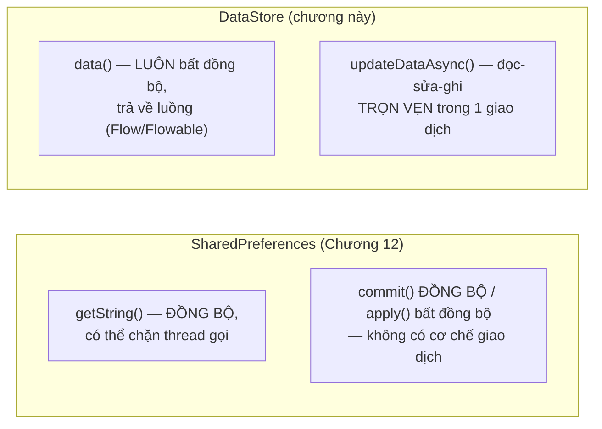

# Chương 15: Jetpack DataStore (thay thế SharedPreferences hiện đại)

## Mục tiêu học

- Hiểu những giới hạn của `SharedPreferences` mà `DataStore` được thiết kế để khắc phục.
- Đọc/ghi được dữ liệu qua Preferences DataStore trong project Java (dùng cầu nối RxJava3 chính thức).
- Hiểu khái niệm cập nhật có tính giao dịch (transactional update) qua `updateDataAsync`.

> Code mẫu: `code/ch15-datastore/` — cùng chức năng với Chương 12 để dễ so sánh trực tiếp.

## 15.1 SharedPreferences có vấn đề gì?

`SharedPreferences` (Chương 12) hoạt động tốt cho phần lớn trường hợp đơn giản, nhưng có vài giới hạn Google chỉ ra làm lý do ra đời `DataStore`:

- `getString()`/`getBoolean()`... chạy **đồng bộ trên thread gọi nó** — nếu file preferences lớn hoặc bị chặn I/O, có thể làm giật main thread mà không có cảnh báo nào (khác Room ở Chương 13, vốn chủ động chặn hành vi sai).
- `commit()` đồng bộ có thể **âm thầm thất bại** mà code gọi không kiểm tra giá trị trả về vẫn tiếp tục chạy như không có gì.
- Không có cách "quan sát" một giá trị cụ thể đổi theo kiểu luồng dữ liệu (stream) hiện đại — phải tự đăng ký/huỷ đăng ký listener thủ công như Chương 12 đã làm.

`DataStore` (Jetpack) giải quyết bằng: **mọi thao tác đều bất đồng bộ**, cập nhật có tính giao dịch (đọc-sửa-ghi trọn vẹn, không bị xen ngang), và trả dữ liệu dưới dạng luồng (Kotlin `Flow`, hoặc `Flowable`/`Observable` nếu dùng cầu nối RxJava như code mẫu Java trong sách).



## 15.2 Vì sao code mẫu dùng RxJava thay vì Kotlin Flow?

Thư viện lõi `androidx.datastore:datastore-preferences` được viết dựa trên Kotlin Coroutines/`Flow` — không gọi trực tiếp thuận tiện từ Java thuần (ngôn ngữ chính của sách này). Google cung cấp cầu nối chính thức `datastore-preferences-rxjava3`, expose cùng chức năng qua kiểu `RxDataStore<Preferences>` với `Flowable`/`Single` — quen thuộc hơn với lập trình viên Java, dùng trong toàn bộ chương này.

```groovy
implementation 'androidx.datastore:datastore-preferences-rxjava3:1.1.1'
implementation 'io.reactivex.rxjava3:rxjava:3.1.8'
implementation 'io.reactivex.rxjava3:rxandroid:3.0.2'
```

## 15.3 Đọc dữ liệu — luôn là một luồng (stream)

```java
RxDataStore<Preferences> dataStore = SettingsDataStore.getInstance(this);

dataStore.data()
        .observeOn(AndroidSchedulers.mainThread())
        .subscribe(prefs -> {
            String name = prefs.get(SettingsKeys.DISPLAY_NAME);
            binding.editDisplayName.setText(name != null ? name : "");
        });
```

`dataStore.data()` trả về `Flowable<Preferences>`: phát ngay giá trị hiện tại lúc `subscribe()`, rồi tiếp tục phát mỗi khi dữ liệu đổi — không cần tự đăng ký/huỷ đăng ký listener thủ công như `OnSharedPreferenceChangeListener` ở Chương 12 (dù bản chất vẫn phải `dispose()` subscription đúng lúc, xem mục 15.5).

## 15.4 Ghi dữ liệu có tính giao dịch

```java
Single<Preferences> update = dataStore.updateDataAsync(prefsIn -> {
    MutablePreferences mutablePrefs = prefsIn.toMutablePreferences();
    mutablePrefs.set(SettingsKeys.DISPLAY_NAME, name);
    mutablePrefs.set(SettingsKeys.NOTIFICATIONS_ENABLED, notificationsEnabled);
    return Single.just(mutablePrefs);
});

update.subscribe(
        prefs -> { /* thành công */ },
        throwable -> { /* thất bại — DataStore CÓ báo lỗi rõ ràng, khác commit() im lặng */ });
```

`updateDataAsync` nhận vào giá trị **hiện tại** (`prefsIn`), bạn sửa nó và trả về giá trị **mới** — toàn bộ diễn ra như một giao dịch duy nhất. Nếu hai nơi trong app cùng gọi cập nhật gần như đồng thời, DataStore đảm bảo chúng không ghi đè mất dữ liệu của nhau (khác nguy cơ tiềm ẩn khi tự đọc rồi tự ghi hai bước riêng với `SharedPreferences.Editor`).

Lưu ý quan trọng: `updateDataAsync` trả về một `Single` — theo đúng bản chất "lazy" của RxJava, **nếu không gọi `.subscribe()`, việc ghi sẽ không bao giờ thực sự xảy ra**. Đây là lỗi rất dễ mắc khi mới làm quen RxJava.

## 15.5 Quản lý subscription bằng `CompositeDisposable`

```java
private final CompositeDisposable disposables = new CompositeDisposable();

@Override
protected void onStart() {
    super.onStart();
    disposables.add(dataStore.data().subscribe(this::applyToUi));
}

@Override
protected void onStop() {
    super.onStop();
    disposables.clear();  // huỷ TẤT CẢ subscription đã add, cùng lúc
}
```

Nguyên tắc giống hệt lý do phải `unregisterOnChangeListener` ở Chương 12: một `subscribe()` không được huỷ đúng lúc sẽ tiếp tục giữ tham chiếu và chạy callback vào một Activity đã không còn hiển thị (thậm chí đã bị huỷ) — rò rỉ bộ nhớ. `CompositeDisposable` chỉ là công cụ gom nhiều subscription lại để huỷ một lượt cho gọn.

## Bài tập

1. Chạy code mẫu, lưu vài giá trị, đóng hẳn app và mở lại — xác nhận dữ liệu còn nguyên, tương tự Chương 12.
2. So sánh trực tiếp file `MainActivity.java` của `ch12-shared-preferences` và `ch15-datastore` — liệt kê ra 3 điểm khác nhau rõ nhất trong cách viết code.
3. Thử bỏ dòng `.subscribe(...)` sau `dataStore.updateDataAsync(...)`, build và chạy lại — bấm Lưu và xác nhận dữ liệu **không** thực sự được ghi (minh chứng cho tính "lazy" nói ở mục 15.4).

## Lỗi thường gặp

- **Gọi `updateDataAsync()` mà quên `.subscribe()`**: không có lỗi nào hiện ra, chỉ đơn giản là việc ghi không xảy ra — rất khó phát hiện nếu không biết trước (xem bài tập 3).
- **Không `dispose()` subscription từ `dataStore.data()`**: rò rỉ bộ nhớ tương tự quên `unregisterOnChangeListener` ở Chương 12.
- **Trộn lẫn cả `SharedPreferences` lẫn `DataStore` cho cùng một loại dữ liệu trong cùng một app**: gây khó hiểu, chọn một trong hai cho mỗi loại cấu hình và nhất quán trong toàn bộ codebase.
- **Cập nhật UI trực tiếp trong callback của `subscribe()` mà quên `observeOn(AndroidSchedulers.mainThread())`**: một số thao tác I/O của DataStore chạy trên thread nền — callback mặc định có thể không nằm trên main thread, gây crash khi đụng tới View.

## Tóm tắt & tiếp theo

Bạn đã khép lại **Phần 2 — Lưu trữ dữ liệu**: từ cấu hình đơn giản (SharedPreferences/DataStore), dữ liệu có cấu trúc (Room), tới file thô (internal/external storage). Phần 3 chuyển hướng sang một chủ đề hoàn toàn khác: cách Android xử lý các tác vụ chạy ngầm, bắt đầu bằng `Service` ở Chương 16.
