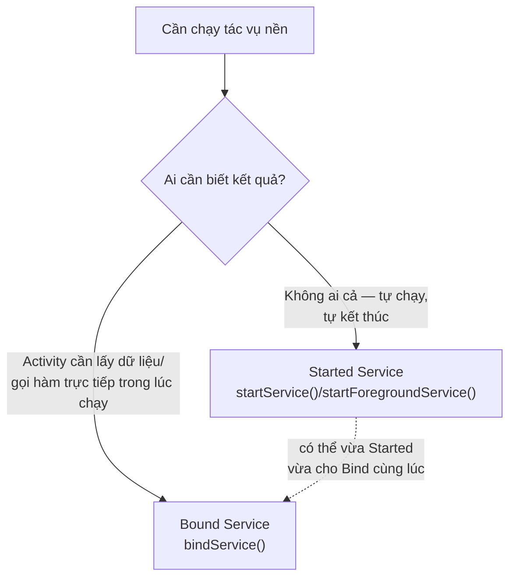
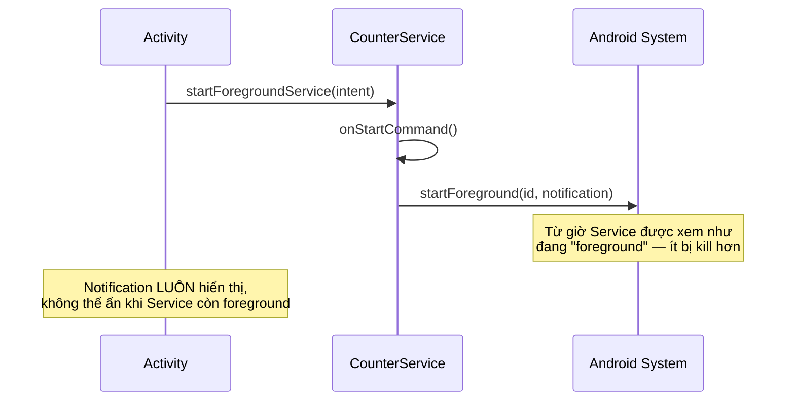

# Chương 16: Service & foreground service

## Mục tiêu học

- Hiểu `Service` là gì — và điều nó KHÔNG phải: không tự động chạy trên thread riêng, không phải "mini Activity không giao diện".
- Phân biệt Service dạng **started** và dạng **bound**, biết khi nào dùng loại nào.
- Hiểu vì sao **foreground service** ra đời và bắt buộc phải có notification liên tục.
- Biết `startForegroundService()` khác `startService()` ở đâu, và giới hạn chạy nền từ Android 8+.

> Code mẫu: `code/ch16-service/`.

## 16.1 Ngộ nhận đầu tiên: Service KHÔNG tự chạy trên thread riêng

Đây là hiểu lầm phổ biến nhất với người mới: `Service` chỉ là một **thành phần có vòng đời riêng, được hệ thống ưu tiên giữ sống lâu hơn Activity thông thường** — mọi callback của nó (`onCreate`, `onStartCommand`...) mặc định vẫn chạy trên **main thread**, giống hệt Activity. Muốn làm việc nặng, bạn vẫn phải tự tạo thread/Executor bên trong Service, đúng như đã làm với Room (Chương 13) hay file I/O (Chương 14).

## 16.2 Hai kiểu Service



Code mẫu chương này minh hoạ **cả hai cùng lúc** trên một `CounterService`: khởi động bằng `startForegroundService()` (chạy độc lập, đếm số giây), đồng thời cho phép `MainActivity` `bindService()` vào để đọc số đếm hiện tại trực tiếp — không cần disk, không cần Intent, chỉ cần gọi hàm Java bình thường qua `Binder`.

## 16.3 Started Service — tự chạy, không cần ai bind

```java
Intent intent = new Intent(this, CounterService.class);
ContextCompat.startForegroundService(this, intent);
```

Sau khi gọi, `CounterService.onStartCommand()` chạy — Service **tiếp tục tồn tại** cho tới khi tự gọi `stopSelf()` hoặc bị `stopService()` từ bên ngoài, **kể cả khi Activity đã bị đóng**. Giá trị trả về của `onStartCommand()` quyết định hành vi khi hệ thống buộc phải kill tiến trình để giải phóng bộ nhớ:

| Giá trị trả về | Hành vi sau khi bị kill |
|---|---|
| `START_STICKY` | Hệ thống tự khởi động lại Service (intent = `null`) — dùng cho tác vụ nên tiếp tục (như code mẫu) |
| `START_NOT_STICKY` | Không tự khởi động lại — dùng cho tác vụ chỉ cần chạy một lần |
| `START_REDELIVER_INTENT` | Tự khởi động lại VÀ gửi lại đúng Intent ban đầu — dùng khi cần biết lại tham số gốc |

## 16.4 Bound Service — Activity gọi hàm trực tiếp

```java
public class LocalBinder extends Binder {
    public CounterService getService() {
        return CounterService.this;
    }
}

@Nullable
@Override
public IBinder onBind(Intent intent) {
    return binder;
}
```

Phía Activity:

```java
private final ServiceConnection connection = new ServiceConnection() {
    @Override
    public void onServiceConnected(ComponentName name, IBinder service) {
        CounterService.LocalBinder localBinder = (CounterService.LocalBinder) service;
        boundService = localBinder.getService();
        boundService.setListener(MainActivity.this);
    }
    @Override
    public void onServiceDisconnected(ComponentName name) { ... }
};

bindService(intent, connection, Context.BIND_AUTO_CREATE);
```

`LocalBinder` chỉ hoạt động vì Activity và Service **chạy trong cùng một tiến trình** (cùng app) — gọi thẳng phương thức Java, không qua serialization nào. Giao tiếp giữa hai tiến trình khác nhau (hai app riêng biệt) cần cơ chế khác hẳn: AIDL, sẽ học ở Chương 34.

**Điểm dễ nhầm nhất**: `unbindService()` **không** làm Service dừng nếu nó đã được khởi động bằng `startForegroundService()` — Service (và notification) tiếp tục chạy độc lập. Chỉ `stopSelf()`/`stopService()` mới thực sự dừng nó.

## 16.5 Foreground Service — vì sao bắt buộc có notification?



Trước Android 8, một app có thể âm thầm chạy Service nền vô thời hạn — nguồn gốc của nhiều app "ăn pin" mà người dùng không biết lý do. Từ Android 8 (API 26), Google **giới hạn mạnh** việc chạy Service nền thông thường, và bắt buộc: muốn chạy tác vụ dài hơi mà người dùng có thể nhận biết, phải dùng **foreground service** — đổi lại được ưu tiên không bị hệ thống kill, nhưng **bắt buộc hiển thị notification liên tục** để người dùng luôn biết app đang làm gì:

```java
@Override
public int onStartCommand(Intent intent, int flags, int startId) {
    // Bắt buộc gọi trong vài giây đầu — trễ hơn sẽ bị hệ thống coi là lỗi (ANR)
    startForeground(NOTIFICATION_ID, buildNotification());
    ...
}
```

Từ Android 14 (API 34), còn phải khai báo rõ **loại** foreground service trong manifest (`android:foregroundServiceType`) — hệ thống áp dụng ràng buộc khác nhau tuỳ loại (ví dụ loại `location` cho phép chạy lâu hơn loại thông thường, nhưng đòi hỏi quyền vị trí tương ứng — liên quan tới Chương 37).

```xml
<service
    android:name=".CounterService"
    android:exported="false"
    android:foregroundServiceType="dataSync" />
```

## Bài tập

1. Chạy code mẫu, bấm Bắt đầu, rời khỏi app (Home) — quan sát notification tiếp tục cập nhật số đếm mỗi giây dù không có màn hình nào của app hiển thị.
2. Mở lại app, quan sát `textCount` đồng bộ ngay với số hiện tại của Service (nhờ `bindService()` đọc trực tiếp `getCount()`).
3. Thử đổi `START_STICKY` thành `START_NOT_STICKY`, mô tả tình huống hành vi sẽ khác nhau (không cần code thêm, chỉ cần giải thích bằng lời dựa vào bảng ở mục 16.3).

## Lỗi thường gặp

- **Gọi `startService()` thay vì `startForegroundService()` khi target Android 8+, rồi gọi `startForeground()` trễ**: hệ thống ném `ForegroundServiceDidNotStartInTimeException`, app bị crash.
- **Quên khai báo `foregroundServiceType` trên Android 14+**: crash ngay khi gọi `startForeground()` với thông báo lỗi rõ ràng về thiếu type.
- **Tưởng `bindService()` một mình đủ để Service chạy nền bền vững**: sai — Service chỉ sống bằng đúng thời gian còn ít nhất một client bind, trừ khi cũng được start bằng `startService()`/`startForegroundService()` (chính là lý do code mẫu dùng cả hai).
- **Không huỷ đăng ký listener (`setListener(null)`) khi Activity dừng bind**: giữ tham chiếu Activity trong Service lâu hơn cần thiết — rò rỉ bộ nhớ, cùng nguyên tắc với Chương 12/15.

## Tóm tắt & tiếp theo

Bạn đã biết chạy tác vụ nền dài hơi, đúng luật của Android hiện đại (foreground service + notification bắt buộc). Chương 17 giới thiệu `BroadcastReceiver` — cách lắng nghe sự kiện hệ thống (như thay đổi pin, kết nối mạng) và giao tiếp giữa các thành phần bằng broadcast.
