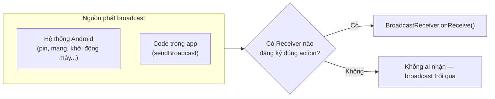

# Chương 17: BroadcastReceiver, hệ thống sự kiện của Android

## Mục tiêu học

- Hiểu `BroadcastReceiver` là gì, và Android dùng nó để thông báo sự kiện hệ thống ra sao.
- Phân biệt đăng ký receiver qua manifest và đăng ký động (runtime) — biết vì sao cách đầu gần như không còn dùng được.
- Gửi và nhận được broadcast tự định nghĩa trong phạm vi app của mình.
- Hiểu khái niệm "sticky broadcast" qua ví dụ pin thiết bị.

> Code mẫu: `code/ch17-broadcast-receiver/`.

## 17.1 BroadcastReceiver là gì?

`BroadcastReceiver` là một thành phần lắng nghe **thông điệp phát rộng (broadcast)** — có thể do hệ thống Android phát ra (pin thay đổi, kết nối mạng đổi, thiết bị khởi động xong...), hoặc do chính app tự phát ra để các phần khác trong app phản ứng lại.



## 17.2 Đăng ký động (runtime) — cách chuẩn hiện nay

```java
private final BroadcastReceiver batteryReceiver = new BroadcastReceiver() {
    @Override
    public void onReceive(Context context, Intent intent) {
        int level = intent.getIntExtra(BatteryManager.EXTRA_LEVEL, -1);
        int scale = intent.getIntExtra(BatteryManager.EXTRA_SCALE, -1);
        int percent = Math.round(level * 100f / scale);
        // cập nhật UI
    }
};

@Override
protected void onStart() {
    super.onStart();
    ContextCompat.registerReceiver(this, batteryReceiver,
            new IntentFilter(Intent.ACTION_BATTERY_CHANGED),
            ContextCompat.RECEIVER_NOT_EXPORTED);
}

@Override
protected void onStop() {
    super.onStop();
    unregisterReceiver(batteryReceiver);
}
```

Đăng ký trong `onStart()`/huỷ trong `onStop()` — cùng nguyên tắc với listener ở Chương 12: receiver chỉ nên "sống" khi Activity thật sự đang hiển thị, tránh nhận sự kiện và giữ tham chiếu Activity không cần thiết khi app đã ẩn.

Tham số cuối `RECEIVER_NOT_EXPORTED` (bắt buộc khai báo rõ từ Android 13/API 33) nghĩa là **chỉ app của chính mình mới gửi broadcast tới được receiver này** — dùng `RECEIVER_EXPORTED` nếu bạn thật sự cần app khác gửi broadcast tới (hiếm gặp, và cần cân nhắc kỹ về bảo mật).

## 17.3 Vì sao không đăng ký qua `AndroidManifest.xml` nữa?

Tài liệu cũ hay dạy khai báo receiver tĩnh trong manifest:

```xml
<!-- CÁCH CŨ — không còn hoạt động với hầu hết broadcast hệ thống từ Android 8+ -->
<receiver android:name=".MyReceiver">
    <intent-filter>
        <action android:name="android.intent.action.BATTERY_CHANGED" />
    </intent-filter>
</receiver>
```

Từ Android 8 (API 26), Google giới hạn mạnh: **hầu hết implicit broadcast hệ thống không còn đánh thức được receiver khai báo tĩnh trong manifest** — lý do tương tự Chương 16 (chống app âm thầm chạy nền tốn pin). `ACTION_BATTERY_CHANGED` thậm chí **chưa bao giờ** hỗ trợ đăng ký qua manifest, kể cả trước Android 8 — bắt buộc phải đăng ký động như mục 17.2. Quy tắc thực dụng: **luôn đăng ký động trong code**, chỉ tra cứu ngoại lệ hiếm hoi (như `BOOT_COMPLETED`) khi thật sự cần nhận sự kiện lúc app chưa chạy.

## 17.4 Gửi broadcast tự định nghĩa trong app

```java
Intent intent = new Intent(PingReceiver.ACTION_PING);
intent.putExtra(PingReceiver.EXTRA_SEQUENCE, ++pingSequence);
intent.setPackage(getPackageName());   // giới hạn trong phạm vi app của mình
sendBroadcast(intent);
```

`setPackage(getPackageName())` là bước quan trọng: từ Android 8+, một broadcast implicit (không set package) với action tự định nghĩa **có thể không tới được receiver nào cả** nếu hệ thống coi nó là broadcast "công khai" bị giới hạn. Giới hạn rõ ràng vào package của chính mình vừa an toàn hơn (không app lạ nào nhận được), vừa đảm bảo hoạt động nhất quán.

> Lưu ý: nếu chỉ cần giao tiếp **giữa các thành phần trong cùng một app** (ví dụ Activity với Activity, hay với Service), các chương sau sẽ giới thiệu những cách trực tiếp và gọn hơn broadcast rất nhiều — `LiveData`/callback đơn giản (đã dùng ở Chương 16), hay `ViewModel` chia sẻ (Chương 28). Broadcast phù hợp nhất khi cần lắng nghe sự kiện **hệ thống**, hoặc giao tiếp **giữa các app khác nhau** (liên quan Chương 32–33).

## 17.5 Sticky broadcast — vì sao pin hiện đúng ngay cả khi không đổi?

`ACTION_BATTERY_CHANGED` là một **sticky broadcast**: hệ thống luôn giữ sẵn Intent chứa giá trị mới nhất, nên **đăng ký receiver vào bất kỳ lúc nào** cũng nhận được giá trị hiện tại ngay lập tức — không cần đợi tới lần pin thay đổi tiếp theo. Đây là lý do code mẫu hiển thị đúng % pin ngay khi mở app, dù không có sự kiện pin nào vừa xảy ra.

## Bài tập

1. Chạy code mẫu, quan sát % pin hiển thị ngay khi mở app.
2. Bấm nút gửi tín hiệu vài lần liên tiếp, xác nhận bộ đếm và số thứ tự đúng.
3. Thử xoá dòng `intent.setPackage(getPackageName())`, build lại, kiểm tra xem tín hiệu còn được nhận trên máy ảo của bạn không (kết quả có thể khác nhau tuỳ phiên bản Android, đó chính là lý do nên luôn set package tường minh thay vì phụ thuộc hành vi ngầm định).

## Lỗi thường gặp

- **Quên `unregisterReceiver()`**: rò rỉ Activity, và tệ hơn — receiver vẫn tiếp tục chạy xử lý sự kiện dù màn hình đã ẩn từ lâu.
- **Gọi `unregisterReceiver()` hai lần (hoặc khi chưa từng đăng ký)**: ném `IllegalArgumentException: Receiver not registered` — đảm bảo cặp đăng ký/huỷ đăng ký luôn khớp nhau (`onStart`/`onStop`, không lệch sang `onCreate`/`onDestroy` rồi quên).
- **Kỳ vọng receiver khai báo tĩnh trong manifest vẫn nhận được broadcast hệ thống**: hầu hết không còn hoạt động từ Android 8+, xem mục 17.3.
- **Gửi broadcast implicit không giới hạn package cho giao tiếp nội bộ app**: hành vi không nhất quán giữa các phiên bản Android, dễ tạo lỗ hổng để app khác giả mạo gửi broadcast trùng action vào app của bạn.

## Tóm tắt & tiếp theo

Bạn đã biết lắng nghe sự kiện hệ thống và tự định nghĩa broadcast riêng khi cần. Chương 18 giới thiệu `WorkManager` — công cụ hiện đại để lên lịch tác vụ nền có điều kiện (chỉ chạy khi có mạng, khi đang sạc...), đảm bảo chạy được kể cả khi app đã đóng hoặc thiết bị khởi động lại.
