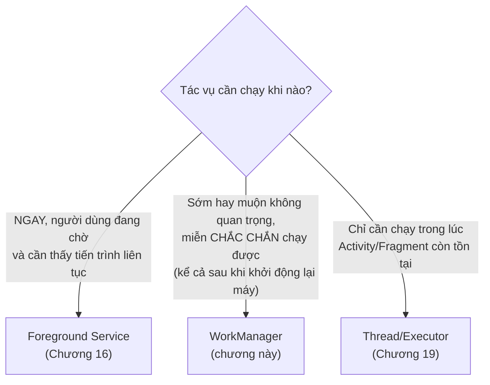
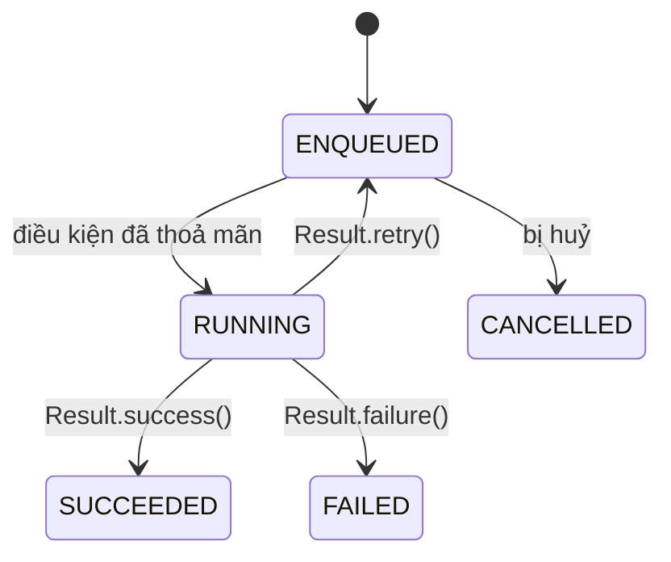

# Chương 18: WorkManager (tác vụ nền có lịch/điều kiện)

## Mục tiêu học

- Hiểu WorkManager giải quyết bài toán gì mà Service (Chương 16) không phù hợp.
- Viết được một `Worker`, chạy một lần (`OneTimeWorkRequest`) với ràng buộc điều kiện (`Constraints`).
- Theo dõi trạng thái công việc qua `WorkInfo` và `LiveData`.
- Biết cú pháp `PeriodicWorkRequest` và giới hạn chu kỳ tối thiểu.

> Code mẫu: `code/ch18-workmanager/`.

## 18.1 WorkManager khác Service ở đâu?



WorkManager phù hợp cho tác vụ như: đồng bộ dữ liệu định kỳ, upload log, nén ảnh trước khi gửi — **không cần chạy ngay lập tức**, nhưng **phải đảm bảo chạy được**, kể cả khi app đã bị đóng hoàn toàn hoặc thiết bị vừa khởi động lại. WorkManager tự chọn cơ chế phù hợp nhất bên dưới tuỳ phiên bản Android (JobScheduler, AlarmManager...) — bạn chỉ cần lập trình với một API duy nhất, không cần tự xử lý khác biệt giữa các phiên bản.

## 18.2 Viết một `Worker`

```java
public class SyncWorker extends Worker {

    public SyncWorker(@NonNull Context context, @NonNull WorkerParameters params) {
        super(context, params);
    }

    @NonNull
    @Override
    public Result doWork() {
        // Chạy trên thread nền do WorkManager tự quản lý — an toàn Thread.sleep(),
        // gọi mạng trực tiếp, không cần tự tạo Executor như Chương 13/14.
        Thread.sleep(3000);

        Data output = new Data.Builder()
                .putString("synced_at", "12:00:00")
                .build();
        return Result.success(output);
    }
}
```

Ba giá trị `Result` có thể trả về: `Result.success(data)` (xong, có thể kèm dữ liệu output), `Result.failure()` (thất bại hẳn, không thử lại), `Result.retry()` (thất bại tạm thời, WorkManager tự lên lịch thử lại sau).

## 18.3 Ràng buộc điều kiện (`Constraints`)

```java
Constraints constraints = new Constraints.Builder()
        .setRequiredNetworkType(NetworkType.CONNECTED)
        .build();

OneTimeWorkRequest request = new OneTimeWorkRequest.Builder(SyncWorker.class)
        .setConstraints(constraints)
        .build();

WorkManager.getInstance(context).enqueue(request);
```

WorkManager tự chờ tới khi điều kiện thoả mãn mới thật sự chạy `doWork()` — ví dụ `NetworkType.CONNECTED` khiến công việc bị giữ ở trạng thái `ENQUEUED` cho tới khi thiết bị có mạng, hoàn toàn tự động, không cần bạn tự kiểm tra kết nối mạng thủ công. Các ràng buộc khác thường dùng: `setRequiresCharging(true)`, `setRequiresBatteryNotLow(true)`, `setRequiresDeviceIdle(true)`.

## 18.4 Theo dõi trạng thái bằng `WorkInfo`



```java
workManager.getWorkInfoByIdLiveData(request.getId()).observe(this, workInfo -> {
    if (workInfo.getState() == WorkInfo.State.SUCCEEDED) {
        String syncedAt = workInfo.getOutputData().getString("synced_at");
        // cập nhật UI
    }
});
```

Trạng thái công việc được WorkManager **lưu xuống database nội bộ riêng** — vẫn tồn tại kể cả khi Activity đang quan sát nó bị huỷ và tạo lại (xoay màn hình, Chương 6), hoặc kể cả khi cả app bị đóng hoàn toàn rồi mở lại.

## 18.5 `PeriodicWorkRequest` — lặp lại định kỳ

```java
PeriodicWorkRequest request = new PeriodicWorkRequest.Builder(SyncWorker.class, 15, TimeUnit.MINUTES)
        .setConstraints(constraints)
        .build();

workManager.enqueueUniquePeriodicWork(
        "periodic_sync", ExistingPeriodicWorkPolicy.KEEP, request);
```

Hai điểm quan trọng cần nhớ:

- **Chu kỳ tối thiểu là 15 phút** — đặt số nhỏ hơn, WorkManager tự động nâng lên 15 phút mà không báo lỗi. Đây không phải giới hạn kỹ thuật ngẫu nhiên mà là chính sách có chủ đích của Android để hạn chế app đánh thức máy quá thường xuyên, tốn pin.
- `enqueueUniquePeriodicWork` với `ExistingPeriodicWorkPolicy.KEEP` đảm bảo dù gọi hàm này nhiều lần (ví dụ mỗi lần mở app), **chỉ một lịch chạy định kỳ duy nhất tồn tại** — tránh tạo hàng chục bản lặp trùng nếu người dùng mở app nhiều lần.

## Bài tập

1. Chạy code mẫu, bấm **Đồng bộ ngay**, quan sát đúng trình tự trạng thái ENQUEUED → RUNNING → SUCCEEDED trong khoảng 3 giây.
2. Bật chế độ máy bay trước khi bấm nút — xác nhận trạng thái dừng lại ở ENQUEUED cho tới khi tắt chế độ máy bay.
3. Sửa `SyncWorker.doWork()` để thỉnh thoảng trả về `Result.retry()` (ví dụ dựa vào `getRunAttemptCount()` để giả lập thất bại ở lần thử đầu), quan sát WorkManager tự động chạy lại.

## Lỗi thường gặp

- **Kỳ vọng `OneTimeWorkRequest` chạy NGAY LẬP TỨC**: WorkManager có thể trì hoãn một chút để tối ưu pin/hệ thống, không đảm bảo chạy tức thời như gọi hàm bình thường — không phù hợp cho việc cần phản hồi ngay (dùng Executor, Chương 19, cho trường hợp đó).
- **Không dùng `enqueueUniquePeriodicWork`**: gọi `enqueuePeriodicWork` thông thường nhiều lần tạo ra nhiều lịch chạy song song, gây tác vụ chạy trùng lặp không kiểm soát.
- **Đặt chu kỳ `PeriodicWorkRequest` nhỏ hơn 15 phút rồi thắc mắc sao chạy chậm hơn khai báo**: đây là hành vi đã định, không phải lỗi — xem lại mục 18.5.
- **Làm việc nặng trực tiếp trên `doWork()` mà không xử lý `InterruptedException`**: WorkManager có thể huỷ Worker giữa chừng (ví dụ hệ thống cần tài nguyên gấp) — nên kiểm tra khả năng dừng sớm với tác vụ dài, tương tự nguyên tắc huỷ Thread ở Chương 19.

## Tóm tắt & tiếp theo

Bạn đã có công cụ đúng đắn cho tác vụ nền cần đảm bảo chạy được, có điều kiện, có thể định kỳ. Chương 19 lùi lại một bước, hệ thống hoá các lựa chọn xử lý bất đồng bộ trong Android (`Thread`, `Handler`, `Executor`) mà sách đã dùng rải rác từ Chương 13 tới giờ.
