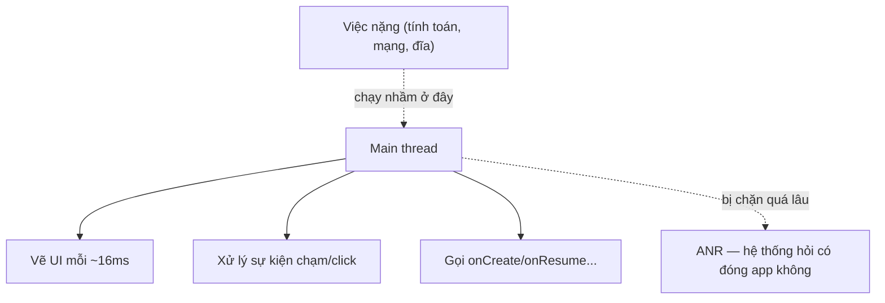
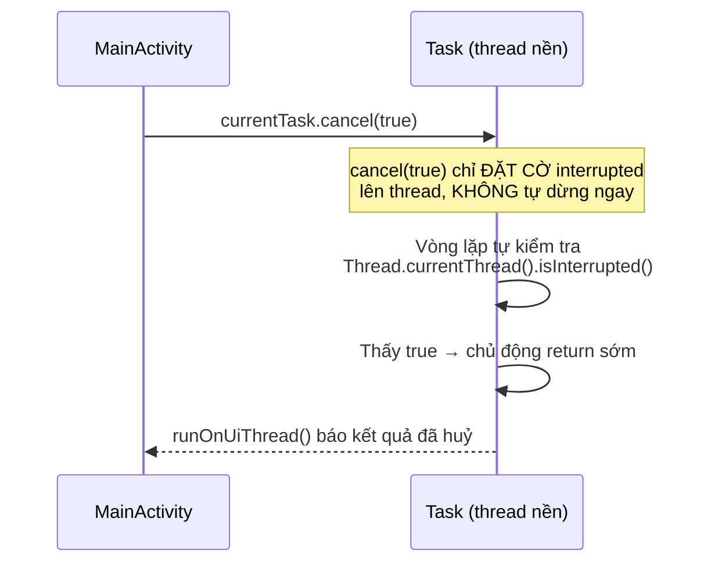

# Chương 19: Xử lý bất đồng bộ — Thread/Executor (Java) và Coroutine (mở rộng Kotlin)

## Mục tiêu học

- Hệ thống hoá lại một nguyên tắc đã lặp lại từ Chương 13: **không làm việc nặng trên main thread**.
- Hiểu vì sao dùng `ExecutorService` thay vì tự tạo `Thread` trực tiếp trong hầu hết trường hợp.
- Biết cách huỷ một tác vụ nền đúng cách (cooperative cancellation), không phải "giết" thread thô bạo.
- Biết `AsyncTask` đã lỗi thời, và Kotlin Coroutine tồn tại như một hướng thay thế hiện đại (ngoài phạm vi code Java của sách).

> Code mẫu: `code/ch19-async-thread-executor/`.

## 19.1 Vì sao main thread quan trọng đến vậy?

Android vẽ lại giao diện khoảng 60 lần/giây (mỗi khung hình ~16ms) — toàn bộ việc này chạy trên **một thread duy nhất gọi là main thread** (cũng là thread chạy mọi callback vòng đời Activity/Fragment, mọi `onClickListener`). Bất kỳ đoạn code nào chạy quá lâu trên thread này đều làm khung hình bị bỏ lỡ (giật, lag) — và nếu chặn quá ~5 giây, hệ thống hiện hộp thoại "Ứng dụng không phản hồi" (ANR) rồi có thể tự đóng app.



Đây chính là lý do xuyên suốt sách luôn nhấn mạnh: Room (Chương 13) tự chặn bạn làm sai, file I/O (Chương 14) và giờ là mọi tính toán nặng đều cần chuyển ra khỏi main thread.

## 19.2 `Thread` thô — hoạt động nhưng thiếu kiểm soát

```java
new Thread(() -> {
    int result = doHeavyWork();
    runOnUiThread(() -> textResult.setText(String.valueOf(result)));
}).start();
```

Cách này **đúng về nguyên tắc** (việc nặng chạy ngoài main thread, cập nhật UI quay lại qua `runOnUiThread()`), nhưng có vấn đề khi dùng ở quy mô lớn hơn: mỗi `new Thread()` tạo ra một thread hệ điều hành thật (tốn tài nguyên để tạo/huỷ), không có cơ chế quản lý số lượng thread đang chạy cùng lúc, và không dễ huỷ giữa chừng một cách có tổ chức.

## 19.3 `ExecutorService` — quản lý thread có tổ chức

```java
private final ExecutorService executor = Executors.newSingleThreadExecutor();

currentTask = executor.submit(() -> {
    int result = PrimeCounter.countPrimes(limit, percent ->
            runOnUiThread(() -> binding.progressBar.setProgress(percent)));
    runOnUiThread(() -> binding.textStatus.setText("Xong: " + result));
});
```

`Executors.newSingleThreadExecutor()` tạo ra **một thread nền duy nhất, tái sử dụng** cho mọi task gửi vào qua `submit()` — task xếp hàng chạy tuần tự, không tạo/huỷ thread liên tục như cách 19.2. Executor cũng đã được dùng ở Chương 13 (Room) và Chương 14 (file I/O) — chương này chính thức hệ thống hoá lại mẫu đó.

Vài loại Executor thường gặp:

| Loại | Khi nào dùng |
|---|---|
| `Executors.newSingleThreadExecutor()` | Các task cần chạy TUẦN TỰ, không chồng chéo (như code mẫu) |
| `Executors.newFixedThreadPool(n)` | Nhiều task độc lập, muốn chạy song song có giới hạn |
| `Executors.newCachedThreadPool()` | Nhiều task ngắn, số lượng biến động — cẩn thận có thể tạo quá nhiều thread nếu dùng sai |

## 19.4 Huỷ tác vụ đúng cách — "hợp tác", không "ép buộc"



```java
public static int countPrimes(int limit, ProgressCallback callback) {
    int count = 0;
    for (int n = 2; n <= limit; n++) {
        if (Thread.currentThread().isInterrupted()) {
            return count;   // dừng SỚM một cách chủ động
        }
        if (isPrime(n)) count++;
    }
    return count;
}
```

Điểm quan trọng nhất chương này: `Future.cancel(true)` **không có phép màu nào tự dừng vòng lặp đang chạy** — nó chỉ gọi `Thread.interrupt()`, đặt một cờ nội bộ lên. Code bên trong task phải **tự nguyện kiểm tra** cờ đó (`isInterrupted()`) tại những điểm hợp lý (ở đây là đầu mỗi vòng lặp) và tự quyết định dừng. Bỏ qua bước kiểm tra này, `cancel(true)` gọi xong nhưng vòng lặp vẫn chạy tới hết — hiện tượng "bấm Huỷ mà không huỷ" rất khó hiểu nếu không biết cơ chế này.

## 19.5 `AsyncTask` đã lỗi thời — vì sao không dùng?

Nhiều tài liệu cũ dạy `AsyncTask` — lớp này đã bị Google **đánh dấu deprecated (API 30) và gỡ bỏ hoàn toàn khỏi Android 13 SDK**. Lý do: hành vi chạy tuần tự/song song của nó thay đổi khó lường giữa các phiên bản Android, và dễ gây rò rỉ Activity nếu dùng sai. Nếu gặp code cũ dùng `AsyncTask`, nên chuyển sang `ExecutorService` (như chương này) hoặc `WorkManager` (Chương 18) tuỳ tình huống.

## 19.6 Kotlin Coroutine — hướng đi hiện đại (ngoài phạm vi code Java)

Cộng đồng Android hiện đại phần lớn đã chuyển sang **Kotlin Coroutines** cho xử lý bất đồng bộ — cú pháp gần giống code đồng bộ thông thường (`suspend fun`) nhưng chạy không chặn thread, tích hợp sẵn cơ chế huỷ (`cancel()` hợp tác tương tự mục 19.4 nhưng được ngôn ngữ hỗ trợ trực tiếp) và xử lý lỗi gọn hơn nhiều so với callback lồng nhau. Sách này viết bằng Java nên không đi sâu vào cú pháp Coroutine, nhưng **nên biết tên và khái niệm này tồn tại** — nếu sau này chuyển một phần project sang Kotlin (hoàn toàn có thể làm xen kẽ trong cùng một project Android), đây là hướng đáng tìm hiểu tiếp theo.

## Bài tập

1. Chạy code mẫu, bấm Bắt đầu rồi bấm Huỷ giữa chừng — xác nhận số lượng nguyên tố hiển thị đúng bằng số đã đếm được TỚI THỜI ĐIỂM huỷ, không phải 0.
2. Thử xoá dòng kiểm tra `Thread.currentThread().isInterrupted()` trong `PrimeCounter.countPrimes()`, build lại — bấm Huỷ và quan sát tác vụ vẫn chạy tới hết (minh chứng trực tiếp cho mục 19.4).
3. Đổi `Executors.newSingleThreadExecutor()` thành `Executors.newFixedThreadPool(2)`, thử bấm Bắt đầu hai lần liên tiếp với hai giá trị giới hạn khác nhau — quan sát cả hai cùng chạy song song thay vì xếp hàng.

## Lỗi thường gặp

- **Cập nhật View trực tiếp từ trong task chạy trên Executor** (quên `runOnUiThread()`): ném `CalledFromWrongThreadException` ngay lập tức — Android chủ động chặn hành vi này, tương tự tinh thần bảo vệ của Room ở Chương 13.
- **Tưởng `cancel(true)` dừng tác vụ ngay lập tức**: sai, xem mục 19.4 — tác vụ chỉ dừng nếu chủ động kiểm tra cờ interrupted.
- **Không gọi `executor.shutdown()`/`shutdownNow()` khi Activity bị huỷ**: executor (và thread nó tạo ra) tiếp tục tồn tại dù không còn Activity nào cần tới, rò rỉ tài nguyên.
- **Dùng `AsyncTask` trong code mới**: đã bị gỡ khỏi SDK ở các phiên bản Android mới — code sẽ không biên dịch được nếu compileSdk đủ mới.

## Tóm tắt & tiếp theo

Bạn đã có bộ công cụ đầy đủ cho xử lý bất đồng bộ trong Java: `Executor` để chạy nền có tổ chức, và cơ chế huỷ hợp tác đúng cách. Chương 20 khép lại Phần 3 với `Notification` — cách giao tiếp với người dùng ngay cả khi app không ở foreground, đã dùng sơ bộ ở Chương 16, giờ sẽ đi sâu đầy đủ.
