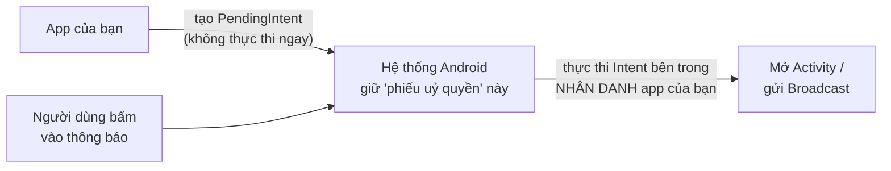

# Chương 20: Notification

## Mục tiêu học

- Tạo `NotificationChannel` đúng cách, hiểu vì sao không thể đổi importance bằng code sau khi tạo.
- Xây một notification đầy đủ: tiêu đề, nội dung dài (`BigTextStyle`), tap để mở app, nút hành động xử lý ngay trên thông báo.
- Hiểu `PendingIntent` là gì và vì sao nó khác `Intent` thường.
- Xin đúng quyền `POST_NOTIFICATIONS` (Android 13+).

> Code mẫu: `code/ch20-notification/` — dùng lại và mở rộng notification đã xuất hiện sơ bộ ở Chương 16.

## 20.1 `NotificationChannel` — bắt buộc từ Android 8

```java
NotificationChannel channel = new NotificationChannel(
        CHANNEL_ID,
        "Nhắc nhở",
        NotificationManager.IMPORTANCE_DEFAULT);
NotificationManager manager = getSystemService(NotificationManager.class);
manager.createNotificationChannel(channel);
```

Từ Android 8 (API 26), **mọi notification phải thuộc về một channel** — người dùng kiểm soát riêng từng channel (tắt tiếng, đổi mức độ quan trọng) qua Settings, thay vì chỉ bật/tắt toàn bộ thông báo của app như trước. Code mẫu tạo channel trong `Application.onCreate()` (Chương 6 đã giới thiệu `Application` — đây là một ví dụ thực tế cho việc "khởi tạo một lần khi app chạy" mà chương đó nói tới).

**Lưu ý quan trọng**: gọi `createNotificationChannel()` nhiều lần với cùng ID là an toàn (không tạo trùng), nhưng **một khi channel đã tồn tại, code không thể tự đổi `importance` của nó nữa** — chỉ người dùng tự đổi được trong Settings. Đặt đúng mức quan trọng ngay từ đầu, và tạo channel MỚI (ID khác) nếu cần một mức khác hẳn về sau.

## 20.2 Xây notification đầy đủ

```java
NotificationCompat.Builder builder = new NotificationCompat.Builder(context, CHANNEL_ID)
        .setSmallIcon(android.R.drawable.ic_dialog_info)
        .setContentTitle("Đừng quên ôn bài!")
        .setContentText(longText)
        .setStyle(new NotificationCompat.BigTextStyle().bigText(longText))
        .setPriority(NotificationCompat.PRIORITY_DEFAULT)
        .setAutoCancel(true);
```

`setStyle(BigTextStyle...)` cho phép người dùng kéo giãn thông báo để đọc đầy đủ nội dung dài — thiếu dòng này, nội dung dài sẽ bị cắt ngắn còn một dòng. `setAutoCancel(true)` khiến thông báo tự biến mất khi người dùng bấm vào nó (không cần tự gọi `cancel()`).

## 20.3 `PendingIntent` — "phiếu uỷ quyền" cho hệ thống



`Intent` thường thực thi ngay khi bạn gọi `startActivity()`/`sendBroadcast()`. `PendingIntent` thì khác: nó là một **"phiếu uỷ quyền"** — bạn tạo ra và trao cho hệ thống (qua notification), hệ thống giữ nó và chỉ thực thi khi có sự kiện tương ứng xảy ra (người dùng bấm vào thông báo/nút), **thực thi nhân danh app của bạn** dù lúc đó app có đang chạy hay không.

```java
Intent contentIntent = new Intent(context, MainActivity.class);
PendingIntent pendingIntent = PendingIntent.getActivity(
        context, notificationId, contentIntent,
        PendingIntent.FLAG_UPDATE_CURRENT | PendingIntent.FLAG_IMMUTABLE);
```

`FLAG_IMMUTABLE` (bắt buộc khai báo rõ từ Android 12) nghĩa là hệ thống **không được sửa đổi** nội dung Intent bên trong trước khi thực thi — chỉ dùng `FLAG_MUTABLE` khi có lý do kỹ thuật cụ thể cần hệ thống chỉnh sửa (hiếm gặp, ngoài phạm vi sách này).

## 20.4 Nút hành động ngay trên thông báo — không cần mở app

```java
Intent markReadIntent = new Intent(context, MarkReadReceiver.class);
markReadIntent.setAction(MarkReadReceiver.ACTION_MARK_READ);
PendingIntent markReadPendingIntent = PendingIntent.getBroadcast(
        context, notificationId, markReadIntent,
        PendingIntent.FLAG_UPDATE_CURRENT | PendingIntent.FLAG_IMMUTABLE);

builder.addAction(icon, "Đánh dấu đã đọc", markReadPendingIntent);
```

Đây là lúc `BroadcastReceiver` (Chương 17) và `Notification` phối hợp: bấm nút hành động gửi một broadcast, `MarkReadReceiver.onReceive()` xử lý (ở đây là huỷ notification và hiện Toast) **mà không cần mở Activity nào cả**.

**Ngoại lệ hợp lệ đối với nguyên tắc "luôn đăng ký động" ở Chương 17**: `MarkReadReceiver` phải khai báo **tĩnh** trong manifest, vì `PendingIntent` có thể được kích hoạt bất kỳ lúc nào sau này — kể cả khi tiến trình app đã bị hệ thống kill hoàn toàn, lúc đó không có Activity/Service nào đang sống để tự đăng ký receiver động.

```xml
<receiver android:name=".MarkReadReceiver" android:exported="false" />
```

## 20.5 Xin quyền `POST_NOTIFICATIONS` (Android 13+)

```java
if (Build.VERSION.SDK_INT >= Build.VERSION_CODES.TIRAMISU
        && ContextCompat.checkSelfPermission(this, Manifest.permission.POST_NOTIFICATIONS)
        != PackageManager.PERMISSION_GRANTED) {
    requestPermission.launch(Manifest.permission.POST_NOTIFICATIONS);
} else {
    sendReminderNotification();
}
```

Từ Android 13 (API 33), hiển thị BẤT KỲ notification nào cũng cần quyền runtime — dùng đúng Activity Result API đã học ở Chương 8. Chương 26 sẽ giải thích đầy đủ mô hình permission runtime của Android; ở đây chỉ cần biết notification là một trong những trường hợp cần xin quyền.

## Bài tập

1. Chạy code mẫu, thử cả hai luồng: bấm vào nội dung thông báo (mở app), và bấm nút hành động (không mở app) — quan sát khác biệt.
2. Đổi `IMPORTANCE_DEFAULT` thành `IMPORTANCE_HIGH` trong `ReminderApplication`, gỡ cài đặt app rồi cài lại (để channel cũ không còn tồn tại), quan sát thông báo mới hiện dạng "heads-up" (nổi lên đầu màn hình) thay vì chỉ nằm trong thanh trạng thái.
3. Thử bỏ `FLAG_IMMUTABLE` khỏi `PendingIntent`, build lại trên compileSdk 34 — quan sát Android Studio/Gradle có cảnh báo hoặc lỗi gì liên quan tới yêu cầu bắt buộc chỉ định rõ mutability.

## Lỗi thường gặp

- **Quên tạo `NotificationChannel` trên Android 8+**: notification không hiện ra, không có lỗi rõ ràng nào cả — rất khó debug nếu không biết trước quy tắc này.
- **Đổi `importance` của channel đã tồn tại bằng code, tưởng sẽ có tác dụng**: không có gì thay đổi — phải hướng dẫn người dùng tự vào Settings, hoặc tạo channel ID mới.
- **Dùng `sendBroadcast()`/`startActivity()` trực tiếp thay vì `PendingIntent` khi cấu hình notification**: không biên dịch được — API notification yêu cầu đúng kiểu `PendingIntent`, đây là điểm khác biệt nền tảng đã giải thích ở mục 20.3.
- **Quên xin quyền `POST_NOTIFICATIONS` trên Android 13+**: `notify()` gọi xong không ném lỗi, nhưng notification âm thầm không hiển thị — kiểm tra kỹ quyền trước khi kết luận code sai.

## Tóm tắt & tiếp theo

Bạn đã khép lại **Phần 3 — Chạy ngầm & bất đồng bộ**: Service, BroadcastReceiver, WorkManager, xử lý đa luồng, và Notification — năm mảnh ghép phối hợp chặt chẽ với nhau trong phần lớn ứng dụng Android thực tế. Phần 4 chuyển hướng sang giao tiếp mạng, bắt đầu với việc gọi HTTP API ở Chương 21.
