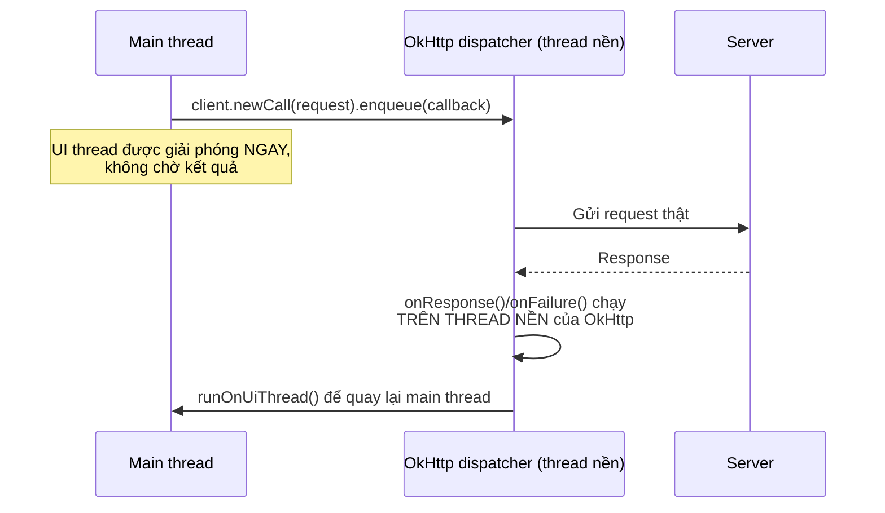

# Chương 21: Gọi HTTP với OkHttp

## Mục tiêu học

- Khai báo đúng quyền `INTERNET` và hiểu vì sao Android không tự cho phép truy cập mạng.
- Gửi được một request GET bằng OkHttp, xử lý response bất đồng bộ.
- Hiểu callback của OkHttp chạy trên thread nào — và vì sao phải `runOnUiThread()`.
- Phân biệt lỗi MẠNG (không kết nối được) với lỗi HTTP (server phản hồi nhưng báo lỗi).

> Code mẫu: `code/ch21-http-okhttp/`. Chương này cố tình dùng OkHttp thuần + parse JSON thủ công để bạn thấy rõ những gì Retrofit (Chương 22) sẽ tự động hoá giúp bạn.

## 21.1 Quyền `INTERNET`

```xml
<uses-permission android:name="android.permission.INTERNET" />
```

Đây là quyền **duy nhất trong sách không cần xin runtime** (khác `POST_NOTIFICATIONS` ở Chương 20) — chỉ cần khai báo trong manifest là đủ, vì Google xếp nó vào nhóm quyền "normal" (rủi ro thấp), sẽ giải thích đầy đủ mô hình phân loại quyền ở Chương 26. Thiếu dòng này, mọi request mạng sẽ thất bại với `SecurityException`, dù logic code hoàn toàn đúng — lỗi hay gặp nhất với người mới bắt đầu phần mạng.

## 21.2 Gửi một request GET

```java
private final OkHttpClient client = new OkHttpClient.Builder()
        .connectTimeout(10, TimeUnit.SECONDS)
        .readTimeout(10, TimeUnit.SECONDS)
        .build();

Request request = new Request.Builder()
        .url("https://jsonplaceholder.typicode.com/posts")
        .get()
        .build();

client.newCall(request).enqueue(new Callback() {
    @Override
    public void onFailure(Call call, IOException e) { ... }

    @Override
    public void onResponse(Call call, Response response) throws IOException { ... }
});
```

`OkHttpClient` nên được **tạo một lần, dùng lại cho cả app** — nó tự quản lý connection pool bên trong, tạo mới liên tục cho mỗi request sẽ lãng phí và chậm hơn hẳn. `enqueue()` gửi request bất đồng bộ (không chặn thread gọi nó) — có `execute()` đồng bộ nhưng **không bao giờ gọi trên main thread** (Android chủ động ném `NetworkOnMainThreadException` nếu bạn thử làm vậy, tương tự tinh thần bảo vệ của Room ở Chương 13).

## 21.3 Callback chạy trên thread nào?



Đây là điểm dễ nhầm nhất: callback `onResponse`/`onFailure` **không chạy trên main thread** — khác hẳn Retrofit ở Chương 22 (Retrofit tự động đưa callback về main thread khi chạy trên Android). Với OkHttp thuần, mọi cập nhật UI trong callback đều phải bọc qua `runOnUiThread()`, đúng nguyên tắc đã lặp lại xuyên suốt từ Chương 13.

```java
@Override
public void onResponse(Call call, Response response) {
    String json = response.body().string();
    List<Post> posts = parsePosts(json);
    runOnUiThread(() -> adapter.submitList(posts));  // bắt buộc
}
```

## 21.4 Hai loại lỗi khác nhau — đừng gộp chung

```java
@Override
public void onFailure(Call call, IOException e) {
    // Lỗi MẠNG: không kết nối được server (mất mạng, timeout, sai domain...)
    runOnUiThread(() -> showError("Lỗi mạng: " + e.getMessage()));
}

@Override
public void onResponse(Call call, Response response) {
    if (!response.isSuccessful()) {
        // Lỗi HTTP: SERVER ĐÃ TRẢ LỜI, nhưng với mã lỗi (404, 500...)
        runOnUiThread(() -> showError("Server trả lỗi HTTP " + response.code()));
        return;
    }
    // response.isSuccessful() true — xử lý dữ liệu bình thường
}
```

Hai tình huống cần thông báo khác nhau cho người dùng: `onFailure` nghĩa là **request chưa bao giờ tới được server** (kiểm tra lại kết nối mạng); `response.isSuccessful() == false` bên trong `onResponse` nghĩa là **server đã nhận và xử lý, nhưng trả về lỗi** (ví dụ dữ liệu không tồn tại, server đang gặp sự cố) — hai loại lỗi này cần hướng xử lý khác nhau, sẽ bàn kỹ hơn ở Chương 23.

## 21.5 Parse JSON thủ công — tại sao chương này cố tình làm "khổ"?

```java
private List<Post> parsePosts(String json) throws JSONException {
    List<Post> posts = new ArrayList<>();
    JSONArray array = new JSONArray(json);
    for (int i = 0; i < array.length(); i++) {
        JSONObject obj = array.getJSONObject(i);
        posts.add(new Post(
                obj.getInt("id"),
                obj.getInt("userId"),
                obj.getString("title"),
                obj.getString("body")));
    }
    return posts;
}
```

Với API có nhiều field, lồng nhau nhiều tầng, cách viết tay này nhanh chóng trở nên dài dòng và dễ gõ sai tên field (`"titel"` thay vì `"title"` chỉ phát hiện lúc chạy). Chương 22 giới thiệu Gson/Retrofit tự động hoá toàn bộ phần này — cố tình cho bạn thấy công việc thủ công trước để hiểu rõ **Retrofit thực chất đang làm gì bên dưới**, thay vì dùng nó như một "hộp đen".

## Bài tập

1. Chạy code mẫu, tải danh sách bài viết thành công.
2. Bật chế độ máy bay, bấm tải lại — xác nhận thấy đúng thông báo lỗi MẠNG (`onFailure`).
3. Sửa tạm `POSTS_URL` thành `".../postss"` (sai đường dẫn, JSONPlaceholder trả 404) — xác nhận thấy đúng thông báo lỗi HTTP (khác thông báo ở bài tập 2).

## Lỗi thường gặp

- **Quên khai báo `<uses-permission android:name="android.permission.INTERNET" />`**: mọi request thất bại với `SecurityException`, dễ nhầm tưởng lỗi code logic.
- **Gọi `execute()` (đồng bộ) trên main thread thay vì `enqueue()`**: crash ngay với `NetworkOnMainThreadException`.
- **Cập nhật View trực tiếp trong `onResponse`/`onFailure` mà quên `runOnUiThread()`**: `CalledFromWrongThreadException`, cùng nguyên nhân đã gặp ở Chương 19.
- **Gộp chung xử lý lỗi mạng và lỗi HTTP vào một nhánh**: người dùng nhận thông báo mơ hồ ("Có lỗi xảy ra") thay vì gợi ý hữu ích ("Kiểm tra kết nối mạng" so với "Server đang bảo trì").

## Tóm tắt & tiếp theo

Bạn đã gọi được API thật, hiểu rõ cơ chế bất đồng bộ và hai loại lỗi mạng/HTTP. Chương 22 giới thiệu Retrofit + Gson — xây lại đúng chức năng này với ít code hơn nhiều, tự động hoá phần parse JSON vừa làm thủ công ở đây.
