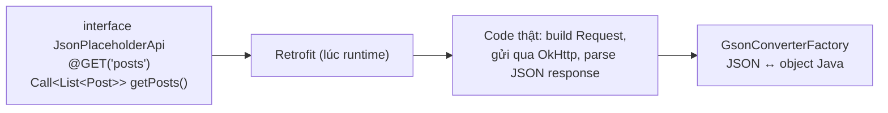

# Chương 22: Parse JSON (Gson/Moshi), mapping dữ liệu

## Mục tiêu học

- Hiểu Retrofit tự động hoá những gì bạn vừa làm thủ công ở Chương 21.
- Khai báo API bằng interface + annotation, để Retrofit tự sinh code gọi mạng.
- Dùng Gson map JSON sang object Java, xử lý trường hợp tên field khác nhau bằng `@SerializedName`.
- Biết Moshi tồn tại như một lựa chọn thay thế Gson, và khi nào nên cân nhắc.

> Code mẫu: `code/ch22-json-parsing/` — cùng chức năng với Chương 21, viết lại bằng Retrofit + Gson để so sánh trực tiếp.

## 22.1 Retrofit là gì?

Retrofit biến việc gọi API thành gọi một **hàm Java bình thường**: bạn khai báo interface mô tả API, Retrofit tự sinh code thật (dựa trên OkHttp bên dưới) để gửi request và parse response — hoàn toàn tương tự cách `@Dao` của Room (Chương 13) chỉ cần khai báo, không viết thân hàm.



## 22.2 Khai báo API bằng interface

```java
public interface JsonPlaceholderApi {
    @GET("posts")
    Call<List<Post>> getPosts();

    @GET("posts/{id}")
    Call<Post> getPost(@Path("id") int id);
}
```

`@GET("posts")` ghép với `baseUrl` thành URL đầy đủ. `@Path("id")` thay thế `{id}` trong đường dẫn bằng giá trị tham số truyền vào — Retrofit hỗ trợ tương tự cho query parameter (`@Query`), request body (`@Body`), header (`@Header`)... đủ dùng cho hầu hết REST API mà không cần tự ghép chuỗi URL bằng tay như Chương 21.

## 22.3 Khởi tạo Retrofit — một singleton dùng chung

```java
public final class ApiClient {
    private static final String BASE_URL = "https://jsonplaceholder.typicode.com/";
    private static volatile JsonPlaceholderApi api;

    public static JsonPlaceholderApi getApi() {
        if (api == null) {
            synchronized (ApiClient.class) {
                if (api == null) {
                    Retrofit retrofit = new Retrofit.Builder()
                            .baseUrl(BASE_URL)
                            .addConverterFactory(GsonConverterFactory.create())
                            .build();
                    api = retrofit.create(JsonPlaceholderApi.class);
                }
            }
        }
        return api;
    }
}
```

Mẫu singleton **giống hệt** `AppDatabase` ở Chương 13 — cùng lý do: chỉ nên có một instance Retrofit (và OkHttpClient bên dưới nó) cho toàn bộ app.

## 22.4 Gọi API — so sánh trực tiếp với Chương 21

```java
ApiClient.getApi().getPosts().enqueue(new Callback<List<Post>>() {
    @Override
    public void onResponse(Call<List<Post>> call, Response<List<Post>> response) {
        if (response.isSuccessful() && response.body() != null) {
            adapter.submitList(response.body());   // đã là List<Post>, không cần tự parse!
        }
    }

    @Override
    public void onFailure(Call<List<Post>> call, Throwable t) {
        showError(t.getMessage());
    }
});
```

Hai khác biệt quan trọng so với OkHttp thuần (Chương 21):

1. **Không còn bước parse JSON thủ công** — `response.body()` đã là `List<Post>` sẵn.
2. **Callback chạy thẳng trên main thread** khi dùng trên Android — không cần `runOnUiThread()` nữa, Retrofit tự phát hiện đang chạy trên Android và tự động đưa callback về đúng main thread.

## 22.5 `@SerializedName` — khi tên field Java khác tên key JSON

```java
public class Post {
    public int id;

    @SerializedName("userId")   // JSON dùng "userId", ta muốn field Java tên khác
    public int authorId;

    public String title;
    public String body;
}
```

Gson mặc định map field JSON và field Java **cùng tên** — field nào không khớp tên sẽ bị bỏ qua (không lỗi, chỉ âm thầm giữ giá trị mặc định). `@SerializedName("tên-key-json")` cho phép đặt tên field Java theo ý muốn (rõ nghĩa hơn, đúng convention đặt tên của bạn) mà vẫn map đúng dữ liệu.

## 22.6 Moshi — lựa chọn thay thế Gson

Moshi (cũng của Square, cùng nhà với Retrofit/OkHttp) là một thư viện parse JSON khác, thường được nhắc tới như lựa chọn thay thế Gson. Cú pháp tương tự, dùng annotation `@Json(name = "...")` thay cho `@SerializedName`, và cần đổi converter factory:

```groovy
implementation 'com.squareup.retrofit2:converter-moshi:2.11.0'
```

```java
Retrofit retrofit = new Retrofit.Builder()
        .baseUrl(BASE_URL)
        .addConverterFactory(MoshiConverterFactory.create())
        .build();
```

Khác biệt thực dụng: Moshi kiểm tra chặt hơn (mặc định coi field thiếu là lỗi thay vì âm thầm bỏ qua như Gson), và hiệu năng nhỉnh hơn ở một số benchmark. Với quy mô project trong sách này, cả hai đều dùng tốt — Gson được chọn làm mặc định vì phổ biến hơn trong tài liệu tiếng Việt và dễ tiếp cận hơn cho người mới.

## Bài tập

1. Chạy code mẫu, xác nhận `authorId` hiển thị đúng giá trị `userId` gốc từ JSON.
2. Thêm một field mới vào `Post` khớp tên JSON có sẵn (ví dụ không có trong API này, thử thêm field `email` không tồn tại) — quan sát Gson gán giá trị `null` mặc định thay vì báo lỗi, khác hành vi bạn có thể ngờ.
3. So sánh trực tiếp số dòng code giữa `MainActivity.java` của Chương 21 và Chương 22 — liệt kê những phần đã biến mất.

## Lỗi thường gặp

- **Gõ sai giá trị trong `@SerializedName`**: field Java âm thầm nhận giá trị mặc định (`0`, `null`) mà không có lỗi báo — luôn double-check tên field JSON thực tế (xem response mẫu từ Postman/trình duyệt trước khi viết model).
- **Quên `addConverterFactory(GsonConverterFactory.create())`**: Retrofit không biết cách chuyển JSON thành object, ném lỗi runtime ngay khi gọi API đầu tiên.
- **Trộn lẫn kiểu dữ liệu** (khai báo field Java là `int` nhưng JSON trả về chuỗi `"123"`): Gson khá khoan dung và tự chuyển đổi được nhiều trường hợp, nhưng không phải luôn luôn — kiểm tra kỹ khi gặp `JsonSyntaxException`.
- **Dùng `response.body()` mà không kiểm tra `null`**: một số trường hợp server trả `204 No Content` hoặc lỗi bất thường khiến `body()` là `null` dù `isSuccessful()` vẫn `true`.

## Tóm tắt & tiếp theo

Bạn đã thấy Retrofit + Gson giảm tải đáng kể công việc gọi API so với làm thủ công. Chương 23 khép lại Phần 4 với chủ đề xử lý lỗi mạng bài bản hơn, chiến lược retry, và cache offline-first — kết hợp lại với Room (Chương 13) để app vẫn dùng được khi mất mạng.
