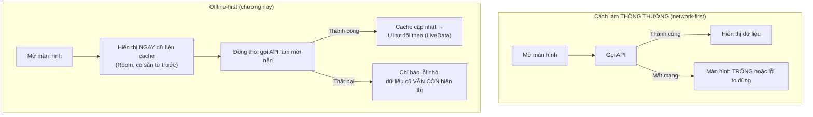
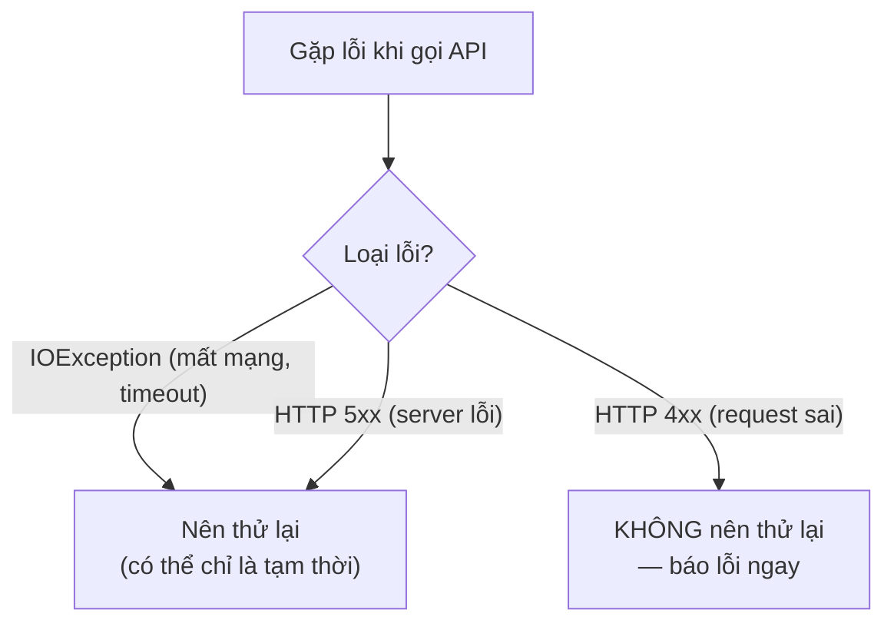

# Chương 23: Xử lý lỗi mạng, retry, cache offline-first cơ bản

## Mục tiêu học

- Thiết kế màn hình theo tư duy **offline-first**: luôn hiển thị dữ liệu cục bộ trước, mạng chỉ để làm mới.
- Kết hợp Room (Chương 13) và Retrofit (Chương 22) qua một `Repository` gọn gàng.
- Viết cơ chế retry đơn giản, biết phân biệt lỗi nên thử lại và lỗi không nên.
- Hiển thị lỗi mạng mà không phá hỏng trải nghiệm người dùng đang có.

> Code mẫu: `code/ch23-network-cache/` — capstone của Phần 4, ghép lại toàn bộ kỹ năng từ Chương 13, 21, 22.

## 23.1 Offline-first là gì, vì sao quan trọng?



Phần lớn ứng dụng thực tế (mạng xã hội, ghi chú, email...) đều áp dụng tư duy này: **mất mạng không nên đồng nghĩa với "app không dùng được"**. Đây cũng là lý do Chương 13 dạy Room từ rất sớm — nó chính là nền tảng lưu cache cho chương này.

## 23.2 `Repository` — gộp hai nguồn dữ liệu thành một API

```java
public class PostRepository {

    public LiveData<List<Post>> getCachedPosts() {
        return dao.getAll();          // luôn đọc từ Room
    }

    public void refresh(RefreshCallback callback) {
        fetchWithRetry(1, callback);  // gọi mạng, kết quả ghi ngược lại vào Room
    }
}
```

UI chỉ cần biết hai việc: **quan sát** `getCachedPosts()` để luôn có dữ liệu hiển thị, và **gọi** `refresh()` khi muốn làm mới — không cần tự phối hợp giữa Room và Retrofit. Đây là bước đệm nhẹ cho khái niệm "Repository pattern" sẽ chính thức xuất hiện trong kiến trúc MVVM ở Chương 28.

```java
repository.getCachedPosts().observe(this, adapter::submitList);
repository.refresh(callback);
```

Vòng khép kín quan trọng nhất: khi `refresh()` thành công, nó **ghi dữ liệu mới vào Room**, và vì UI đang `observe()` trực tiếp Room (không phải kết quả API), UI **tự động cập nhật** — không cần code nào nối trực tiếp "API trả về" với "adapter.submitList()" như Chương 22 đã làm.

## 23.3 Retry — thử lại khi nào, và khi nào không nên

```java
private void handleFailure(int attempt, String message, RefreshCallback callback) {
    if (attempt < MAX_ATTEMPTS) {
        mainHandler.postDelayed(() -> fetchWithRetry(attempt + 1, callback), RETRY_DELAY_MS);
    } else {
        callback.onError(message);
    }
}
```

Nguyên tắc quan trọng hay bị bỏ qua: **không phải lỗi nào cũng nên thử lại**. Lỗi mạng thoáng qua (timeout, mất sóng tạm thời) hợp lý để thử lại. Nhưng lỗi HTTP 4xx (ví dụ 401 Unauthorized, 404 Not Found) là lỗi **do bản chất request sai** — thử lại y hệt sẽ luôn nhận cùng kết quả, chỉ tổ tốn pin/dữ liệu di động. Code mẫu đơn giản hoá bằng cách thử lại mọi loại lỗi một lần duy nhất — đủ dùng cho quy mô sách, nhưng trong hệ thống thực tế nên kiểm tra `response.code()` để chỉ retry với lỗi 5xx/lỗi mạng, không retry với 4xx.



## 23.4 Hiển thị lỗi mà không phá dữ liệu đang có

```java
@Override
public void onError(String message) {
    binding.progressBar.setVisibility(View.GONE);
    binding.textError.setVisibility(View.VISIBLE);
    binding.textError.setText(getString(R.string.error_refresh_kept_cache, message));
    // KHÔNG gọi adapter.submitList(emptyList()) hay bất kỳ thao tác nào xoá dữ liệu
}
```

Sai lầm thường gặp: khi `refresh()` thất bại, nhiều người có phản xạ xoá danh sách hoặc hiện toàn màn hình lỗi — xoá mất dữ liệu vẫn còn giá trị sử dụng được. Code mẫu chỉ hiện một dòng thông báo nhỏ, **giữ nguyên** danh sách cache đang hiển thị.

## Bài tập

1. Chạy code mẫu với mạng bình thường, đóng app, bật chế độ máy bay, mở lại — xác nhận danh sách vẫn đầy đủ.
2. Tắt máy bay, bấm **Làm mới**, xác nhận thông báo lỗi biến mất và dữ liệu (nếu đổi ở server) được cập nhật.
3. Sửa `PostRepository` để phân biệt lỗi HTTP 4xx (không retry, báo lỗi ngay) với lỗi mạng/5xx (giữ nguyên cơ chế retry hiện tại) — dựa vào gợi ý ở mục 23.3.

## Lỗi thường gặp

- **Chỉ hiển thị dữ liệu khi API thành công, bỏ qua Room hoàn toàn**: quay lại đúng vấn đề "network-first" ở mục 23.1 — mất mạng là màn hình trống.
- **Retry vô hạn lần không giới hạn**: có thể khiến app gọi API liên tục, tốn pin/dữ liệu di động nghiêm trọng nếu server đang gặp sự cố kéo dài — luôn giới hạn số lần thử (`MAX_ATTEMPTS` trong code mẫu).
- **Xoá sạch dữ liệu hiển thị mỗi khi có lỗi mạng**: trải nghiệm tệ hơn nhiều so với việc chỉ báo lỗi nhỏ và giữ dữ liệu cũ, như đã bàn ở mục 23.4.
- **Insert dữ liệu mới vào Room trên main thread** (quên bọc qua `dbExecutor` như Chương 13 đã dạy): dễ bỏ sót khi code đã "quen tay" gọi trực tiếp sau một chuỗi callback dài.

## Tóm tắt & tiếp theo

Bạn đã khép lại **Phần 4 — Mạng & API**: từ gọi HTTP thô, tự động hoá bằng Retrofit/Gson, tới thiết kế offline-first hoàn chỉnh kết hợp với Room. Phần 5 chuyển hướng sang chủ đề kiểm thử và bảo mật — bắt đầu với Unit test bằng JUnit ở Chương 24.
