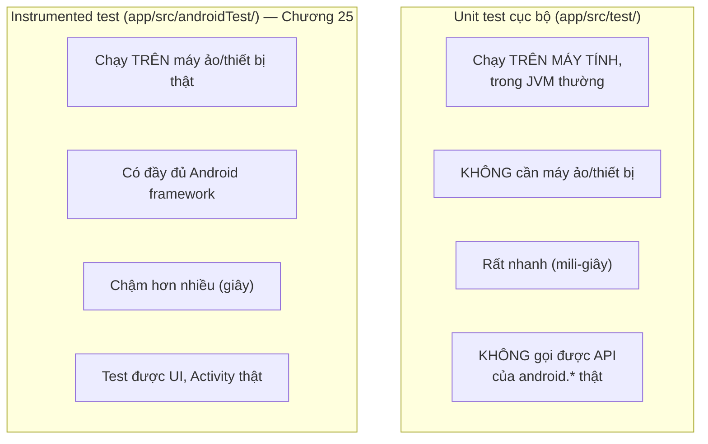

# Chương 24: Unit test với JUnit

## Mục tiêu học

- Phân biệt **Unit test cục bộ** (chạy trên JVM máy tính) và **Instrumented test** (chạy trên thiết bị/máy ảo, Chương 25).
- Viết được test case với JUnit: trường hợp bình thường, trường hợp biên, trường hợp ném ngoại lệ.
- Hiểu vì sao tách logic ra khỏi Activity giúp việc test dễ dàng hơn nhiều.

> Code mẫu: `code/ch24-unit-test-junit/`.

## 24.1 Hai loại test trong Android — chạy Ở ĐÂU là khác biệt cốt lõi



Chương này chỉ dùng **Unit test cục bộ** — nằm trong thư mục `app/src/test/java/`, khác thư mục `app/src/main/java/` (code chạy thật) và `app/src/androidTest/java/` (Chương 25). Vì chạy trên JVM thường (không có Android thật), code được test **không được phép** gọi thẳng các API của `android.*` — đây chính là lý do mục 24.2 nhấn mạnh việc tách logic.

## 24.2 Tách logic ra khỏi Activity để dễ test

```java
// PasswordStrengthChecker.java — KHÔNG import bất kỳ thứ gì từ android.*
public final class PasswordStrengthChecker {
    public enum Strength { WEAK, MEDIUM, STRONG }

    public static Strength check(String password) {
        if (password == null) {
            throw new IllegalArgumentException("password không được null");
        }
        // ... logic thuần Java
    }
}
```

`MainActivity` chỉ **gọi** hàm này khi người dùng gõ, không tự chứa logic rẽ nhánh nào cần test riêng:

```java
binding.editPassword.addTextChangedListener(new TextWatcher() {
    @Override
    public void onTextChanged(CharSequence s, int start, int before, int count) {
        PasswordStrengthChecker.Strength strength = PasswordStrengthChecker.check(s.toString());
        binding.textStrength.setText(labelFor(strength));
    }
    // ...
});
```

Nguyên tắc thực dụng: **business logic (quy tắc tính toán, xác thực dữ liệu...) nên là các hàm/class Java thuần**, tách khỏi Activity/Fragment — không phải vì "đúng chuẩn kiến trúc" trừu tượng, mà vì lý do rất cụ thể: chỉ có code như vậy mới test được bằng Unit test nhanh, không cần khởi động máy ảo mỗi lần chạy thử.

## 24.3 Viết test case với JUnit

```java
public class PasswordStrengthCheckerTest {

    @Test
    public void matKhauNgan_luonYeu() {
        assertEquals(PasswordStrengthChecker.Strength.WEAK,
                PasswordStrengthChecker.check("ab1"));
    }

    @Test
    public void nullNemNgoaiLe() {
        assertThrows(IllegalArgumentException.class,
                () -> PasswordStrengthChecker.check(null));
    }
}
```

Mỗi phương thức đánh dấu `@Test` là một trường hợp kiểm thử độc lập. `assertEquals(expected, actual)` so sánh giá trị mong đợi với giá trị thực tế; `assertThrows(ExceptionClass.class, lambda)` xác nhận một đoạn code ném đúng loại ngoại lệ mong muốn.

## 24.4 Test trường hợp biên (boundary) — nơi lỗi hay ẩn náu nhất

```java
@Test
public void bienChinhXacDoDaiToiThieuCuaStrong() {
    // Đủ 3 loại ký tự nhưng CHƯA đủ 10 ký tự -> chỉ MEDIUM, không phải STRONG.
    assertEquals(PasswordStrengthChecker.Strength.MEDIUM,
            PasswordStrengthChecker.check("Abc12345"));
}
```

Lỗi lập trình thường không nằm ở trường hợp "bình thường" mà ở đúng **ranh giới** của điều kiện (ví dụ `>= 10` hay `> 10`, một lỗi off-by-one kinh điển). Thói quen tốt: với mỗi điều kiện dạng so sánh số trong code, luôn viết ít nhất một test case đứng đúng ngay tại ranh giới đó.

## 24.5 Chạy test — không cần máy ảo, không cần chờ đợi

Trong Android Studio: bấm nút mũi tên xanh cạnh tên class hoặc từng `@Test`. Từ dòng lệnh:

```powershell
.\gradlew.bat testDebugUnitTest
```

Toàn bộ file `PasswordStrengthCheckerTest.java` (6 test case) chạy xong trong tích tắc — đây chính là giá trị thực dụng lớn nhất của Unit test: **phản hồi gần như tức thời** mỗi khi bạn sửa code, so với việc phải build lại app, chờ cài lên máy ảo, rồi tự tay thao tác lại từng bước để kiểm tra thủ công.

## Bài tập

1. Chạy toàn bộ test có sẵn, xác nhận cả 6 test case đều pass (màu xanh).
2. Sửa `PasswordStrengthChecker.check()`, đổi điều kiện độ dài tối thiểu của `STRONG` từ `10` xuống `8`, chạy lại test — xác nhận đúng test `bienChinhXacDoDaiToiThieuCuaStrong` chuyển sang fail (vì giờ nó mong đợi kết quả khác với hành vi mới).
3. Viết thêm một test case cho chuỗi rỗng (`""`) — dự đoán kết quả trước, sau đó chạy để xác nhận.

## Lỗi thường gặp

- **Viết logic quan trọng trực tiếp trong `onClick`/`onTextChanged` thay vì tách hàm riêng**: không có gì để gọi từ test, buộc phải test thủ công bằng tay mỗi lần — chậm và dễ bỏ sót trường hợp.
- **Chỉ test "đường vui" (happy path), bỏ qua input null/rỗng/âm**: đây thường là nguồn crash phổ biến nhất trong thực tế, và là chỗ Unit test phát huy giá trị rõ nhất.
- **Test phụ thuộc vào thứ tự chạy của các test khác** (ví dụ test B giả định test A đã chạy trước và để lại trạng thái nào đó): mỗi `@Test` nên độc lập hoàn toàn, JUnit không đảm bảo thứ tự chạy cố định.
- **Nhầm Unit test cục bộ với Instrumented test**: cố `import android.widget.TextView` trong file ở `app/src/test/java/` sẽ báo lỗi hoặc test luôn fail — loại API đó chỉ tồn tại thật sự trên thiết bị, thuộc phạm vi Chương 25.

## Tóm tắt & tiếp theo

Bạn đã biết viết Unit test nhanh cho business logic thuần Java. Chương 25 chuyển sang Instrumented test với Espresso — kiểm thử tự động ngay trên giao diện thật, bù đắp cho phần Unit test không chạm tới được.
