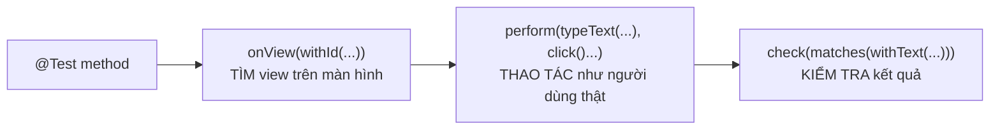
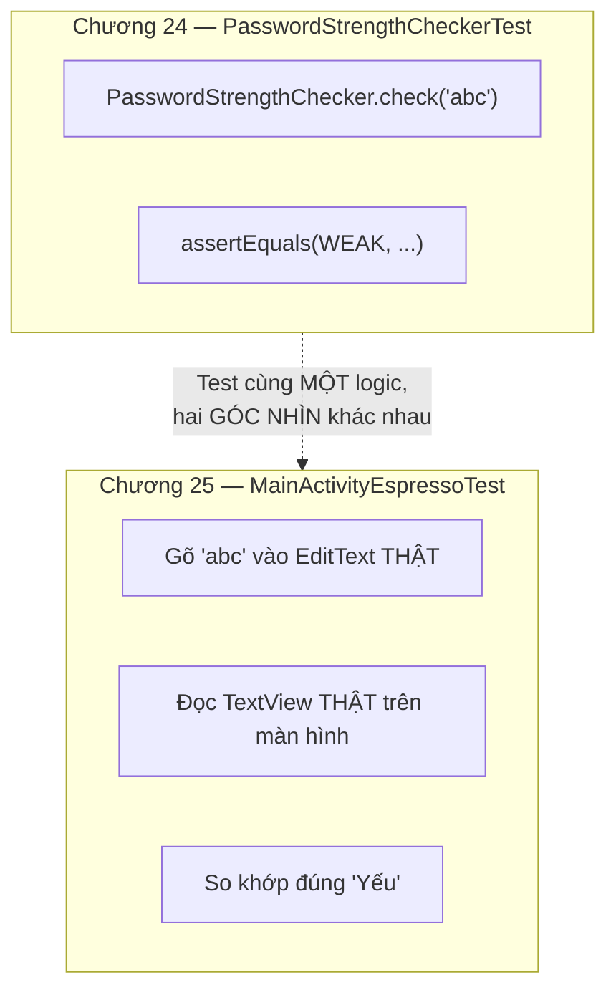

# Chương 25: UI test với Espresso

## Mục tiêu học

- Viết được Instrumented test — chạy trên máy ảo/thiết bị thật, thao tác lên UI như người dùng.
- Dùng ba bước cốt lõi của Espresso: tìm View (`onView`), thao tác (`perform`), kiểm tra (`check`).
- Biết `ActivityScenarioRule` tự động hoá việc mở/đóng Activity cho mỗi test.

> Code mẫu: `code/ch25-ui-test-espresso/` — cùng app Chương 24, thêm test UI.

## 25.1 Espresso hoạt động thế nào?



Ba bước này lặp lại trong hầu hết mọi test Espresso: **tìm** một View bằng ID hoặc thuộc tính khác, **thao tác** lên nó (gõ chữ, bấm, cuộn...), rồi **kiểm tra** trạng thái sau đó đúng như mong đợi. Khác Unit test (Chương 24) gọi thẳng hàm Java, Espresso mô phỏng chính xác hành vi người dùng thật trên giao diện thật.

## 25.2 `ActivityScenarioRule` — tự mở/đóng Activity mỗi test

```java
@RunWith(AndroidJUnit4.class)
public class MainActivityEspressoTest {

    @Rule
    public ActivityScenarioRule<MainActivity> activityRule =
            new ActivityScenarioRule<>(MainActivity.class);

    @Test
    public void goMatKhauYeu_hienThiNhanYeu() {
        onView(withId(R.id.editPassword))
                .perform(typeText("abc"), closeSoftKeyboard());

        onView(withId(R.id.textStrength))
                .check(matches(withText("Yếu")));
    }
}
```

`@Rule` là cơ chế của JUnit cho phép chạy code thiết lập/dọn dẹp quanh mỗi `@Test` — ở đây `ActivityScenarioRule` tự mở `MainActivity` **trước** mỗi test, tự đóng lại **sau** mỗi test, đảm bảo các test không ảnh hưởng lẫn nhau (một nguyên tắc đã nhắc ở Chương 24: mỗi test case nên độc lập).

## 25.3 Các thao tác (`ViewActions`) thường dùng

| Hàm | Ý nghĩa |
|---|---|
| `typeText("...")` | Gõ chữ vào ô nhập (như `EditText`) |
| `clearText()` | Xoá sạch nội dung đang có |
| `click()` | Bấm vào View (nút, item danh sách...) |
| `closeSoftKeyboard()` | Đóng bàn phím ảo — thường cần sau `typeText` để tránh bàn phím che View khác |
| `scrollTo()` | Cuộn tới một View đang nằm ngoài vùng nhìn thấy |

```java
onView(withId(R.id.editPassword))
        .perform(typeText("Abcdefgh123"), closeSoftKeyboard());
```

Nhiều thao tác có thể nối chuỗi trong cùng một `perform()`, thực hiện tuần tự theo đúng thứ tự liệt kê.

## 25.4 Các phép kiểm tra (`ViewAssertions`/`Matchers`) thường dùng

```java
onView(withId(R.id.textStrength)).check(matches(withText("Mạnh")));
```

`matches(withText("..."))` kiểm tra View có đúng nội dung chữ. Các matcher khác thường gặp: `isDisplayed()` (View có đang hiển thị), `isChecked()` (với `CheckBox`/`Switch`, dùng lại được ngay cho code từ Chương 12), `hasChildCount(n)` (với `ViewGroup`).

## 25.5 So sánh trực tiếp với Unit test (Chương 24)



Cả hai chương đều đang kiểm tra cùng một quy tắc nghiệp vụ (`PasswordStrengthChecker`), nhưng từ hai góc độ bổ sung cho nhau: Unit test xác nhận **logic tính toán đúng**, Espresso xác nhận **logic đó thật sự được nối đúng dây với giao diện** (đúng ID, đúng sự kiện, hiển thị đúng chỗ). Một dự án lớn cần cả hai loại — Unit test nhiều vì nhanh, Espresso ít hơn nhưng bao quát đúng những luồng người dùng quan trọng nhất.

## Bài tập

1. Chạy cả 3 test có sẵn trên máy ảo/thiết bị, xác nhận đều pass.
2. Thêm một test case mới kiểm tra trường hợp `Strength.MEDIUM` (gõ một chuỗi có đúng 2 loại ký tự, độ dài từ 6 trở lên).
3. Cố tình đổi `R.id.textStrength` thành một ID không tồn tại trong một test, chạy lại — đọc thông báo lỗi Espresso đưa ra (`NoMatchingViewException`) để làm quen với loại lỗi này khi gặp trong thực tế.

## Lỗi thường gặp

- **Quên `closeSoftKeyboard()` sau `typeText()`**: bàn phím ảo có thể che mất View cần thao tác tiếp theo, gây lỗi "view not displayed" dù code test có vẻ đúng logic.
- **Đặt file test vào `app/src/test/` thay vì `app/src/androidTest/`**: sai vị trí khiến Gradle không nhận diện đây là Instrumented test, hoặc biên dịch lỗi vì thiếu Android framework thật.
- **Chạy Espresso test mà không có máy ảo/thiết bị nào đang kết nối**: Android Studio báo lỗi rõ ràng "no target device" — cần một máy ảo/thiết bị đã bật, khác Unit test ở Chương 24 không cần gì cả.
- **Viết test phụ thuộc animation/thời gian chờ không xác định**: Espresso mặc định tự đồng bộ với main thread khá tốt, nhưng animation dài hoặc network call thật trong lúc test có thể gây flaky test (lúc pass lúc fail) — nên tránh gọi mạng thật trong Espresso test cơ bản như ở chương này.

## Tóm tắt & tiếp theo

Bạn đã có cả hai công cụ kiểm thử tự động: Unit test cho logic, Espresso cho giao diện. Chương 26 chuyển hướng sang một chủ đề nền tảng khác của Android: mô hình sandbox và hệ thống quyền (permission) — đã được nhắc tới thoáng qua từ Chương 1, giờ sẽ giải thích đầy đủ.
