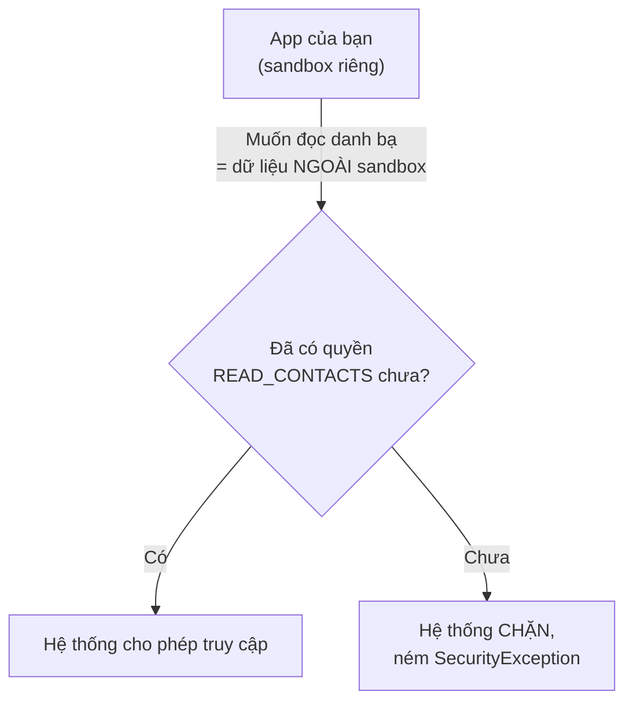
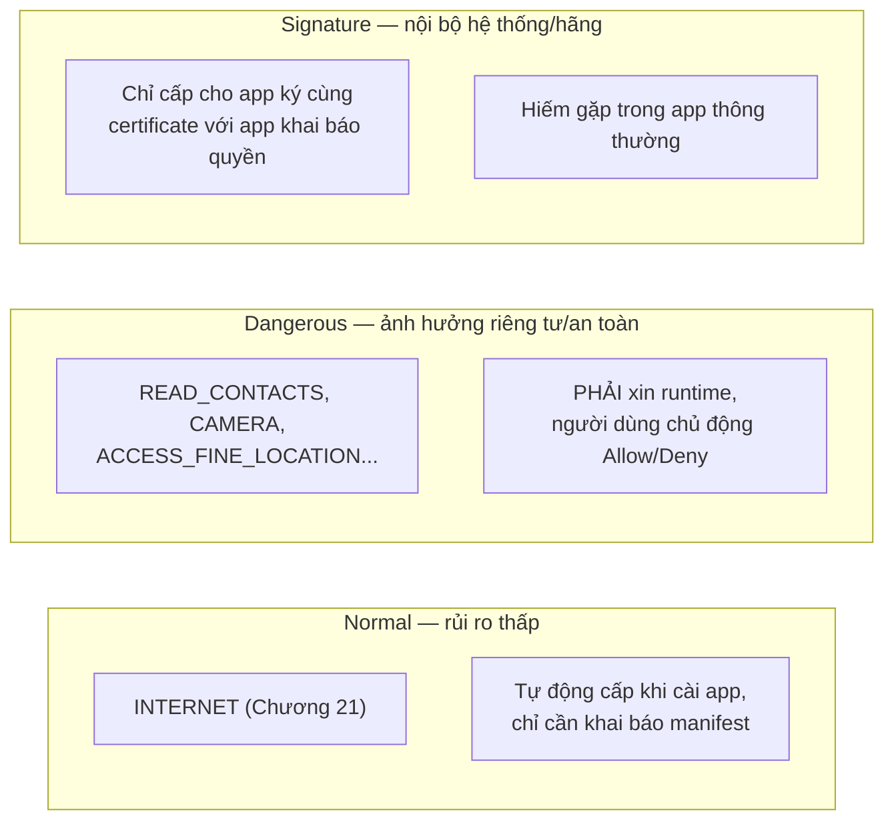
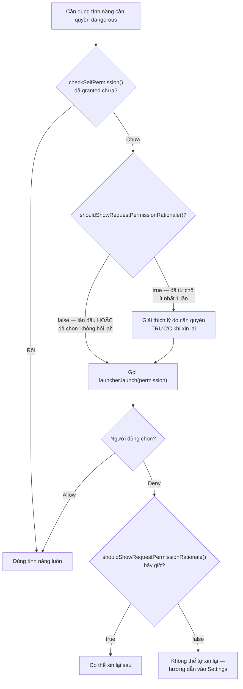

# Chương 26: Sandbox của Android — mô hình quyền (permission), runtime permission

## Mục tiêu học

- Hiểu cơ chế sandbox của Android ở tầng hệ điều hành — nhắc lại và đào sâu Chương 1.
- Phân biệt ba nhóm quyền: normal, dangerous, signature.
- Viết đúng luồng xin quyền runtime đầy đủ: kiểm tra, xin, xử lý từ chối, xử lý "không hỏi lại".
- Biết khi nào phải giải thích lý do (rationale) trước khi xin quyền.

> Code mẫu: `code/ch26-permission/`. Chương này cũng đã dùng runtime permission ở Chương 16/20 (`POST_NOTIFICATIONS`) — giờ giải thích đầy đủ cơ chế đứng sau.

## 26.1 Nhắc lại: Sandbox là gì?

Chương 1 đã nhắc: mỗi app Android chạy trong **sandbox** riêng — tiến trình Linux riêng, user ID riêng (`UID`), thư mục dữ liệu riêng mà app khác không đọc/ghi được (đây chính là nền tảng cho `getFilesDir()` "luôn riêng tư" ở Chương 14). Permission là **cơ chế app xin phép vượt ra ngoài sandbox của chính mình** — đọc danh bạ (dữ liệu người dùng), dùng camera (phần cứng), truy cập mạng (Chương 21), v.v.



## 26.2 Ba nhóm quyền



Sách đã gặp cả ba nhóm: `INTERNET` (Chương 21) và `FOREGROUND_SERVICE` (Chương 16) thuộc nhóm **normal** — chỉ cần khai báo trong manifest là đủ. `POST_NOTIFICATIONS` (Chương 20) và `READ_CONTACTS` (chương này) thuộc nhóm **dangerous** — khai báo manifest là điều kiện CẦN nhưng CHƯA ĐỦ, còn phải xin runtime lúc chạy. Nhóm **signature** hiếm gặp trong app thông thường nên không đi sâu.

## 26.3 Luồng xin quyền runtime đầy đủ



```java
private void checkAndReadContacts() {
    if (ContextCompat.checkSelfPermission(this, Manifest.permission.READ_CONTACTS)
            == PackageManager.PERMISSION_GRANTED) {
        readContactsCount();
        return;
    }
    if (shouldShowRequestPermissionRationale(Manifest.permission.READ_CONTACTS)) {
        binding.textResult.setText(R.string.rationale_contacts);
    }
    requestPermissionLauncher.launch(Manifest.permission.READ_CONTACTS);
}
```

`launcher` ở đây dùng đúng Activity Result API đã học ở Chương 8/16/20 — `ActivityResultContracts.RequestPermission()`.

## 26.4 "Không hỏi lại" — điểm dễ làm sai nhất

```java
private void handleDenied() {
    if (!shouldShowRequestPermissionRationale(Manifest.permission.READ_CONTACTS)) {
        // false SAU KHI đã bị từ chối => người dùng chọn "Không hỏi lại"
        binding.buttonOpenSettings.setVisibility(View.VISIBLE);
    } else {
        binding.textResult.setText(R.string.permission_denied_once);
    }
}
```

`shouldShowRequestPermissionRationale()` trả về `true`/`false` mang **hai ý nghĩa hoàn toàn khác nhau tuỳ ngữ cảnh gọi**:

- Gọi **TRƯỚC KHI** xin quyền lần đầu: `false` (chưa từng hỏi, chưa có gì để "nên giải thích").
- Gọi **SAU KHI** bị từ chối: `true` nghĩa là "có thể xin lại, nên giải thích trước"; `false` nghĩa là **người dùng đã chọn "Không hỏi lại"** — từ giờ `launcher.launch()` sẽ tự động trả về `false` ngay lập tức, không hiện hộp thoại nào nữa. Cách duy nhất còn lại là mở màn hình Settings của app cho người dùng tự bật:

```java
private void openAppSettings() {
    Intent intent = new Intent(Settings.ACTION_APPLICATION_DETAILS_SETTINGS);
    intent.setData(Uri.fromParts("package", getPackageName(), null));
    startActivity(intent);
}
```

## 26.5 Dùng quyền sau khi được cấp — vẫn nên chạy nền

```java
executor.execute(() -> {
    int count = 0;
    try (Cursor cursor = getContentResolver().query(
            ContactsContract.Contacts.CONTENT_URI,
            new String[]{ContactsContract.Contacts._ID},
            null, null, null)) {
        if (cursor != null) count = cursor.getCount();
    }
    runOnUiThread(() -> binding.textResult.setText(...));
});
```

Được cấp quyền không có nghĩa thao tác truy cập dữ liệu trở nên "miễn phí" về hiệu năng — `ContentResolver.query()` (đọc qua `ContentProvider`, sẽ học kỹ ở Chương 32) vẫn là một lời gọi liên tiến trình, nên vẫn tuân theo nguyên tắc đã xuyên suốt từ Chương 13: không chạy việc có thể chậm trên main thread.

## Bài tập

1. Chạy code mẫu, cấp quyền, xác nhận số lượng liên hệ hiển thị đúng.
2. Gỡ cài đặt, cài lại, thử luồng từ chối rồi xin lại — xác nhận thấy đúng dòng giải thích rationale trước khi hộp thoại hiện lại lần hai.
3. Chọn "Không hỏi lại" ở lần từ chối tiếp theo, xác nhận nút "Mở Cài đặt ứng dụng" xuất hiện và dẫn đúng tới màn hình Settings của app.

## Lỗi thường gặp

- **Chỉ khai báo `<uses-permission>` trong manifest mà quên xin runtime cho quyền dangerous**: crash ngay với `SecurityException` khi gọi API cần quyền đó — quên mất bước bắt buộc kể từ Android 6 (API 23).
- **Gọi `requestPermissionLauncher.launch()` liên tục dù người dùng đã chọn "Không hỏi lại"**: không có tác dụng gì (không hiện hộp thoại), lãng phí và gây trải nghiệm khó hiểu — luôn kiểm tra `shouldShowRequestPermissionRationale()` để phát hiện đúng tình huống này.
- **Xin quyền ngay khi vừa mở app, trước khi người dùng hiểu vì sao cần nó**: tỷ lệ bị từ chối cao hơn hẳn so với xin đúng lúc người dùng vừa bấm vào tính năng cần quyền đó (nguyên tắc UX quan trọng, không chỉ là vấn đề kỹ thuật).
- **Quên rằng người dùng có thể thu hồi quyền bất kỳ lúc nào trong Settings**, kể cả sau khi đã cấp: luôn `checkSelfPermission()` lại mỗi lần thật sự cần dùng, không giả định quyền đã cấp sẽ mãi mãi còn hiệu lực.

## Tóm tắt & tiếp theo

Bạn đã nắm vững mô hình quyền của Android — nền tảng chi phối mọi tính năng "nhạy cảm" từ đây tới hết sách (đặc biệt là Bluetooth/NFC/vị trí ở Phần 7). Chương 27 khép lại Phần 5 với bảo mật ở tầng build: ProGuard/R8 và ký ứng dụng bằng keystore.
