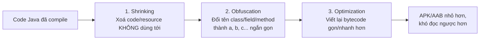
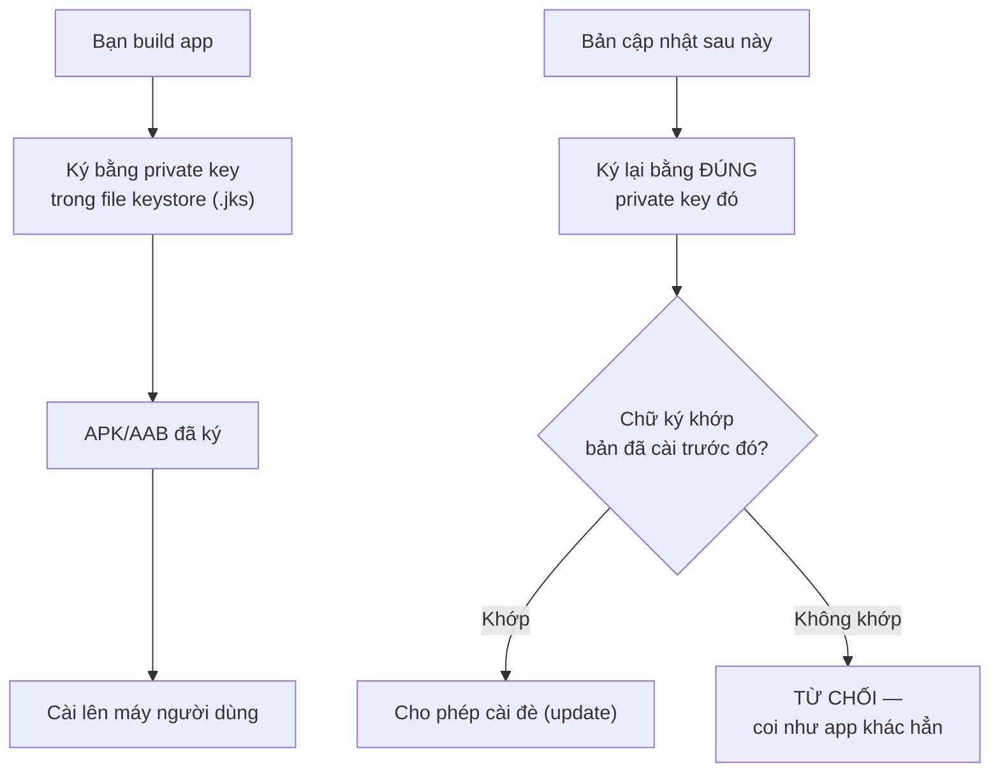

# Chương 27: Bảo mật cơ bản — ProGuard/R8, keystore, ký ứng dụng

## Mục tiêu học

- Hiểu R8 làm ba việc gì: shrinking, obfuscation, optimization.
- Viết đúng `proguard-rules.pro` cho code dùng reflection (Gson) — tránh lỗi "hoạt động ở debug, crash ở release".
- Hiểu khái niệm ký ứng dụng bằng keystore, và vì sao mất keystore là sự cố nghiêm trọng.
- Biết `mapping.txt` dùng để làm gì và vì sao phải lưu giữ nó.

> Code mẫu: `code/ch27-proguard-keystore/` — bật R8 cho app Retrofit + Gson ở Chương 22.

## 27.1 R8 làm gì với code của bạn?



R8 (thay thế ProGuard cũ, nhưng vẫn dùng chung định dạng file cấu hình `proguard-rules.pro`) chạy tự động khi bật `minifyEnabled true` cho build type `release`. Hai lợi ích cụ thể: **APK/AAB nhỏ hơn** (ảnh hưởng tốc độ tải về, quan trọng ở Chương 39), và **khó dịch ngược hơn** — không phải bất khả xâm phạm, nhưng đủ để cản trở việc đọc hiểu logic app của người không có quyền truy cập source code.

## 27.2 Vì sao build release "vô cớ" crash mà debug thì không?

Đây là tình huống rất phổ biến và gây khó chịu cho người mới: app chạy hoàn hảo ở bản debug (`minifyEnabled false` mặc định), nhưng bản release đóng gói để test thử lại crash hoặc trả dữ liệu `null` không rõ lý do.

Thủ phạm gần như luôn là: **thư viện dùng reflection** (đọc/ghi field bằng tên chuỗi lúc chạy, không qua lời gọi hàm bình thường lúc biên dịch) — Gson (Chương 22) là ví dụ điển hình:

```java
public class Post {
    public int id;
    public String title;   // Gson gán giá trị vào field này bằng REFLECTION,
    public String body;    // dựa theo tên field khớp với key JSON "title", "body"
}
```

R8 không "nhìn thấy" được việc field `title` đang bị Gson truy cập theo tên chuỗi — nó chỉ thấy field này **không có lời gọi Java tường minh nào** nên coi là an toàn để đổi tên thành `a`, `b`. Sau khi đổi tên, Gson tìm field tên `"title"` để gán giá trị nhưng field đó giờ tên là `"a"` — **âm thầm không gán được gì cả**, không ném exception, chỉ để `null`.

## 27.3 Viết `proguard-rules.pro` đúng cách

```
# Giữ nguyên tên mọi field trong Post — Gson cần đúng tên gốc để map JSON.
-keepclassmembers class vn.example.ch27security.Post {
    <fields>;
}

# Giữ thông tin kiểu generic (Call<List<Post>>) — Retrofit/Gson cần lúc runtime
# để biết chính xác phải parse JSON thành kiểu dữ liệu nào.
-keepattributes Signature
-keepattributes *Annotation*
```

Quy tắc thực dụng: **bất kỳ class nào bị truy cập bằng reflection từ bên ngoài code Java thông thường** (model JSON, class dùng qua `Class.forName()`, đối tượng inject bằng Hilt ở Chương 29...) đều cần một dòng `-keep` tương ứng. Một cách khác, gọn hơn cho từng class riêng lẻ, là đánh dấu ngay trong code bằng annotation `@Keep` của AndroidX:

```java
@Keep
public class Post { ... }
```

`@Keep` và viết tay trong `proguard-rules.pro` đạt cùng mục đích — chọn một cách nhất quán trong cả project để dễ theo dõi.

## 27.4 `mapping.txt` — chìa khoá đọc lại crash log

```
app/build/outputs/mapping/release/mapping.txt
```

File này ghi lại bảng đối chiếu tên gốc ↔ tên đã bị R8 đổi (`Post -> a`, `getPosts -> b`...). Khi app đã phát hành gặp crash thật ngoài thực tế, log lỗi thu về từ công cụ theo dõi (Chương 40 sẽ giới thiệu Crashlytics) sẽ chỉ hiện tên đã bị làm rối (`a.b.c: NullPointerException`) — **hoàn toàn vô nghĩa nếu không có đúng file `mapping.txt` của đúng phiên bản đó** để dịch ngược lại tên thật. Quy tắc bắt buộc: **lưu trữ `mapping.txt` cho mọi bản release đã phát hành**, thường bằng cách tải nó lên cùng công cụ theo dõi crash hoặc lưu trữ có đánh số phiên bản riêng.

## 27.5 Keystore — vì sao mọi APK đều phải được ký?



Android dùng chữ ký số (dựa trên cặp khoá bất đối xứng, lưu trong file **keystore**) để đảm bảo: bản cập nhật của một app **chắc chắn đến từ cùng một nhà phát triển** với bản đã cài trước đó — đây chính là nguyên nhân lỗi quen thuộc `INSTALL_FAILED_UPDATE_INCOMPATIBLE` đã gặp ở Chương 5, khi hai bản build được ký bằng hai key khác nhau.

Android Studio tự tạo sẵn một **debug keystore** (key mặc định, không bảo mật, dùng chung cho mọi máy phát triển) để bạn build và test nhanh — **không bao giờ dùng để phát hành**. Trước khi phát hành thật (Chương 38), bắt buộc tự tạo một **release keystore** riêng:

```powershell
keytool -genkeypair -v -keystore release-key.jks -alias my-app-key -keyalg RSA -keysize 2048 -validity 10000
```

**Cảnh báo quan trọng nhất chương này**: làm mất file keystore này (và không dùng Google Play App Signing — Chương 38 sẽ giải thích cơ chế đó) đồng nghĩa với việc **không bao giờ phát hành được bản cập nhật nào nữa** cho app đã public dưới đúng định danh cũ — phải phát hành app mới hoàn toàn, mất hết lượt cài đặt/đánh giá cũ. Không commit file `.jks` hay mật khẩu của nó vào git.

## Bài tập

1. Build thử bản release của code mẫu (`gradlew assembleRelease`), mở `mapping.txt` sinh ra, tìm dòng ánh xạ tên class `Post`.
2. Thử xoá tạm rule `-keepclassmembers class ... Post` trong `proguard-rules.pro`, build lại, cài bản APK release lên máy ảo (dùng `adb install`, nhớ bản release ở dạng chưa ký cần cấu hình `signingConfig debug` tạm để cài thử được — hoặc đơn giản chỉ so sánh nội dung `mapping.txt` trước/sau mà không cần cài) — quan sát field `title`/`body` của `Post` cũng bị đổi tên trong mapping.
3. Tự tạo một release keystore thử nghiệm bằng lệnh `keytool` ở mục 27.5 (dùng thông tin giả), sau đó tự xoá nó đi — chỉ để quen thao tác trước khi làm thật ở Chương 38.

## Lỗi thường gặp

- **Bật `minifyEnabled true` mà không test kỹ bản release trước khi phát hành**: lỗi do thiếu `-keep` rule chỉ xuất hiện ở bản release, dễ lọt qua nếu chỉ test bản debug suốt quá trình phát triển.
- **Đánh mất `mapping.txt` của một bản đã phát hành**: không thể đọc hiểu crash report từ bản đó nữa, dù bug vẫn còn nguyên trong code.
- **Làm mất keystore release, hoặc để lộ nó công khai** (commit nhầm lên GitHub): mất keystore = không update được app cũ; lộ keystore = người khác có thể giả mạo phát hành bản cập nhật độc hại dưới danh nghĩa app của bạn.
- **Tưởng debug keystore đủ an toàn để dùng cho bản phát hành thật**: debug keystore dùng chung mật khẩu mặc định trên mọi máy cài Android Studio — hoàn toàn không có giá trị bảo mật.

## Tóm tắt & tiếp theo

Bạn đã khép lại **Phần 5 — Kiểm thử, Sandbox & Bảo mật**: JUnit, Espresso, mô hình quyền, và bảo mật ở tầng build/ký ứng dụng. Phần 6 chuyển sang kiến trúc nâng cao, bắt đầu với MVVM và `ViewModel`/`LiveData` ở Chương 28 — chính thức hệ thống hoá mẫu "Repository" đã dùng tạm ở Chương 23.
