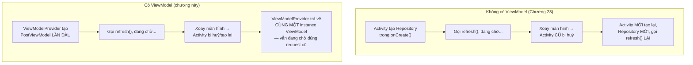
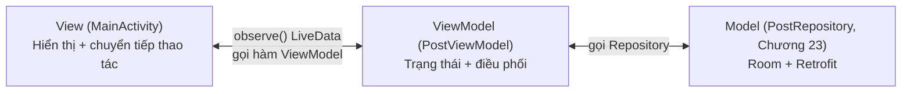

# Chương 28: MVVM, ViewModel & LiveData

## Mục tiêu học

- Hiểu vấn đề cụ thể `ViewModel` giải quyết: dữ liệu sống sót qua configuration change (Chương 6) mà không cần `onSaveInstanceState`.
- Tách Activity thành ba lớp trách nhiệm theo mô hình MVVM: View, ViewModel, Model (Repository — đã có từ Chương 23).
- Biết `ViewModelProvider` cấp phát instance đúng cách, và vòng đời `ViewModel` khác vòng đời Activity ra sao.

> Code mẫu: `code/ch28-mvvm-livedata/` — chính thức hoá kiến trúc cho app đã xây từ Chương 13/22/23.

## 28.1 Vấn đề cụ thể: xoay màn hình làm mất gì?

Nhớ lại Chương 6: xoay màn hình huỷ và tạo lại Activity. Ở bản Chương 23, nếu `MainActivity` đang tự giữ một `PostRepository` và đang chờ kết quả `refresh()`, xoay màn hình giữa chừng sẽ **huỷ luôn cả Activity đang giữ callback đó** — kết quả trả về sau (nếu Activity cũ đã bị huỷ) rơi vào khoảng không, hoặc tệ hơn, Activity mới lại tự gọi `refresh()` từ đầu, gây gọi mạng trùng lặp lãng phí.



## 28.2 `ViewModel` sống lâu hơn Activity như thế nào?

```java
public class PostViewModel extends AndroidViewModel {
    private final PostRepository repository;

    public PostViewModel(@NonNull Application application) {
        super(application);
        repository = new PostRepository(application);
        refresh();
    }
    // ...
}
```

```java
viewModel = new ViewModelProvider(this).get(PostViewModel.class);
```

`ViewModelProvider(this).get(...)` không phải lúc nào cũng tạo instance mới — nó được gắn với một phạm vi sống (ở đây là Activity, tính luôn qua các lần bị huỷ/tạo lại do configuration change) do hệ thống Android quản lý ở tầng thấp hơn cả Activity thường thấy. Kết quả: **cùng một instance `PostViewModel`** được trả về xuyên suốt vòng đời "logic" của màn hình, chỉ thật sự bị huỷ (`onCleared()`) khi Activity kết thúc hẳn (người dùng bấm Back, không phải xoay màn hình).

`AndroidViewModel` (thay vì `ViewModel` trần) có sẵn `Application` Context qua `getApplication()` — dùng khi ViewModel cần Context để khởi tạo thứ gì đó (ở đây là `PostRepository` cần Context cho Room, Chương 13). Lưu ý **Application Context là an toàn để giữ lâu dài**, khác hẳn Activity Context (nguồn rò rỉ bộ nhớ đã cảnh báo từ Chương 6) — đây là lý do `ViewModel` không bao giờ được phép giữ tham chiếu tới Activity/View.

## 28.3 Ba lớp trách nhiệm của MVVM



```java
public class MainActivity extends AppCompatActivity {
    @Override
    protected void onCreate(Bundle savedInstanceState) {
        viewModel = new ViewModelProvider(this).get(PostViewModel.class);

        viewModel.getPosts().observe(this, adapter::submitList);
        viewModel.getLoading().observe(this, isLoading -> ...);
        viewModel.getErrorMessage().observe(this, message -> ...);

        binding.buttonLoad.setOnClickListener(v -> viewModel.refresh());
    }
}
```

So với `MainActivity` ở Chương 23, Activity giờ **không còn logic nghiệp vụ nào** — không tự tạo `PostRepository`, không tự viết callback xử lý thành công/thất bại. Nó chỉ làm hai việc: **quan sát** (`observe`) dữ liệu từ ViewModel để cập nhật UI, và **chuyển tiếp** thao tác người dùng (`refresh()`) vào ViewModel. Toàn bộ trạng thái loading/lỗi giờ là `LiveData` do ViewModel quản lý:

```java
private final MutableLiveData<Boolean> loading = new MutableLiveData<>(false);
private final MutableLiveData<String> errorMessage = new MutableLiveData<>();

public void refresh() {
    loading.setValue(true);
    repository.refresh(new PostRepository.RefreshCallback() {
        @Override
        public void onSuccess() {
            loading.setValue(false);
            errorMessage.setValue(null);
        }
        @Override
        public void onError(String message) {
            loading.setValue(false);
            errorMessage.setValue(message);
        }
    });
}
```

## 28.4 Vì sao Activity mỏng đi lại quan trọng?

Đây không phải "làm cho đẹp code" thuần tuý — Activity càng ít logic, càng dễ:

- **Test được logic mà không cần UI thật**: `PostViewModel` không đụng gì tới `View`/`Activity`, có thể viết Unit test cho nó (Chương 24) mà không cần Espresso (Chương 25).
- **Không lo rò rỉ bộ nhớ do giữ sai Context**: quy tắc "ViewModel không giữ Activity/View" giúp tránh thẳng lỗi kinh điển đã cảnh báo từ Chương 6/12.
- **Activity/Fragment có thể thay đổi (thậm chí đổi từ Activity sang Fragment) mà không đụng tới logic nghiệp vụ** — vì logic đó nằm trọn trong ViewModel, độc lập với loại "View" đang hiển thị nó.

## Bài tập

1. Chạy code mẫu, xoay màn hình (nếu máy ảo hỗ trợ) đúng lúc ProgressBar đang chạy — xác nhận trạng thái loading không bị "giật" về false rồi lại true.
2. Thêm một `LiveData<Integer>` mới trong `PostViewModel` đếm số lần `refresh()` đã được gọi, hiển thị nó trong `MainActivity`.
3. Thử viết một Unit test (Chương 24) đơn giản cho `PostViewModel` mà không cần Espresso — gợi ý: dùng `InstantTaskExecutorRule` của thư viện `androidx.arch.core:core-testing` để `LiveData` phát giá trị ngay lập tức trong môi trường test (tìm hiểu thêm ngoài phạm vi sách nếu muốn thử).

## Lỗi thường gặp

- **Giữ tham chiếu `Activity`/`View`/`Context` (không phải Application) bên trong ViewModel**: rò rỉ bộ nhớ nghiêm trọng — ViewModel sống lâu hơn Activity, giữ Activity cũ mãi không giải phóng được.
- **Tạo `ViewModel` bằng `new PostViewModel(...)` trực tiếp thay vì qua `ViewModelProvider`**: mất hoàn toàn lợi ích "sống sót qua configuration change" — về bản chất chỉ là một object Java bình thường, bị huỷ theo Activity như cũ.
- **Đặt `LiveData` trả về kiểu `MutableLiveData` công khai** (thay vì chỉ để `LiveData` không sửa được ra ngoài, giữ `MutableLiveData` `private`): View bên ngoài vô tình tự ý gọi `setValue()`, phá vỡ nguyên tắc "chỉ ViewModel được sửa trạng thái của chính nó".
- **Nhồi logic hiển thị thuần UI (định dạng ngày giờ theo layout cụ thể, kích thước màn hình...) vào ViewModel**: ViewModel không nên biết gì về `View`/`Resources` cụ thể của UI — ranh giới này dễ bị lạm dụng nếu không cẩn thận.

## Tóm tắt & tiếp theo

Bạn đã chính thức hoá kiến trúc MVVM cho app xây dựng xuyên suốt từ Chương 13. Chương 29 giới thiệu Hilt — tự động hoá việc khởi tạo và truyền các đối tượng như `PostRepository`, `AppDatabase` (hiện đang tự tay viết singleton) thay vì làm thủ công.
