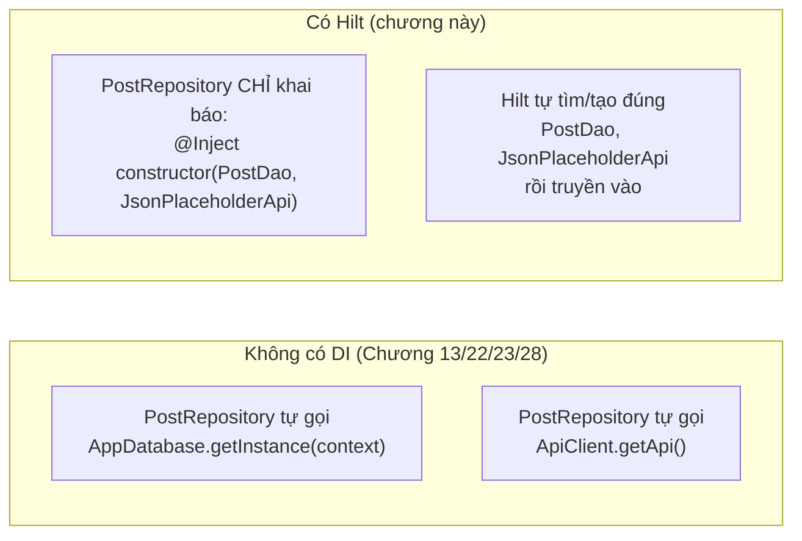
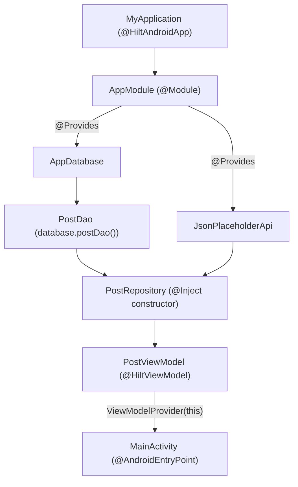

# Chương 29: Dependency Injection với Hilt

## Mục tiêu học

- Hiểu Dependency Injection (DI) giải quyết vấn đề gì — nhìn lại các singleton tự viết tay từ Chương 13/22.
- Cấu hình được Hilt trong project Java: `@HiltAndroidApp`, `@AndroidEntryPoint`, `@Module`.
- Dùng `@Inject` để Hilt tự lắp ráp `Repository`/`ViewModel` thay vì tự tay `new`/singleton.

> Code mẫu: `code/ch29-hilt-di/` — refactor lại app Chương 28 bằng Hilt.

## 29.1 Vấn đề: singleton tự viết tay đang ngày càng cồng kềnh

Nhìn lại các singleton đã tự viết xuyên suốt sách — `AppDatabase.getInstance()` (Chương 13), `ApiClient.getApi()` (Chương 22) — đều theo đúng một khuôn mẫu lặp lại: biến `static volatile`, kiểm tra `null`, khối `synchronized`. Khi số lượng đối tượng cần chia sẻ tăng lên (database, API client, các repository khác nhau...), code khởi tạo thủ công này phình to và dễ tạo phụ thuộc vòng (A cần B, B cần A) khó gỡ.

**Dependency Injection** đảo ngược cách tiếp cận: thay vì một class tự đi "tìm" các phụ thuộc nó cần (gọi `getInstance()`, `new` trực tiếp), phụ thuộc được **truyền vào từ bên ngoài** (thường qua constructor) — class chỉ khai báo "tôi cần một `PostDao`", không cần biết nó được tạo ra từ đâu.



## 29.2 Bốn mảnh ghép cơ bản của Hilt

```java
@HiltAndroidApp
public class MyApplication extends Application { }
```

`@HiltAndroidApp` bắt buộc đặt trên class `Application` — sinh ra "container" gốc quản lý toàn bộ vòng đời DI của app, tương tự cách `Application.onCreate()` ở Chương 6 là nơi khởi tạo một lần cho toàn app.

```java
@AndroidEntryPoint
public class MainActivity extends AppCompatActivity { ... }
```

`@AndroidEntryPoint` đánh dấu Activity/Fragment/Service... có thể nhận đối tượng do Hilt cung cấp — thiếu annotation này, Hilt không biết "chèn" phụ thuộc vào đâu.

```java
@Module
@InstallIn(SingletonComponent.class)
public class AppModule {
    @Provides
    @Singleton
    public AppDatabase provideDatabase(@ApplicationContext Context context) {
        return Room.databaseBuilder(context, AppDatabase.class, "posts_cache.db").build();
    }
}
```

`@Module` là nơi viết "công thức" cho những kiểu dữ liệu Hilt **không thể tự đoán cách tạo** — Room/Retrofit cần gọi qua Builder tĩnh, không có constructor đơn giản để Hilt tự suy luận. `@InstallIn(SingletonComponent.class)` nghĩa là mọi thứ khai báo ở đây sống theo vòng đời **toàn app** — đúng bằng đúng phạm vi các singleton tự viết tay trước đây.

```java
@Singleton
public class PostRepository {
    @Inject
    public PostRepository(PostDao dao, JsonPlaceholderApi api) {
        this.dao = dao;
        this.api = api;
    }
}
```

Ngược lại, với class có **constructor đơn giản** như `PostRepository`, chỉ cần đánh dấu `@Inject` ngay trên constructor — không cần viết `@Module` riêng, Hilt tự biết cách tạo nó (miễn là biết cách tạo đủ các tham số của constructor đó, ở đây là `PostDao` và `JsonPlaceholderApi`, cả hai đã có công thức trong `AppModule`).

## 29.3 `@HiltViewModel` — nối Hilt với ViewModel (Chương 28)

```java
@HiltViewModel
public class PostViewModel extends ViewModel {
    @Inject
    public PostViewModel(PostRepository repository) {
        this.repository = repository;
        refresh();
    }
}
```

Phía `MainActivity`, cách gọi **không đổi gì** so với Chương 28:

```java
viewModel = new ViewModelProvider(this).get(PostViewModel.class);
```

`@AndroidEntryPoint` trên Activity đã âm thầm thay thế factory mặc định của `ViewModelProvider` bằng một factory biết cách gọi đúng constructor có tham số của `PostViewModel` — đây là lý do `PostViewModel` ở Chương 28 phải kế thừa `AndroidViewModel` (để tự lấy `Application` rồi tự tạo `PostRepository`), còn ở chương này chỉ cần kế thừa `ViewModel` trần, nhận thẳng `PostRepository` đã lắp ráp sẵn.

## 29.4 Toàn cảnh: ai tạo ai?



Không một dòng code nào trong toàn bộ chuỗi trên gọi trực tiếp `new PostRepository(...)` hay `AppDatabase.getInstance(...)` — Hilt đọc toàn bộ khai báo `@Provides`/`@Inject` lúc build, tự sinh code lắp ráp thật (tương tự tinh thần "chỉ khai báo, không viết thân hàm" đã gặp ở Room `@Dao` từ Chương 13 và Retrofit interface từ Chương 22).

## Bài tập

1. Chạy code mẫu, xác nhận hành vi giống hệt Chương 28.
2. Thử tạo thêm một `@Provides` mới trong `AppModule` cho một giá trị cấu hình đơn giản (ví dụ base URL dạng `String`, đánh dấu `@Named("baseUrl")`), inject nó vào `provideApi()` thay vì viết cứng chuỗi URL — tìm hiểu thêm về `@Named`/Qualifier annotation nếu muốn mở rộng bài tập này.
3. Xoá annotation `@Inject` khỏi constructor của `PostRepository`, build lại — đọc thông báo lỗi Hilt đưa ra lúc biên dịch (không phải lúc chạy) để thấy Hilt kiểm tra được sai sót ngay từ bước build.

## Lỗi thường gặp

- **Quên `@AndroidEntryPoint` trên Activity/Fragment**: `ViewModelProvider` không tìm được factory phù hợp, ném lỗi runtime khi cố tạo `PostViewModel`.
- **Quên khai báo `MyApplication` trong `AndroidManifest.xml` (`android:name=".MyApplication"`)**: `@HiltAndroidApp` không có tác dụng gì nếu class đó không thật sự được dùng làm Application của app.
- **Trộn lẫn `@InstallIn(SingletonComponent.class)` với vòng đời ngắn hơn cần thiết** (ví dụ đối tượng chỉ nên sống trong một Activity nhưng lại đặt ở `SingletonComponent`): giữ đối tượng tồn tại lâu hơn cần thiết — Hilt có các Component khác (`ActivityComponent`...) cho từng phạm vi ngắn hơn, ngoài phạm vi giới thiệu của chương này.
- **Tưởng Hilt là bắt buộc phải có để làm MVVM**: sai — Chương 28 đã làm MVVM đầy đủ mà không cần Hilt. DI là công cụ giúp việc lắp ráp phụ thuộc gọn hơn khi project lớn dần, không phải điều kiện tiên quyết của kiến trúc MVVM.

## Tóm tắt & tiếp theo

Bạn đã thấy Hilt thay thế các singleton tự viết tay bằng khai báo tường minh, kiểm tra được lúc build. Chương 30 tạm rời xa các chủ đề kiến trúc thuần logic, giới thiệu Jetpack Compose — cách xây UI khai báo (declarative) hiện đại, khác hẳn XML layout đã dùng xuyên suốt từ Chương 7.
