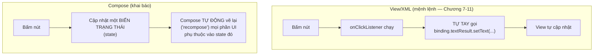
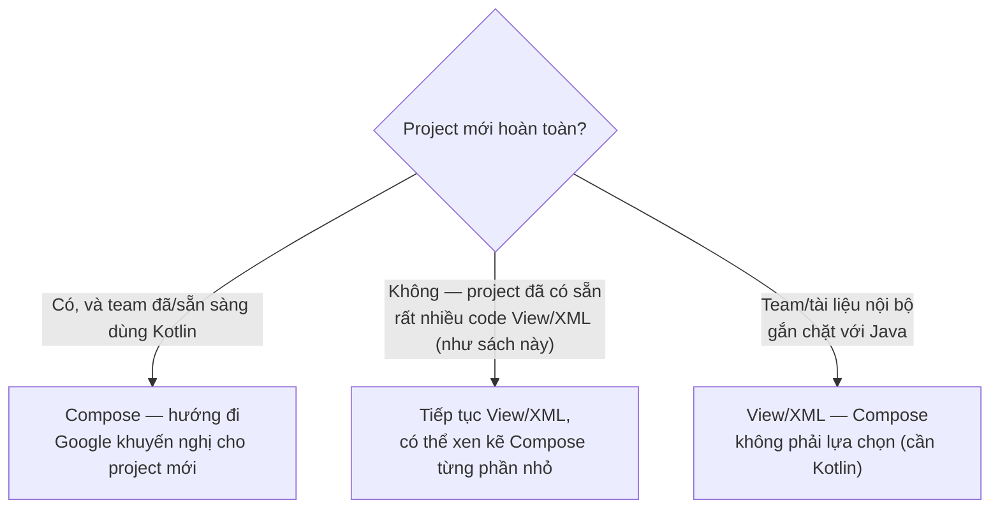

# Chương 30: Giới thiệu Jetpack Compose

> **Lưu ý quan trọng trước khi đọc**: toàn bộ sách dùng Java, nhưng **Jetpack Compose chỉ hoạt động với Kotlin** — không có API Compose nào cho Java. Code mẫu chương này (`code/ch30-jetpack-compose/`) là **project Kotlin duy nhất trong sách**, viết ra để bạn đọc hiểu và so sánh, không nhằm dạy Kotlin đầy đủ. Đây là chương **giới thiệu khái niệm** (đúng như tên chương), không phải chương thực hành sâu như các chương khác.

## Mục tiêu học

- Hiểu Compose khác gì về bản chất so với XML layout (Chương 7) — lập trình khai báo (declarative) so với mệnh lệnh (imperative).
- Đọc hiểu được một đoạn code Compose đơn giản, dù không viết thạo Kotlin.
- Biết khi nào một project Android hiện đại chọn Compose, khi nào vẫn hợp lý dùng View/XML.

## 30.1 Hai triết lý xây UI



Với View/XML (Chương 7), bạn viết code **ra lệnh từng bước**: "tìm view này, đổi text của nó thành X". Với Compose, bạn chỉ mô tả **UI trông như thế nào ỨNG VỚI một trạng thái cho trước** — khi trạng thái đổi, Compose tự tính toán lại và vẽ lại phần cần thiết, bạn không tự tay gọi `setText()`/`setVisibility()` ở bất kỳ đâu.

## 30.2 So sánh trực tiếp: cùng một tính năng, hai cách viết

Bản XML + ViewBinding (Chương 7, Java):

```java
binding.buttonGreet.setOnClickListener(v -> {
    String name = binding.editName.getText().toString().trim();
    binding.textResult.setText(name.isEmpty()
        ? getString(R.string.result_empty_name)
        : getString(R.string.result_greeting, name));
});
```

Bản Compose (chương này, Kotlin):

```kotlin
@Composable
fun GreetingScreen() {
    var name by remember { mutableStateOf("") }
    var greeting by remember { mutableStateOf("") }

    Column(modifier = Modifier.padding(24.dp)) {
        TextField(value = name, onValueChange = { name = it }, ...)

        Button(onClick = {
            greeting = if (name.isBlank()) "Bạn chưa nhập tên." else "Xin chào, $name!"
        }) {
            Text("Chào")
        }

        Text(text = greeting)
    }
}
```

Vài điểm đọc hiểu quan trọng dù bạn chưa biết Kotlin:

- `@Composable` đánh dấu một hàm "biết cách vẽ UI" — tương đương khái niệm một đoạn XML layout, nhưng là **code**, không phải file XML riêng.
- `remember { mutableStateOf(...) }` khai báo một **biến trạng thái** — Compose tự theo dõi, hễ giá trị đổi (`name = it`, `greeting = ...`) thì tự vẽ lại đúng những `Text`/`Button` phụ thuộc vào nó.
- Không có `findViewById`, không có `binding.xxx.setText(...)` ở bất kỳ đâu — toàn bộ giao diện là hệ quả trực tiếp của giá trị các biến trạng thái tại một thời điểm.

## 30.3 Không còn file XML layout riêng

Khác mọi chương trước (nơi UI luôn tách thành file `.xml` riêng trong `res/layout/`), Compose viết UI **ngay trong code Kotlin** — không có `activity_main.xml` nào cả. `setContent { ... }` trong `MainActivity.kt` thay thế hoàn toàn `setContentView(R.layout.activity_main)` đã dùng xuyên suốt từ Chương 4.

```kotlin
class MainActivity : ComponentActivity() {
    override fun onCreate(savedInstanceState: Bundle?) {
        super.onCreate(savedInstanceState)
        setContent {
            MaterialTheme {
                Surface {
                    GreetingScreen()
                }
            }
        }
    }
}
```

## 30.4 Khi nào chọn Compose, khi nào vẫn hợp lý dùng View/XML?



Compose và View/XML **có thể tồn tại xen kẽ trong cùng một project** (Google cung cấp cầu nối `ComposeView` để nhúng Compose vào layout XML và ngược lại) — không nhất thiết phải chọn một, bỏ hẳn cái kia ngay lập tức. Với một codebase Java lâu năm, hướng đi thực dụng thường là: giữ nguyên phần lớn View/XML, chỉ viết màn hình MỚI bằng Compose (kèm chuyển phần đó sang Kotlin) khi có lý do rõ ràng.

## Bài tập

1. Chạy code mẫu, xác nhận hành vi giống hệt bản XML ở Chương 7.
2. Không cần viết code — chỉ đọc lại `MainActivity.kt`, thử tự giải thích bằng lời từng dòng cho một người bạn tưởng tượng chưa biết Compose, dựa vào chú thích trong file.
3. So sánh số dòng code và số file cần thiết giữa hai cách tiếp cận (Chương 7 cần `activity_main.xml` + `MainActivity.java`; chương này chỉ cần một file `.kt`) — tự rút ra nhận xét về đánh đổi giữa hai phong cách.

## Lỗi thường gặp (khi tự tìm hiểu thêm ngoài sách)

- **Cố viết Compose bằng Java**: không thể — Compose Compiler chỉ xử lý code Kotlin, đây không phải giới hạn tạm thời mà là quyết định thiết kế cốt lõi của Compose.
- **Quên `remember`, chỉ dùng `mutableStateOf(...)` trực tiếp**: giá trị bị khởi tạo lại mỗi lần hàm `@Composable` được gọi lại (recompose), mất trạng thái liên tục — lỗi rất phổ biến với người mới học Compose.
- **Nhầm tưởng phải bỏ hết code View/XML đã có để "nâng cấp" lên Compose**: không cần thiết và thường không thực dụng cho codebase lớn đã ổn định.

## Tóm tắt & tiếp theo

Bạn đã có cái nhìn khái quát về Compose — đủ để đọc hiểu, biết khi nào nên tìm hiểu sâu hơn, và tại sao nó đòi hỏi Kotlin. Chương 31 quay lại hoàn toàn với Java, khép lại Phần 6 bằng tư duy Clean Architecture — tổ chức code ở quy mô lớn hơn một app đơn giản.
