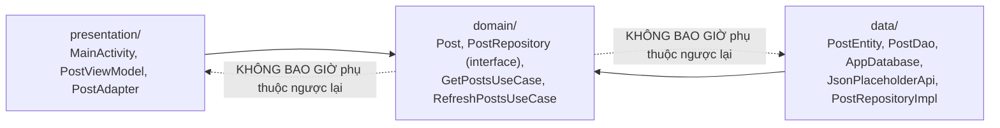
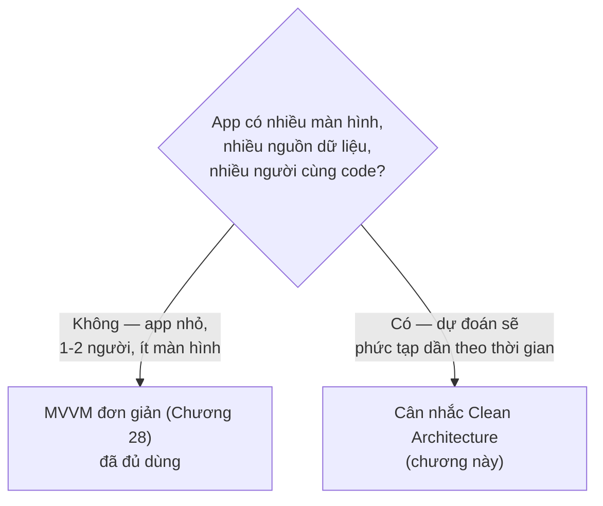

# Chương 31: Clean Architecture cơ bản cho ứng dụng Android

## Mục tiêu học

- Hiểu nguyên tắc cốt lõi của Clean Architecture: **phụ thuộc chỉ hướng vào trong**.
- Tổ chức code thành ba tầng: domain (nghiệp vụ thuần), data (chi tiết kỹ thuật), presentation (UI).
- Viết Use Case đơn giản, hiểu khi nào nó thật sự có giá trị so với gọi thẳng Repository.
- Biết đây là kỹ thuật cho project **lớn dần theo thời gian**, không phải yêu cầu bắt buộc cho mọi app.

> Code mẫu: `code/ch31-clean-architecture/` — tổ chức lại đúng app đã xây từ Chương 13/22/23/28/29.

## 31.1 Nguyên tắc cốt lõi: phụ thuộc chỉ hướng vào trong



Cả `presentation` và `data` đều phụ thuộc vào `domain` — nhưng `domain` **không biết gì** về Android framework, Room, hay Retrofit. Đây là lý do `domain/Post.java` không có bất kỳ annotation nào (so sánh với `data/PostEntity.java` đầy `@Entity`/`@SerializedName`), và `domain/PostRepository.java` chỉ là một `interface` trống nghĩa vụ triển khai.

## 31.2 Ba tầng, ba trách nhiệm

| Tầng | Biết gì | Không biết gì |
|---|---|---|
| **domain** | Quy tắc nghiệp vụ thuần (`Post` là gì, "lấy danh sách bài viết" nghĩa là gì) | Room, Retrofit, Android UI |
| **data** | Cách lấy dữ liệu thật (SQLite qua Room, HTTP qua Retrofit) | `MainActivity`, `PostViewModel` tồn tại |
| **presentation** | Cách hiển thị dữ liệu, phản ứng thao tác người dùng | `PostEntity`, `JsonPlaceholderApi` tồn tại |

```java
// domain/PostRepository.java — CHỈ khai báo, không có Room/Retrofit
public interface PostRepository {
    LiveData<List<Post>> getCachedPosts();
    void refresh(RefreshCallback callback);
}
```

```java
// data/PostRepositoryImpl.java — cài đặt THẬT, biết Room và Retrofit
@Singleton
public class PostRepositoryImpl implements PostRepository {
    @Inject
    public PostRepositoryImpl(PostDao dao, JsonPlaceholderApi api) { ... }

    @Override
    public LiveData<List<Post>> getCachedPosts() {
        return Transformations.map(dao.getAll(), PostMapper::toDomainList);
    }
}
```

`Transformations.map(...)` (dòng cuối) chính là **ranh giới vật lý** giữa hai tầng: `dao.getAll()` trả `LiveData<List<PostEntity>>` (kiểu của tầng data), được chuyển thành `LiveData<List<Post>>` (kiểu của tầng domain) ngay tại đây — `PostEntity` không bao giờ "rò rỉ" ra khỏi package `data`.

## 31.3 Nối hai tầng bằng Hilt `@Binds`

```java
@Module
@InstallIn(SingletonComponent.class)
public abstract class RepositoryModule {

    @Binds
    public abstract PostRepository bindPostRepository(PostRepositoryImpl impl);
}
```

`@Binds` là cú pháp gọn hơn `@Provides` (Chương 29) dành riêng cho đúng một tình huống: "khi cần một `PostRepository`, hãy đưa một `PostRepositoryImpl`". Nhờ khai báo này, `PostViewModel` (tầng presentation) chỉ cần khai báo phụ thuộc vào **interface** `PostRepository` — Hilt tự biết phải truyền vào instance `PostRepositoryImpl` thật.

## 31.4 Use Case — khi nào thật sự có giá trị?

```java
public class GetPostsUseCase {
    private final PostRepository repository;

    @Inject
    public GetPostsUseCase(PostRepository repository) {
        this.repository = repository;
    }

    public LiveData<List<Post>> execute() {
        return repository.getCachedPosts();
    }
}
```

Thành thật mà nói: với logic đơn giản như "lấy danh sách bài viết", `GetPostsUseCase` ở đây gần như chỉ **chuyển tiếp** lời gọi tới `repository.getCachedPosts()` — không thêm giá trị xử lý nào. Đây là điều nên thừa nhận thẳng thắn thay vì che giấu: Use Case phát huy giá trị thật sự khi nghiệp vụ **phức tạp hơn một lệnh gọi đơn giản** — ví dụ: lọc bài viết theo quyền hạn người dùng, ghép dữ liệu từ hai Repository khác nhau, áp dụng một quy tắc validate trước khi trả kết quả. Với app nhỏ, đơn giản, việc `ViewModel` gọi thẳng `Repository` (như Chương 28/29 đã làm) hoàn toàn hợp lý — không nhất thiết phải có tầng Use Case.

## 31.5 Đây có phải "must-have" cho mọi app không?

**Không.** Đây là điểm quan trọng nhất chương cần nhấn mạnh: Clean Architecture (và tầng Use Case nói riêng) là công cụ giải quyết vấn đề **quy mô và độ phức tạp tăng dần theo thời gian** — nhiều màn hình, nhiều nguồn dữ liệu, nhiều người cùng code, cần thay đổi chi tiết kỹ thuật (đổi từ Room sang một giải pháp lưu trữ khác, ví dụ) mà không muốn động vào logic hiển thị.

Với một app nhỏ, một người viết, ít màn hình — kiến trúc MVVM đơn giản ở Chương 28 (thậm chí không cần Hilt) đã là đủ, và việc áp Clean Architecture đầy đủ có thể chỉ tạo thêm nhiều file, nhiều tầng gián tiếp không cần thiết. Áp dụng đúng lúc, đúng quy mô — không áp dụng "cho có" chỉ vì nghe có vẻ chuyên nghiệp.



## Bài tập

1. Chạy code mẫu, xác nhận hành vi giống hệt Chương 28/29.
2. Mở `domain/Post.java` và `data/PostEntity.java` cạnh nhau — liệt kê chính xác những annotation nào có ở bên này mà không có ở bên kia, và giải thích tại sao.
3. Thử tưởng tượng (không cần code thật): nếu muốn thêm một nguồn dữ liệu thứ hai — ví dụ đọc thêm bài viết yêu thích lưu trong `SharedPreferences` (Chương 12) — bạn sẽ sửa ở những file nào trong ba tầng? Xác nhận rằng `presentation/` không cần đổi gì nếu interface `PostRepository` vẫn giữ nguyên chữ ký.

## Lỗi thường gặp

- **Để `PostEntity` (hoặc bất kỳ model tầng data nào) rò rỉ vào `presentation/`**: phá vỡ hoàn toàn mục đích tách tầng — kiểm tra bằng cách tự hỏi "package `presentation` có `import` gì từ package `data` không?", câu trả lời đúng luôn phải là "không".
- **Viết Use Case rỗng cho MỌI thao tác dù chẳng thêm logic gì** (như ví dụ thẳng thắn ở mục 31.4): tạo thêm tầng gián tiếp không cần thiết, làm code khó theo dõi hơn mà không đổi lại lợi ích gì.
- **Áp dụng Clean Architecture đầy đủ ngay từ app "Hello World" đầu tiên**: over-engineering — chi phí tổ chức nhiều tầng chỉ xứng đáng khi độ phức tạp thực tế đạt tới mức cần nó.
- **Quên `Transformations.map()` (hoặc mapper tương đương) khi nối data → domain**: dễ dẫn tới tình huống dở dang — vẫn còn `PostEntity` xuất hiện ở tầng domain vì "tiện" tái sử dụng model, phá vỡ ranh giới đã cố công dựng lên.

## Tóm tắt & tiếp theo

Bạn đã khép lại **Phần 6 — Kiến trúc nâng cao**: MVVM, Dependency Injection với Hilt, giới thiệu Compose, và Clean Architecture — một bộ công cụ đầy đủ để tổ chức app Android ở quy mô lớn dần. Phần 7 chuyển hướng hoàn toàn sang một nhóm chủ đề khác: giao tiếp giữa các ứng dụng và điều khiển phần cứng tầng sâu — bắt đầu với Content Provider ở Chương 32.
