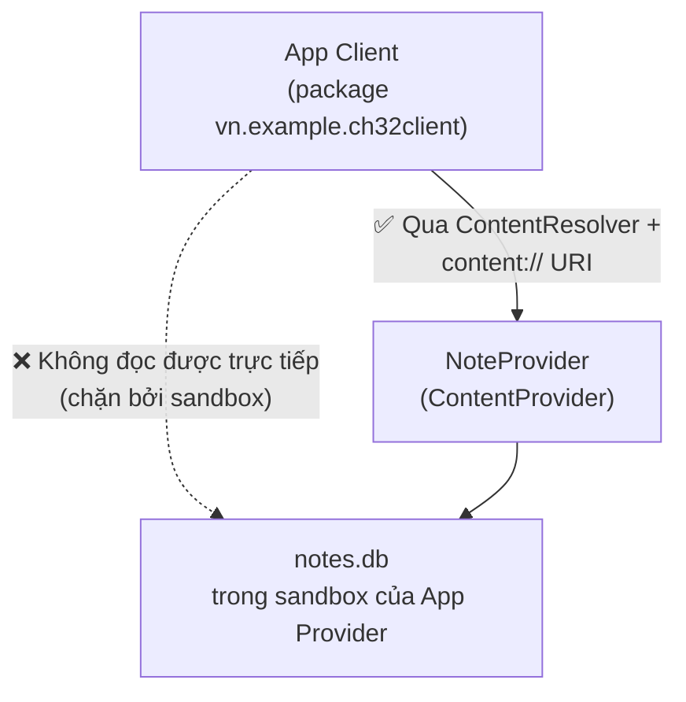

# Chương 32: Content Provider — chia sẻ dữ liệu có kiểm soát giữa các ứng dụng

## Mục tiêu học

- Hiểu vì sao sandbox (Chương 1/26) khiến app khác không đọc được trực tiếp file SQLite của app mình.
- Viết một `ContentProvider` công khai dữ liệu Room qua giao diện chuẩn (query/insert/delete).
- Truy cập dữ liệu app khác từ một app hoàn toàn riêng biệt bằng `ContentResolver`.
- Dùng `ContentObserver` để tự động nhận biết khi dữ liệu ở app kia thay đổi.

> Code mẫu: `code/ch32-content-provider/` — **hai app thật sự riêng biệt** (`:app` và `:client`, hai APK khác nhau) để minh hoạ đúng bản chất chia sẻ liên-app, không phải mô phỏng trong cùng một app.

## 32.1 Vấn đề: sandbox chặn truy cập trực tiếp

Chương 1 và 26 đã nói: mỗi app có `UID` riêng, thư mục dữ liệu riêng (`getFilesDir()`, Chương 14) mà **app khác không đọc/ghi được**. File `notes.db` (SQLite của app Provider ở Chương 13) nằm trong sandbox đó — một app khác không thể mở file này trực tiếp, dù biết chính xác đường dẫn.



`ContentProvider` là **cửa duy nhất** được phép mở xuyên qua ranh giới sandbox này — nó tự quyết định app khác được đọc/ghi những gì, theo cách nào, không phải mở toang toàn bộ file.

## 32.2 Viết `ContentProvider` — bốn thao tác chuẩn

```java
public class NoteProvider extends ContentProvider {

    @Override
    public boolean onCreate() {
        return true;   // chạy RẤT SỚM, kể cả trước Application.onCreate() — không làm việc nặng ở đây
    }

    @Override
    public Cursor query(Uri uri, String[] projection, String selection,
                         String[] selectionArgs, String sortOrder) {
        Cursor cursor = writableDb().query(new SimpleSQLiteQuery(
                "SELECT id, title, created_at FROM notes ORDER BY id DESC"));
        cursor.setNotificationUri(requireContext().getContentResolver(), uri);
        return cursor;
    }

    @Override
    public Uri insert(Uri uri, ContentValues values) {
        long id = writableDb().insert("notes", SQLiteDatabase.CONFLICT_REPLACE, values);
        Uri result = ContentUris.withAppendedId(NoteContract.CONTENT_URI, id);
        requireContext().getContentResolver().notifyChange(result, null);
        return result;
    }
}
```

Bốn phương thức bắt buộc cài đặt: `query`, `insert`, `update`, `delete` (code mẫu bỏ qua `update` để gọn, một Provider thật cần đủ cả bốn). `writableDb()` lấy `SupportSQLiteDatabase` ngay từ `AppDatabase` (Room) đã xây ở Chương 13 — Provider chỉ là một **lớp giao diện mỏng** đặt trước database đã có sẵn, không cần viết lại logic lưu trữ.

## 32.3 `UriMatcher` và "hợp đồng" URI công khai

```java
public final class NoteContract {
    public static final String AUTHORITY = "vn.example.ch32provider.provider";
    public static final Uri CONTENT_URI = Uri.parse("content://" + AUTHORITY + "/notes");
    public static final String COLUMN_ID = "id";
    public static final String COLUMN_TITLE = "title";
    public static final String COLUMN_CREATED_AT = "created_at";
}
```

`AUTHORITY` là định danh duy nhất của Provider trên toàn hệ thống (tương tự `applicationId` cho app) — khai báo khớp trong manifest:

```xml
<provider
    android:name=".NoteProvider"
    android:authorities="vn.example.ch32provider.provider"
    android:exported="true" />
```

`android:exported="true"` **bắt buộc** để app khác truy cập được — ngược với mặc định "false" đã quen dùng cho Activity/Service nội bộ (Chương 8, 16). Đây chính là điểm cần cân nhắc bảo mật: Provider `exported=true` không kèm `readPermission`/`writePermission` nghĩa là **MỌI app khác trên máy** đều đọc/ghi được, không chỉ app Client trong ví dụ. Với dữ liệu nhạy cảm, luôn thêm quyền tuỳ chỉnh (`android:readPermission="com.example.app.permission.READ_NOTES"`) để giới hạn — nằm ngoài phạm vi trình bày chi tiết ở chương này nhưng bắt buộc biết để tự tra cứu khi làm dự án thật.

## 32.4 Phía app khách: `ContentResolver`

```java
private static final Uri NOTES_URI =
        Uri.parse("content://vn.example.ch32provider.provider/notes");

try (Cursor cursor = getContentResolver().query(NOTES_URI, null, null, null, null)) {
    int idxTitle = cursor.getColumnIndexOrThrow("title");
    while (cursor.moveToNext()) {
        String title = cursor.getString(idxTitle);
        // ...
    }
}
```

Đây chính là API đã dùng để đọc danh bạ ở Chương 26 (`getContentResolver().query(ContactsContract...)`) — danh bạ máy thực chất cũng chỉ là một `ContentProvider` do hệ thống cung cấp sẵn. App Client trong code mẫu **không hề import bất kỳ class nào của app Provider** — chỉ cần đúng chuỗi URI và tên cột, y hệt cách một app thật kết nối tới Provider của app khác mà không cần mã nguồn của nhau.

## 32.5 `ContentObserver` — tự động biết khi dữ liệu đổi

```java
private final ContentObserver observer = new ContentObserver(mainHandler) {
    @Override
    public void onChange(boolean selfChange) {
        queryNotes();   // tự tải lại, không cần người dùng bấm nút
    }
};

getContentResolver().registerContentObserver(NOTES_URI, true, observer);
```

Hoạt động được là nhờ `cursor.setNotificationUri(...)` trong `query()` và `notifyChange(...)` trong `insert()`/`delete()` phía Provider — đúng nguyên tắc "đăng ký lúc `onStart`, huỷ đăng ký lúc `onStop`" đã lặp lại từ Chương 12/17: `unregisterContentObserver()` trong `onStop()` để tránh rò rỉ.

## Bài tập

1. Cài cả hai app (`:app` và `:client`) lên cùng một máy ảo, làm theo README để xác nhận luồng đọc/ghi hai chiều hoạt động.
2. Gỡ cài đặt app `:app`, mở app `:client`, bấm đọc ghi chú — đọc thông báo lỗi hiển thị, xác nhận app không crash im lặng.
3. Thử thêm `android:readPermission` tuỳ chỉnh vào `NoteProvider` trong manifest của `:app`, không khai báo quyền tương ứng ở `:client` — build lại cả hai, quan sát lỗi `SecurityException` khi `:client` cố gọi `query()`.

## Lỗi thường gặp

- **Quên `android:exported="true"`**: Provider tồn tại nhưng không app nào khác gọi tới được — từ Android 12 (API 31), giá trị này bắt buộc khai báo tường minh, không có mặc định ngầm.
- **Provider `exported="true"` không giới hạn quyền cho dữ liệu nhạy cảm**: bất kỳ app nào cài trên máy (không chỉ app bạn tự viết) đều đọc được — cân nhắc `readPermission`/`writePermission` ngay từ đầu với dữ liệu thật.
- **Quên gọi `notifyChange()` sau `insert`/`delete`**: `ContentObserver` phía client không bao giờ được kích hoạt, giao diện không tự cập nhật dù dữ liệu đã đổi thật sự.
- **Làm việc nặng trong `onCreate()` của Provider**: Provider khởi tạo cực sớm trong vòng đời tiến trình, việc nặng ở đây có thể làm chậm toàn bộ quá trình khởi động app, kể cả trước khi `Application.onCreate()` (Chương 6) chạy.

## Tóm tắt & tiếp theo

Bạn đã biết cách chia sẻ dữ liệu có kiểm soát giữa hai app hoàn toàn tách biệt — cơ chế đứng sau danh bạ, lịch, và nhiều API hệ thống khác đã dùng ở Chương 26. Chương 33 mở rộng sang các hình thức giao tiếp liên ứng dụng khác: App Links/Deep Link, chia sẻ nội dung qua Share sheet, và `PendingIntent` (đã gặp ở Chương 20) nhìn từ góc độ liên ứng dụng.
