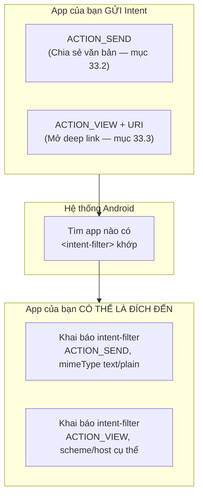
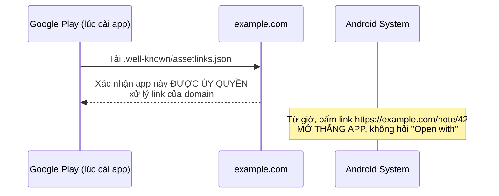

# Chương 33: Giao tiếp liên ứng dụng nâng cao — App Links/Deep Link, Share sheet, PendingIntent

## Mục tiêu học

- Làm app của mình **xuất hiện** trong Share sheet của app khác (nhận chia sẻ), không chỉ gửi đi.
- Phân biệt custom scheme deep link (luôn hoạt động) và App Link http/https có `autoVerify` (cần xác minh domain).
- Ôn lại `PendingIntent` (Chương 20) từ góc nhìn liên ứng dụng: ai thực thi nó, và tại sao đó lại an toàn.

> Code mẫu: `code/ch33-app-links-share/`. Chương 8 đã dùng implicit Intent để **gửi** đi (mở trình duyệt); chương này mở rộng theo cả hai chiều gửi/nhận, và thêm cơ chế deep link.

## 33.1 Ba cơ chế, một nền tảng chung: Intent + `<intent-filter>`



Tất cả đều dựa trên implicit Intent đã học ở Chương 8 — điểm mới ở chương này là **app của bạn cũng có thể là bên nhận**, không chỉ bên gửi.

## 33.2 Share sheet — vừa gửi, vừa nhận

**Gửi** (mở hộp thoại "Chia sẻ qua"):

```java
Intent sendIntent = new Intent(Intent.ACTION_SEND);
sendIntent.setType("text/plain");
sendIntent.putExtra(Intent.EXTRA_TEXT, message);
startActivity(Intent.createChooser(sendIntent, "Chia sẻ qua"));
```

`Intent.createChooser(...)` **luôn** hiện hộp thoại chọn app, kể cả khi chỉ có một app khớp — khác gọi thẳng `startActivity(sendIntent)` (có thể tự mở app duy nhất khớp mà không hỏi, gây bất ngờ nếu người dùng không chủ ý). Luôn dùng `createChooser` cho hành động chia sẻ.

**Nhận** — khai báo `<intent-filter>` để app xuất hiện trong Share sheet của **app khác**:

```xml
<activity android:name=".MainActivity" android:exported="true">
    <intent-filter>
        <action android:name="android.intent.action.SEND" />
        <category android:name="android.intent.category.DEFAULT" />
        <data android:mimeType="text/plain" />
    </intent-filter>
</activity>
```

Đọc dữ liệu được chia sẻ tới:

```java
if (Intent.ACTION_SEND.equals(intent.getAction()) && intent.getType().startsWith("text/")) {
    String sharedText = intent.getStringExtra(Intent.EXTRA_TEXT);
    // hiển thị sharedText
}
```

## 33.3 Deep Link bằng custom scheme — luôn hoạt động, dễ test

```xml
<activity android:name=".NoteDetailActivity" android:exported="true">
    <intent-filter>
        <action android:name="android.intent.action.VIEW" />
        <category android:name="android.intent.category.DEFAULT" />
        <category android:name="android.intent.category.BROWSABLE" />
        <data android:scheme="ch33share" android:host="note" />
    </intent-filter>
</activity>
```

`ch33share://note/42` khớp `scheme="ch33share"` + `host="note"` — phần `/42` còn lại đọc được qua `Uri.getLastPathSegment()`:

```java
Uri uri = getIntent().getData();
String noteId = uri.getLastPathSegment();   // "42"
```

`category.BROWSABLE` cho phép trình duyệt/app khác mở được link này (không chỉ code trong chính app gọi `startActivity`) — test trực tiếp từ dòng lệnh, mô phỏng một nguồn bên ngoài bất kỳ:

```powershell
adb shell am start -a android.intent.action.VIEW -d "ch33share://note/99"
```

Ưu điểm: hoạt động **ngay lập tức**, không cần cấu hình gì thêm. Nhược điểm: nếu chưa cài app, hệ thống không biết phải làm gì với link này (không tự động rơi về một trang web dự phòng như App Link thật).

## 33.4 App Link http/https — cần xác minh domain (`autoVerify`)

```xml
<intent-filter android:autoVerify="true">
    <action android:name="android.intent.action.VIEW" />
    <category android:name="android.intent.category.DEFAULT" />
    <category android:name="android.intent.category.BROWSABLE" />
    <data android:scheme="https" android:host="example.com" android:pathPrefix="/note" />
</intent-filter>
```



Khác custom scheme, App Link thật đòi hỏi bạn **sở hữu domain** và host file `/.well-known/assetlinks.json` chứng minh app được uỷ quyền — hệ thống tự tải và kiểm tra file này lúc cài đặt (`autoVerify="true"`). Đổi lại, một link `https://example.com/note/42` bấm từ bất kỳ đâu (tin nhắn, email, trình duyệt) sẽ **mở thẳng app**, không hiện hộp thoại "Open with" như custom scheme có thể gặp khi nhiều app cùng khai báo trùng scheme. Code mẫu khai báo cấu hình này chỉ để bạn thấy đúng cú pháp — không hoạt động thật trên máy bạn vì `example.com` không phải domain bạn sở hữu.

## 33.5 `PendingIntent` nhìn lại từ góc độ liên ứng dụng

Chương 20 đã dùng `PendingIntent` để notification "biết cách" mở Activity dù app không đang chạy. Nhìn từ góc độ chương này: `PendingIntent` chính là cách an toàn để **trao quyền thực thi một Intent cho một thành phần bên ngoài** (ở đó là hệ thống Notification) — tương tự tinh thần Provider (Chương 32) trao quyền truy cập dữ liệu có kiểm soát, thay vì mở toang. `FLAG_IMMUTABLE` (đã dùng ở Chương 20) đảm bảo bên nhận `PendingIntent` không thể chỉnh sửa nội dung Intent bên trong trước khi thực thi — một biện pháp an toàn khi trao quyền cho bên ngoài.

## Bài tập

1. Chạy code mẫu, thử luồng chia sẻ cả hai chiều (gửi đi và nhận từ app khác) như mô tả trong README.
2. Mở deep link bằng nút trong app, rồi thử lại bằng lệnh `adb` — xác nhận cả hai cách đều tới đúng `NoteDetailActivity` với đúng ID.
3. Thử đổi `android:pathPrefix="/note"` thành `/notes` (thêm "s") trong intent-filter App Link — không cần test thật (vì không sở hữu domain), chỉ giải thích bằng lời tại sao link `https://example.com/note/42` sẽ không còn khớp nữa nếu áp dụng thay đổi này cho app thật.

## Lỗi thường gặp

- **Quên `category.BROWSABLE`**: trình duyệt/nguồn bên ngoài không mở được link, dù `category.DEFAULT` đã có — cả hai category đều cần thiết cho deep link mở từ nguồn ngoài app.
- **Dùng `startActivity()` trực tiếp thay vì `Intent.createChooser()`** cho hành động chia sẻ: có thể tự mở thẳng một app cụ thể mà không hỏi, gây trải nghiệm khó lường nếu máy chỉ cài đúng một app khớp.
- **Nhầm lẫn custom scheme với App Link thật**: tưởng chỉ cần khai báo `autoVerify="true"` là xong — thực chất phải sở hữu domain và host đúng file xác minh, nếu không hệ thống âm thầm không xác minh được và rơi về hành vi hỏi "Open with" như custom scheme thường.
- **Đọc `Intent.EXTRA_TEXT` mà không kiểm tra `intent.getType()`**: một app khác có thể gửi `ACTION_SEND` với kiểu dữ liệu khác (ảnh, file) — luôn kiểm tra đúng mimeType mong đợi trước khi xử lý.

## Tóm tắt & tiếp theo

Bạn đã biết đầy đủ các cơ chế giao tiếp liên ứng dụng ở tầng Intent — gửi/nhận chia sẻ, mở màn hình qua deep link. Chương 34 đi sâu hơn nữa: giao tiếp liên tiến trình (IPC) thật sự bằng AIDL và Bound Service, cho phép hai app gọi thẳng phương thức của nhau, không chỉ trao đổi dữ liệu qua Intent.
