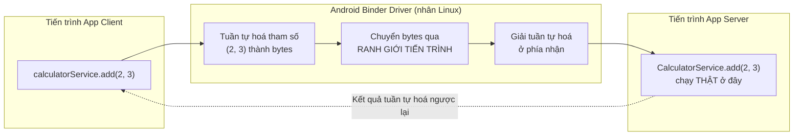

# Chương 34: AIDL & Bound Service — giao tiếp liên tiến trình (IPC) giữa các app

## Mục tiêu học

- Hiểu IPC (Inter-Process Communication) là gì, và vì sao gọi hàm giữa hai app không đơn giản như gọi hàm bình thường.
- Viết một file `.aidl` định nghĩa interface, hiểu Android tự sinh code Binder từ nó.
- Bind một Service từ MỘT APP KHÁC (khác Chương 16, nơi bind cùng app), xử lý đúng vòng đời kết nối.
- Biết `RemoteException` là gì và vì sao nó chỉ xuất hiện với lời gọi liên tiến trình.

> Code mẫu: `code/ch34-aidl-bound-service/` — hai app thật riêng biệt (`:server`, `:client`), nối tiếp đúng mô hình hai-app đã dùng ở Chương 32.

## 34.1 Vì sao gọi hàm giữa hai app không đơn giản như trong cùng app?

Chương 16 đã bind một Service **trong cùng app** — `LocalBinder` trả thẳng đối tượng Service, gọi hàm Java bình thường vì hai bên **chung một tiến trình, chung bộ nhớ**. Giữa hai app khác nhau, mỗi app chạy trong tiến trình Linux riêng (sandbox, Chương 1/26) — **không có bộ nhớ chung** để truyền thẳng một tham chiếu đối tượng.



**Binder** là cơ chế IPC riêng của Android (một phần của nhân Linux tuỳ biến) thực hiện toàn bộ việc tuần tự hoá/chuyển giao/giải tuần tự hoá này. **AIDL** (Android Interface Definition Language) là ngôn ngữ khai báo interface, để công cụ build **tự sinh code Java** làm việc với Binder — bạn không viết tay logic tuần tự hoá.

## 34.2 Viết file `.aidl`

```java
// server/src/main/aidl/vn/example/ch34aidlserver/ICalculatorService.aidl
package vn.example.ch34aidlserver;

interface ICalculatorService {
    int add(int a, int b);
    int multiply(int a, int b);
    int getCallCount();
}
```

AIDL chỉ hỗ trợ một tập kiểu dữ liệu giới hạn: kiểu nguyên thuỷ, `String`, `List`/`Map` của chúng, và `Parcelable` tự khai báo — **không** truyền được object Java tuỳ ý như khi gọi hàm trong cùng tiến trình (khác hẳn `LocalBinder` ở Chương 16, vốn trả thẳng cả object Service).

**Điểm dễ gây nhầm nhất**: vì `:server` và `:client` là hai project Gradle hoàn toàn độc lập (không `implementation project(':server')`), file `.aidl` này phải được **chép sang cả hai module**, cùng khai báo `package vn.example.ch34aidlserver;` — công cụ build ở mỗi bên tự sinh code Java tương ứng (`ICalculatorService.Stub`, `ICalculatorService.Stub.Proxy`) khớp nhau nhờ cùng tên interface đầy đủ.

## 34.3 Phía Server: cài đặt `Stub`

```java
public class CalculatorService extends Service {
    private final ICalculatorService.Stub binder = new ICalculatorService.Stub() {
        @Override
        public int add(int a, int b) throws RemoteException {
            callCount++;
            return a + b;
        }
    };

    @Override
    public IBinder onBind(Intent intent) {
        return binder;
    }
}
```

```xml
<service android:name=".CalculatorService" android:exported="true">
    <intent-filter>
        <action android:name="vn.example.ch34aidlserver.action.BIND_CALCULATOR" />
    </intent-filter>
</service>
```

`android:exported="true"` bắt buộc — cùng lý do đã gặp với `ContentProvider` (Chương 32): mặc định "false" chặn mọi app khác gọi tới.

## 34.4 Phía Client: bind bằng Intent tường minh + `setPackage`

```java
Intent intent = new Intent("vn.example.ch34aidlserver.action.BIND_CALCULATOR");
intent.setPackage("vn.example.ch34aidlserver");   // BẮT BUỘC từ Android 5.0+
bindService(intent, connection, Context.BIND_AUTO_CREATE);
```

Khác Chương 16 (`new Intent(this, CounterService.class)` — chỉ định thẳng class vì cùng app), ở đây **không thể tham chiếu class `CalculatorService`** (nó nằm trong một APK khác, không có trên classpath của `:client`). Phải dùng implicit Intent (action) kèm `setPackage()` để giới hạn đúng app đích — thiếu `setPackage()`, hệ thống từ chối resolve intent tới bất kỳ Service nào của app khác vì lý do bảo mật.

```java
private final ServiceConnection connection = new ServiceConnection() {
    @Override
    public void onServiceConnected(ComponentName name, IBinder binder) {
        calculatorService = ICalculatorService.Stub.asInterface(binder);
    }
    @Override
    public void onServiceDisconnected(ComponentName name) {
        // Tiến trình SERVER bị kill đột ngột — trường hợp gần như không xảy ra
        // khi bind cùng app (Chương 16), nhưng hoàn toàn có thể xảy ra ở đây.
    }
};
```

`ICalculatorService.Stub.asInterface(binder)` bọc `IBinder` thô nhận được thành interface Java quen thuộc — gọi `calculatorService.add(2, 3)` **trông như** một lời gọi hàm bình thường, nhưng thực chất kích hoạt toàn bộ chuỗi Binder ở mục 34.1.

## 34.5 `RemoteException` — dấu hiệu riêng của lời gọi liên tiến trình

```java
try {
    int result = calculatorService.add(a, b);
} catch (RemoteException e) {
    // Tiến trình server đã chết giữa lúc gọi, hoặc lỗi truyền dữ liệu qua Binder
}
```

Mọi phương thức AIDL đều khai báo `throws RemoteException` — điều **không bao giờ xảy ra** với lời gọi hàm thông thường trong cùng tiến trình (như `LocalBinder` ở Chương 16). Đây là lời nhắc trực tiếp trong chữ ký hàm: "lời gọi này có thể thất bại vì lý do nằm ngoài tầm kiểm soát của bạn — tiến trình bên kia có thể đã không còn tồn tại".

## Bài tập

1. Cài cả hai app theo README, thực hiện vài phép tính — xác nhận số lượt gọi (`getCallCount()`) tăng dần đúng, chứng minh cùng một `CalculatorService` instance phục vụ nhiều lời gọi liên tiếp.
2. Gỡ cài đặt app `:server`, mở lại app `:client` — xác nhận thấy thông báo "Không tìm thấy Calculator Server" thay vì crash.
3. Thử xoá dòng `intent.setPackage(...)` ở `:client`, build và chạy lại — quan sát `bindService()` trả về `false` (không tìm được Service nào), minh chứng trực tiếp cho mục 34.4.

## Lỗi thường gặp

- **Quên chép file `.aidl` sang module còn lại (hoặc chép nhưng sai package)**: hai bên sinh ra interface không khớp, lỗi biên dịch hoặc lỗi runtime khó hiểu.
- **Quên khai báo `<queries>` trong manifest client (Android 11+)**: `bindService()` âm thầm không tìm thấy Service, dù app server đã cài đúng — package visibility (đã gặp khái niệm tương tự cần cân nhắc ở Chương 32/33) chặn truy vấn package khác nếu không khai báo rõ.
- **Quên `setPackage()` khi bind implicit Intent sang app khác**: hệ thống từ chối resolve, không tìm được Service nào dù mọi khai báo khác đều đúng.
- **Không xử lý `RemoteException`**: app crash ngay khi tiến trình server bị hệ thống kill đúng lúc đang gọi — tình huống hiếm nhưng hoàn toàn có thể xảy ra trong thực tế.

## Tóm tắt & tiếp theo

Bạn đã biết cơ chế giao tiếp liên tiến trình sâu nhất trong sách — nền tảng của mọi Binder-based API hệ thống (kể cả `ContentProvider` ở Chương 32 thực chất cũng dùng Binder bên dưới). Chương 35 chuyển hẳn sang phần cứng: kết nối Bluetooth Classic và BLE để giao tiếp với thiết bị bên ngoài, không chỉ giữa các app trên cùng máy.
