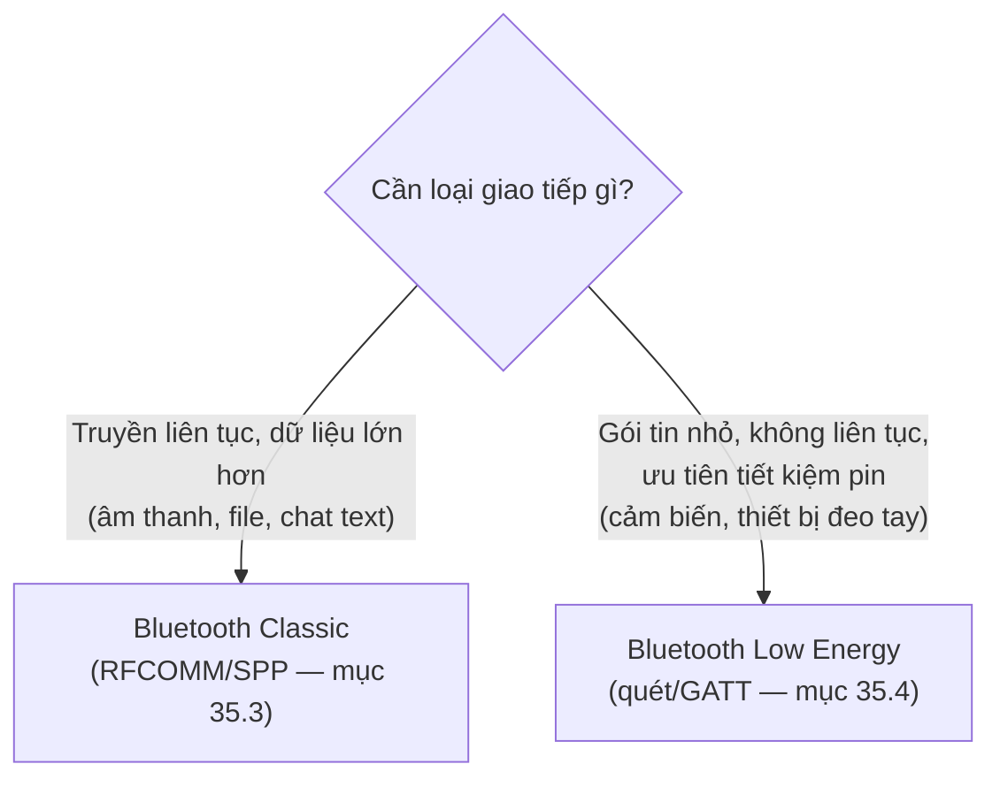
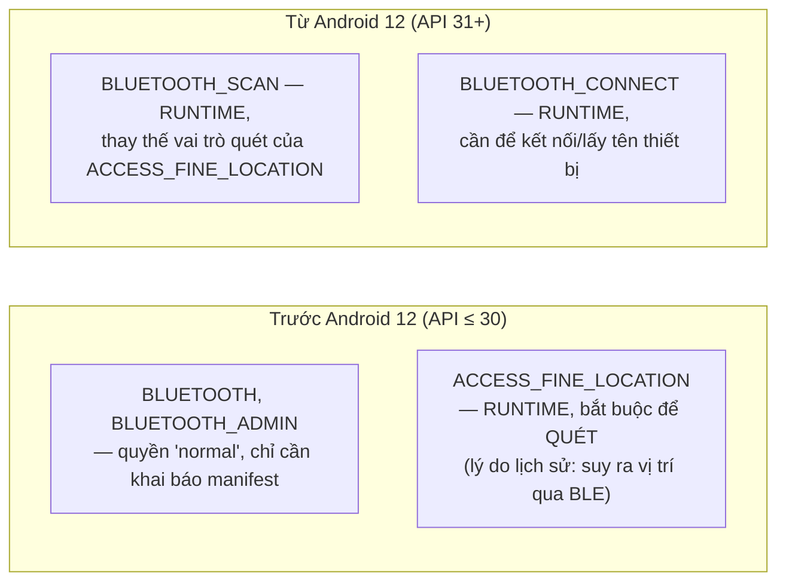
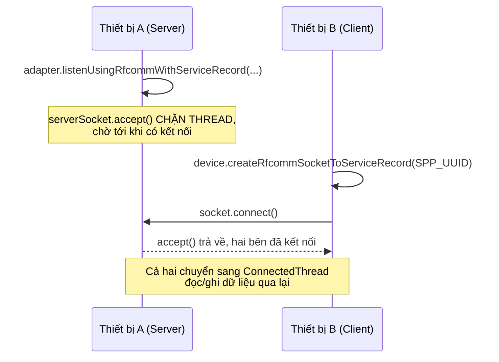

# Chương 35: Bluetooth — Classic & BLE, quét thiết bị, kết nối, truyền/nhận dữ liệu

> **Lưu ý**: chương này cần **thiết bị Android thật** để thực hành đầy đủ — máy ảo (Chương 3) không mô phỏng phần cứng radio Bluetooth thật. Cần ít nhất hai thiết bị thật cho phần Classic (chat hai chiều), một thiết bị cho phần quét BLE.

## Mục tiêu học

- Phân biệt Bluetooth Classic (kết nối bền, truyền dữ liệu liên tục — âm thanh, file, chat) và BLE (Bluetooth Low Energy — tiết kiệm pin, truyền gói tin nhỏ, phổ biến ở thiết bị đeo tay/IoT).
- Xin đúng bộ quyền Bluetooth theo từng nhóm phiên bản Android (trước và từ Android 12).
- Cài đặt kết nối Bluetooth Classic hai chiều bằng mẫu Server/Client kinh điển (`AcceptThread`/`ConnectThread`/`ConnectedThread`).
- Quét thiết bị BLE xung quanh bằng `BluetoothLeScanner`.

> Code mẫu: `code/ch35-bluetooth/`.

## 35.1 Bluetooth Classic và BLE — chọn loại nào?



Code mẫu chương này minh hoạ cả hai: **chat hai chiều** qua Bluetooth Classic (đúng chuẩn Serial Port Profile — SPP), và **quét thiết bị** qua BLE (không đi sâu vào việc đọc/ghi dữ liệu GATT của BLE, vốn phức tạp hơn và nằm ngoài phạm vi giới thiệu của sách).

## 35.2 Quyền Bluetooth — khác nhau rõ rệt trước/sau Android 12



```xml
<uses-permission android:name="android.permission.BLUETOOTH" android:maxSdkVersion="30" />
<uses-permission android:name="android.permission.BLUETOOTH_ADMIN" android:maxSdkVersion="30" />
<uses-permission android:name="android.permission.ACCESS_FINE_LOCATION" android:maxSdkVersion="30" />

<uses-permission android:name="android.permission.BLUETOOTH_SCAN"
    android:usesPermissionFlags="neverForLocation" />
<uses-permission android:name="android.permission.BLUETOOTH_CONNECT" />
```

`android:usesPermissionFlags="neverForLocation"` là khai báo quan trọng: nó nói với hệ thống "app này quét Bluetooth nhưng **không** dùng kết quả để suy ra vị trí người dùng" — nhờ đó xin được `BLUETOOTH_SCAN` **mà không cần kèm** `ACCESS_FINE_LOCATION` trên Android 12+. Code mẫu gom logic chọn đúng bộ quyền theo `Build.VERSION.SDK_INT` vào `BluetoothPermissions.java`, đúng tinh thần "gom logic vào một chỗ" đã áp dụng với `PrefsManager` ở Chương 12.

## 35.3 Bluetooth Classic — mẫu Server/Client/Connected kinh điển



Ba thread luôn xuất hiện trong mọi cài đặt Bluetooth Classic hai chiều:

```java
// Server: chờ kết nối tới — accept() CHẶN THREAD
BluetoothServerSocket serverSocket = adapter.listenUsingRfcommWithServiceRecord(NAME, SPP_UUID);
BluetoothSocket socket = serverSocket.accept();

// Client: chủ động kết nối — connect() cũng CHẶN THREAD
BluetoothSocket socket = device.createRfcommSocketToServiceRecord(SPP_UUID);
socket.connect();

// Cả hai, sau khi đã kết nối: đọc liên tục — read() CHẶN THREAD tới khi có dữ liệu
InputStream input = socket.getInputStream();
int bytes = input.read(buffer);
```

Cả ba lời gọi in đậm (`accept`, `connect`, `read`) đều **chặn (blocking)** — đúng nguyên tắc đã lặp lại xuyên suốt từ Chương 13/19: **không bao giờ** chạy chúng trên main thread. Code mẫu (`BluetoothChatManager.java`) đặt mỗi vai trò vào một `Thread` riêng (`AcceptThread`, `ConnectThread`, `ConnectedThread`), báo kết quả về main thread qua `Handler` — chính là mẫu hình đã quen thuộc từ Chương 16 (Service dùng Handler báo về Activity).

`SPP_UUID` (`00001101-0000-1000-8000-00805F9B34FB`) là UUID **chuẩn, cố định** cho Serial Port Profile — hầu như mọi thiết bị Bluetooth Classic hỗ trợ truyền dữ liệu nối tiếp đều dùng chung giá trị này, không phải do bạn tự đặt.

## 35.4 Quét BLE — không cần ghép đôi để "thấy" thiết bị

```java
BluetoothLeScanner scanner = bluetoothAdapter.getBluetoothLeScanner();

ScanCallback callback = new ScanCallback() {
    @Override
    public void onScanResult(int callbackType, ScanResult result) {
        String name = result.getScanRecord().getDeviceName();
        int rssi = result.getRssi();   // cường độ tín hiệu — càng gần 0 càng mạnh
        // ...
    }
};

scanner.startScan(callback);
// ... sau một khoảng thời gian:
scanner.stopScan(callback);
```

Khác Bluetooth Classic (`getBondedDevices()` chỉ liệt kê thiết bị đã **ghép đôi** từ Settings), BLE scan phát hiện **mọi thiết bị đang quảng bá (advertising)** xung quanh — không cần ghép đôi trước. Đây là lý do tai nghe, vòng đeo tay thông minh thường "hiện ra ngay" khi mở app quét BLE, dù chưa từng kết nối với chúng.

**Luôn giới hạn thời gian quét** — code mẫu tự động `stopScan()` sau 12 giây bằng `Handler.postDelayed`, và dừng ngay trong `onStop()` nếu người dùng rời màn hình. Quét BLE liên tục vô thời hạn là nguyên nhân phổ biến khiến app bị coi là "hao pin bất thường".

## Bài tập

1. Với hai thiết bị thật đã ghép đôi Bluetooth, làm theo README: một bên Server, một bên Client, gửi tin nhắn qua lại.
2. Mở màn hình quét BLE trên một thiết bị thật, xác nhận thấy danh sách thiết bị xung quanh kèm RSSI, không thiết bị nào trùng lặp (nhờ `Map` theo địa chỉ MAC trong `BleScanActivity`).
3. Tắt Bluetooth trên thiết bị Client giữa lúc đang chat — quan sát thiết bị Server nhận được sự kiện "Đã ngắt kết nối" qua `ConnectedThread` bắt được `IOException` từ `read()`.

## Lỗi thường gặp

- **Xin `ACCESS_FINE_LOCATION` trên Android 12+ mà quên `BLUETOOTH_SCAN`**: quét thất bại âm thầm hoặc ném lỗi quyền — hai bộ quyền phục vụ hai nhóm phiên bản khác nhau, không thể dùng chung.
- **Gọi `connect()`/`accept()`/`read()` trực tiếp trên main thread**: đứng UI ngay lập tức (các hàm này chặn vô thời hạn tới khi có sự kiện) — luôn bọc trong `Thread` riêng như code mẫu.
- **Quên `adapter.cancelDiscovery()` trước khi `connect()`**: quá trình quét (nếu đang chạy) làm chậm đáng kể, thậm chí khiến `connect()` thất bại — thói quen tốt luôn hủy discovery trước khi kết nối Classic.
- **Quét BLE không giới hạn thời gian, không dừng khi rời màn hình**: tốn pin nghiêm trọng — luôn có cơ chế tự dừng (timeout) và dừng trong `onStop()`.

## Tóm tắt & tiếp theo

Bạn đã biết giao tiếp với thiết bị bên ngoài qua cả hai chuẩn Bluetooth phổ biến. Chương 36 tiếp tục với NFC — giao tiếp tầm cực gần, thường dùng cho thanh toán, đọc thẻ, và chia sẻ dữ liệu bằng cách chạm hai thiết bị vào nhau.
