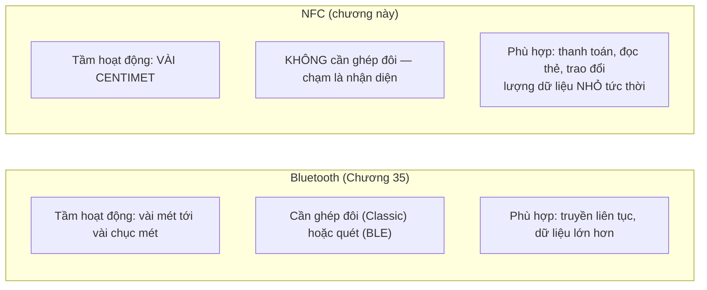
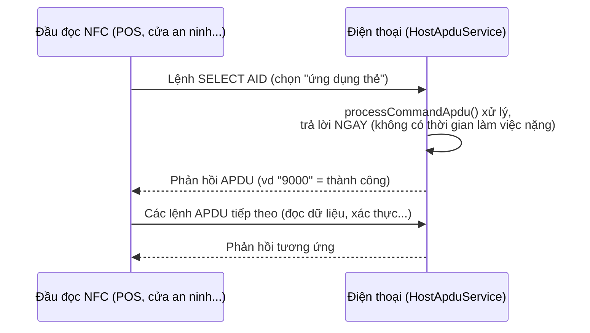

# Chương 36: NFC — đọc/ghi tag, Host Card Emulation (HCE), giao tiếp giữa 2 thiết bị

> **Lưu ý**: phần đọc/ghi thẻ NFC cần **thiết bị Android thật có NFC** — máy ảo không mô phỏng được sóng NFC thật. Phần Host Card Emulation (HCE) khó tự kiểm chứng hơn nữa, cần đầu đọc NFC chuyên dụng — xem giải thích chi tiết ở mục 36.5.

## Mục tiêu học

- Hiểu NFC hoạt động ở khoảng cách cực gần (vài cm), khác hẳn tầm hoạt động của Bluetooth (Chương 35).
- Dùng Foreground Dispatch để giành quyền xử lý sự kiện chạm thẻ khi Activity đang mở.
- Đọc và ghi `NdefMessage`/`NdefRecord` — định dạng dữ liệu chuẩn cho tag NFC.
- Biết Host Card Emulation (HCE) là gì ở mức khái niệm — cơ chế đứng sau Google Wallet.

> Code mẫu: `code/ch36-nfc/`.

## 36.1 NFC khác Bluetooth ở điểm nào?



Chính khoảng cách cực gần này khiến NFC phù hợp cho các tình huống cần **chủ đích rõ ràng** của người dùng (chạm thẻ để thanh toán, chạm để mở khoá) — khó bị kích hoạt nhầm hay từ xa như Bluetooth.

## 36.2 Foreground Dispatch — giành quyền xử lý khi Activity đang mở

```java
@Override
protected void onResume() {
    super.onResume();
    nfcAdapter.enableForegroundDispatch(this, pendingIntent, intentFilters, null);
}

@Override
protected void onPause() {
    super.onPause();
    nfcAdapter.disableForegroundDispatch(this);
}
```

Không có Foreground Dispatch, khi chạm thẻ, hệ thống tự chọn app xử lý dựa trên `<intent-filter>` tĩnh trong manifest — có thể hiện hộp thoại "Open with" nếu nhiều app cùng khai báo, hoặc mở nhầm app khác. `enableForegroundDispatch()` (gọi trong `onResume`) đảm bảo **Activity đang mở này luôn nhận sự kiện trước tiên**, không hỏi han gì — đúng cặp bật/tắt theo vòng đời `onResume`/`onPause` đã quen thuộc từ nguyên tắc đăng ký/huỷ đăng ký ở Chương 12/17.

```java
private void setupForegroundDispatch() {
    Intent intent = new Intent(this, getClass()).addFlags(Intent.FLAG_ACTIVITY_SINGLE_TOP);
    pendingIntent = PendingIntent.getActivity(this, 0, intent, PendingIntent.FLAG_MUTABLE);
    intentFilters = new IntentFilter[]{
            new IntentFilter(NfcAdapter.ACTION_NDEF_DISCOVERED),
            new IntentFilter(NfcAdapter.ACTION_TAG_DISCOVERED)
    };
}
```

`PendingIntent` (đã học kỹ ở Chương 20, nhìn lại ở Chương 33) một lần nữa xuất hiện — đây là cách hệ thống "gọi ngược" vào đúng Activity đang mở khi phát hiện thẻ, dùng `FLAG_MUTABLE` (khác `FLAG_IMMUTABLE` ở Chương 20) vì hệ thống cần **chèn thêm dữ liệu thẻ** vào Intent trước khi gửi lại cho app.

## 36.3 Đọc `NdefMessage` từ thẻ

```java
@Override
protected void onNewIntent(Intent intent) {
    super.onNewIntent(intent);
    Tag tag = intent.getParcelableExtra(NfcAdapter.EXTRA_TAG);
    Parcelable[] rawMessages = intent.getParcelableArrayExtra(NfcAdapter.EXTRA_NDEF_MESSAGES);
    if (rawMessages != null) {
        NdefMessage message = (NdefMessage) rawMessages[0];
        for (NdefRecord record : message.getRecords()) {
            String text = decodeTextRecord(record);
            // hiển thị text
        }
    }
}
```

`NDEF` (NFC Data Exchange Format) là định dạng dữ liệu chuẩn cho tag NFC — một `NdefMessage` chứa một hoặc nhiều `NdefRecord`. Việc giải mã một record kiểu Text đòi hỏi đọc đúng cấu trúc byte: byte đầu tiên là độ dài mã ngôn ngữ, phần còn lại mới là văn bản thật:

```java
private String decodeTextRecord(NdefRecord record) {
    byte[] payload = record.getPayload();
    int langLength = payload[0] & 0x3F;
    return new String(payload, 1 + langLength, payload.length - 1 - langLength, StandardCharsets.UTF_8);
}
```

## 36.4 Ghi `NdefMessage` vào thẻ

```java
Ndef ndef = Ndef.get(tag);
if (ndef != null) {
    ndef.connect();
    if (ndef.isWritable()) {
        ndef.writeNdefMessage(message);
    }
    ndef.close();
} else {
    // Thẻ TRỐNG, chưa từng có định dạng NDEF — cần format trước khi ghi
    NdefFormatable formatable = NdefFormatable.get(tag);
    if (formatable != null) {
        formatable.connect();
        formatable.format(message);
        formatable.close();
    }
}
```

Hai đường khác nhau tuỳ trạng thái thẻ: `Ndef` (thẻ đã có định dạng NDEF, có thể ghi đè) và `NdefFormatable` (thẻ hoàn toàn trống, cần định dạng lần đầu trước khi ghi được). Luôn kiểm tra `isWritable()` — một số thẻ bị khoá ghi (read-only) sau lần format/ghi đầu tiên có chủ đích.

## 36.5 Host Card Emulation (HCE) — điện thoại "giả làm" thẻ



Khác mọi phần trước (điện thoại **chủ động đọc** thẻ), HCE khiến điện thoại đóng vai **bị động** — chờ một đầu đọc bên ngoài gửi lệnh APDU (theo chuẩn ISO 7816-4) tới. Đây chính là cơ chế đứng sau việc dùng điện thoại thay thẻ giao thông, thẻ ra vào văn phòng, hay Google Wallet.

```java
public class HceService extends HostApduService {
    @Override
    public byte[] processCommandApdu(byte[] commandApdu, Bundle extras) {
        if (startsWith(commandApdu, SELECT_APDU_HEADER)) {
            return SUCCESS_RESPONSE; // phải trả lời NGAY, không có độ trễ
        }
        return UNKNOWN_COMMAND;
    }
}
```

```xml
<aid-group android:category="other">
    <aid-filter android:name="F0010203040506" />
</aid-group>
```

`AID` (Application Identifier) đóng vai trò tương tự `AUTHORITY` của `ContentProvider` (Chương 32) — "địa chỉ" để đầu đọc chọn đúng "ứng dụng thẻ" cần giao tiếp trong số nhiều app HCE có thể cài trên máy. Dải AID bắt đầu bằng `F0` dành riêng cho mục đích proprietary/nội bộ, không trùng với AID thật của các hệ thống thanh toán.

**Vì sao khó tự test tại nhà**: HCE cần một **đầu đọc NFC thật** (không phải điện thoại khác) đã biết gửi đúng lệnh APDU khớp AID khai báo — khác phần đọc/ghi tag (mục 36.3-36.4) chỉ cần một thẻ NFC rẻ tiền là tự kiểm chứng được ngay.

## Bài tập

1. Chạy code mẫu trên thiết bị thật, thử luồng ghi rồi đọc lại đúng nội dung trên cùng một thẻ NFC.
2. Thử chạm một thẻ NFC hoàn toàn mới (chưa từng format) — xác nhận app tự chuyển sang dùng `NdefFormatable` thay vì `Ndef`.
3. Đọc lại `HceService.java`, tự vẽ ra sơ đồ tương tự mục 36.5 nhưng cho tình huống app của bạn dùng để mở cửa văn phòng bằng điện thoại — xác định đâu là "đầu đọc", đâu là "lệnh APDU" trong ngữ cảnh đó.

## Lỗi thường gặp

- **Quên `disableForegroundDispatch()` trong `onPause()`**: Activity tiếp tục giành sự kiện NFC dù không còn hiển thị, chặn cả Activity khác trong cùng app nhận đúng sự kiện của nó.
- **Không kiểm tra `NfcAdapter.getDefaultAdapter(this)` trả về `null`**: crash ngay trên thiết bị không có phần cứng NFC — luôn kiểm tra trước khi dùng, giống `BluetoothAdapter` ở Chương 35.
- **Cố ghi vào thẻ mà không kiểm tra `isWritable()`**: một số thẻ bị khoá ghi có chủ đích (ví dụ thẻ NFC dùng cho mục đích công cộng, cố định nội dung) — `writeNdefMessage()` ném lỗi rõ ràng thay vì âm thầm thất bại.
- **Xử lý chậm trong `processCommandApdu()`**: đầu đọc NFC thường có thời gian chờ phản hồi rất ngắn (vài trăm ms) — bất kỳ việc nặng nào (mạng, đĩa) đều khiến giao dịch thất bại; trả lời gần như tức thời là bắt buộc.

## Tóm tắt & tiếp theo

Bạn đã hoàn thành ba chương phần cứng (Bluetooth, NFC) — đủ kiến thức cơ bản để giao tiếp với thế giới vật lý bên ngoài điện thoại. Chương 37 khép lại Phần 7 bằng việc hệ thống hoá toàn bộ các quyền runtime đã gặp rải rác (vị trí cho quét Bluetooth/BLE, quyền theo từng API level) thành một bức tranh đầy đủ.
