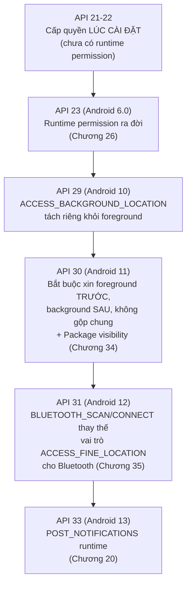
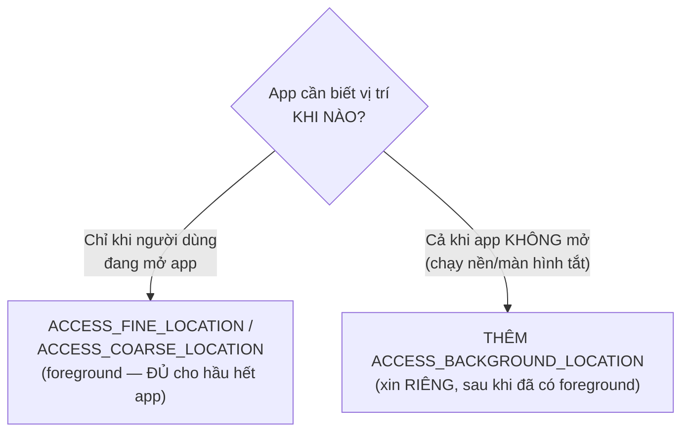

# Chương 37: Quyền & sandbox cho phần cứng — vị trí cho BLE/NFC, background location, runtime permission theo API level

## Mục tiêu học

- Hệ thống hoá lại toàn bộ các quyền runtime đã gặp rải rác từ Chương 26, 35, 36 thành một bức tranh theo dòng thời gian API level.
- Xin đúng trình tự quyền vị trí foreground và background — hai bước bắt buộc tách biệt.
- Biết tự đặt câu hỏi "app có thật sự cần quyền này không?" trước khi xin — nguyên tắc xuyên suốt của cả Phần 7.

> Code mẫu: `code/ch37-hardware-permission/`.

## 37.1 Toàn cảnh: quyền phần cứng đã đổi thế nào qua các phiên bản



Mỗi mốc trong sơ đồ này đã xuất hiện rải rác: Chương 20 (thông báo), Chương 26 (mô hình chung + danh bạ), Chương 34 (package visibility), Chương 35 (Bluetooth). Chương này gom lại thành một bức tranh duy nhất, tập trung vào mảnh còn thiếu: **vị trí (location)**.

## 37.2 Vì sao quét Bluetooth/BLE từng cần quyền vị trí?

Đây là câu hỏi khiến nhiều người mới bối rối nhất: "Tại sao app Bluetooth của tôi lại đòi quyền vị trí?" Chương 35 đã nhắc: **trước Android 12**, hệ thống dùng chung `ACCESS_FINE_LOCATION` để bảo vệ cả việc truy cập vị trí GPS thật lẫn việc quét Bluetooth/Wi-Fi — vì địa chỉ MAC của các access point/thiết bị BLE xung quanh có thể dùng để **suy luận ra vị trí tương đối chính xác** của người dùng (kỹ thuật định vị không cần GPS, dựa vào cơ sở dữ liệu vị trí các access point đã biết).

Từ Android 12, hai quyền `BLUETOOTH_SCAN`/`BLUETOOTH_CONNECT` tách riêng, cho phép khai báo rõ ràng `neverForLocation` (mục 35.2) nếu app không dùng kết quả quét để suy ra vị trí — tách bạch hai mục đích trước đây bị gộp chung.

## 37.3 Vị trí Foreground và Background — hai quyền, hai câu hỏi khác nhau



```java
// Bước 1 — foreground, xin trước, dùng được ngay khi app đang mở
foregroundLauncher.launch(new String[]{
        Manifest.permission.ACCESS_FINE_LOCATION,
        Manifest.permission.ACCESS_COARSE_LOCATION
});

// Bước 2 — CHỈ xin nếu thật sự cần, và CHỈ SAU KHI đã có bước 1
backgroundLauncher.launch(Manifest.permission.ACCESS_BACKGROUND_LOCATION);
```

Từ Android 11 (API 30), hệ thống **không cho phép** xin cả hai quyền trong cùng một hộp thoại — phải tách thành hai bước tuần tự như trên. Nhiều phiên bản Android còn tự động **chuyển hướng người dùng sang màn hình Settings** để chọn "Allow all the time" cho quyền nền, thay vì hiện hộp thoại Allow/Deny quen thuộc — hành vi giao diện cụ thể do hệ thống quyết định, code gọi API vẫn giữ nguyên cách làm.

**Câu hỏi quan trọng nhất trước khi viết dòng code xin quyền nền**: "Tính năng này có thật sự cần vị trí khi app không mở không?" Một app bản đồ tra cứu đường đi, hay tìm cửa hàng gần đây, **không cần** `ACCESS_BACKGROUND_LOCATION` — chỉ ứng dụng như theo dõi hành trình chạy bộ liên tục, hay chia sẻ vị trí thời gian thực khi đã tắt màn hình, mới thật sự cần. Google Play cũng yêu cầu giải trình rõ ràng mục đích sử dụng quyền này khi phát hành (liên quan tới Chương 39) — xin quá tay không chỉ ảnh hưởng lòng tin người dùng mà còn có thể bị từ chối duyệt.

## 37.4 Bảng tổng hợp — tra cứu nhanh

| Tính năng | Quyền cần thiết | Từ API level | Xin runtime? |
|---|---|---|---|
| Mạng (Chương 21) | `INTERNET` | Mọi phiên bản | Không (normal) |
| Foreground service (Chương 16) | `FOREGROUND_SERVICE` | 28+ | Không (normal) |
| Thông báo (Chương 20) | `POST_NOTIFICATIONS` | 33+ | **Có** |
| Đọc danh bạ (Chương 26) | `READ_CONTACTS` | Mọi phiên bản | **Có** (dangerous) |
| Quét Bluetooth/BLE (Chương 35), trước 12 | `ACCESS_FINE_LOCATION` | ≤ 30 | **Có** |
| Quét/kết nối Bluetooth (Chương 35), từ 12 | `BLUETOOTH_SCAN`, `BLUETOOTH_CONNECT` | 31+ | **Có** |
| NFC (Chương 36) | `NFC` | Mọi phiên bản | Không (normal) |
| Vị trí khi dùng app (chương này) | `ACCESS_FINE_LOCATION`/`ACCESS_COARSE_LOCATION` | Mọi phiên bản (runtime từ 23) | **Có** |
| Vị trí khi chạy nền (chương này) | `ACCESS_BACKGROUND_LOCATION` | 29+ | **Có**, xin RIÊNG sau foreground |

## Bài tập

1. Chạy code mẫu, xin quyền foreground trước, xác nhận vị trí cập nhật đúng.
2. Thử xin quyền background — quan sát hành vi hệ thống trên máy ảo/thiết bị bạn đang dùng (hộp thoại thường, hay chuyển sang Settings).
3. Tự tra bảng ở mục 37.4, chọn ra 3 quyền bạn nghĩ dễ bị lạm dụng/xin quá mức nhất trong các app thường gặp trên điện thoại của mình, giải thích lý do.

## Lỗi thường gặp

- **Xin `ACCESS_BACKGROUND_LOCATION` cùng lúc với `ACCESS_FINE_LOCATION` trong cùng một lời gọi**: bị hệ thống từ chối/bỏ qua trên Android 11+ — phải tách thành hai bước tuần tự đúng như mục 37.3.
- **Xin quyền vị trí nền "cho chắc" dù tính năng không thật sự cần**: tăng nguy cơ bị từ chối khi đăng Google Play, và giảm lòng tin người dùng khi thấy yêu cầu quyền không tương xứng với chức năng hiển thị.
- **Quên rằng hành vi UI của hộp thoại xin quyền vị trí nền thay đổi giữa các phiên bản Android**: đừng giả định luôn có nút "Allow"/"Deny" đơn giản — một số phiên bản đưa thẳng người dùng vào Settings.
- **Nhầm lẫn quyền cho việc quét Bluetooth (Chương 35) với quyền vị trí thật của chương này**: dù cùng nhóm "location-related" trong lịch sử Android, `BLUETOOTH_SCAN` (từ Android 12) và `ACCESS_FINE_LOCATION` (dùng cho GPS thật) là hai quyền độc lập, phục vụ hai mục đích khác nhau.

## Tóm tắt & tiếp theo

Bạn đã khép lại **Phần 7 — Giao tiếp liên ứng dụng & phần cứng nâng cao**: chia sẻ dữ liệu (ContentProvider), deep link/share, IPC qua AIDL, Bluetooth, NFC, và toàn cảnh hệ thống quyền chi phối tất cả. Phần 8 — phần cuối cùng của sách — chuyển sang việc đưa ứng dụng ra thế giới thật: chuẩn bị bản release, ký ứng dụng, và phát hành lên Google Play.
