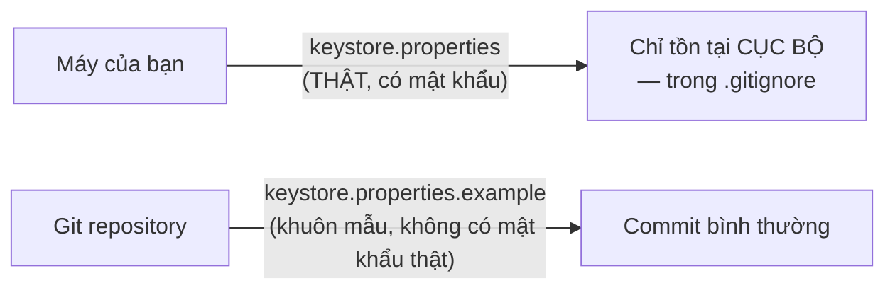
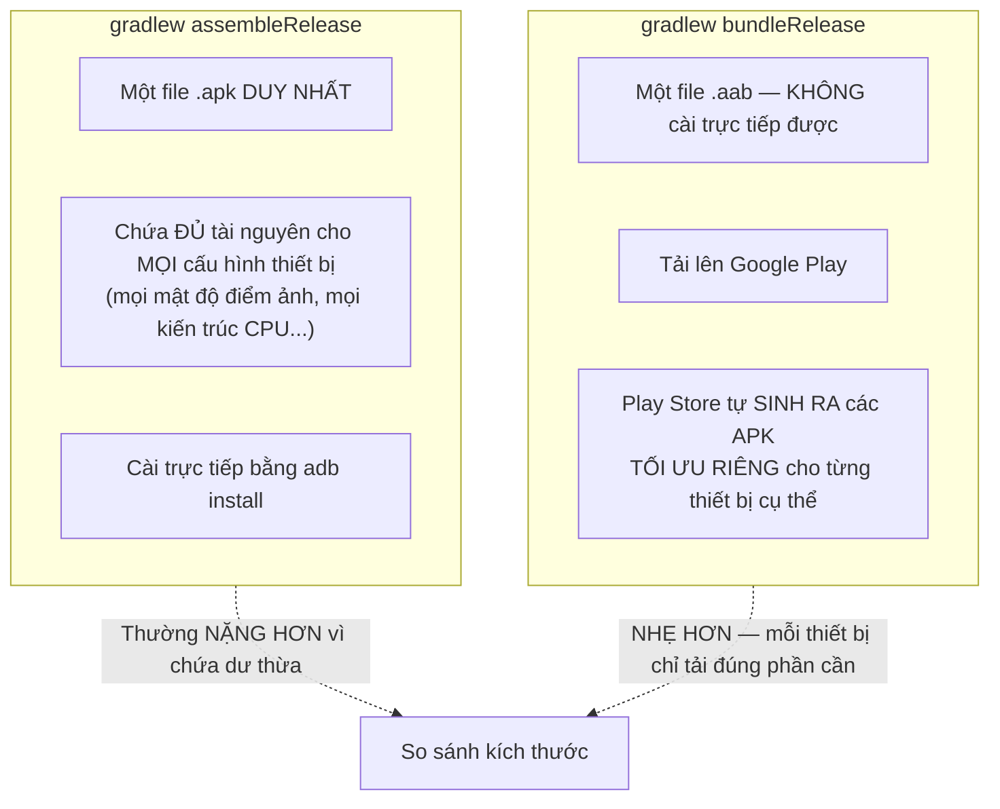

# Chương 38: Chuẩn bị release build, ký ứng dụng, tối ưu kích thước (App Bundle)

## Mục tiêu học

- Cấu hình `signingConfig` để Gradle tự động ký bản release, đọc thông tin nhạy cảm từ file KHÔNG commit.
- Hiểu `versionCode`/`versionName` khác nhau ra sao và quy tắc tăng chúng qua mỗi lần phát hành.
- Phân biệt APK và Android App Bundle (AAB) — vì sao Google Play khuyến nghị AAB.

> Code mẫu: `code/ch38-release-build/` — hoàn thiện nốt phần build release mà Chương 27 mới dừng ở bước ProGuard/R8.

## 38.1 Không bao giờ để mật khẩu keystore trong file commit

Chương 27 đã cảnh báo: mất keystore đồng nghĩa không update được app cũ. Cảnh báo thứ hai cũng quan trọng không kém: **để lộ mật khẩu keystore** (commit nhầm lên Git, kể cả repo riêng tư) cũng nguy hiểm tương đương — ai có mật khẩu đều ký được bản cập nhật giả mạo dưới danh nghĩa app của bạn.

```groovy
def keystoreProperties = new Properties()
def keystorePropertiesFile = rootProject.file("keystore.properties")
def hasKeystoreConfig = keystorePropertiesFile.exists()
if (hasKeystoreConfig) {
    keystoreProperties.load(new FileInputStream(keystorePropertiesFile))
}

android {
    signingConfigs {
        release {
            if (hasKeystoreConfig) {
                storeFile rootProject.file(keystoreProperties['storeFile'])
                storePassword keystoreProperties['storePassword']
                keyAlias keystoreProperties['keyAlias']
                keyPassword keystoreProperties['keyPassword']
            }
        }
    }
    buildTypes {
        release {
            if (hasKeystoreConfig) {
                signingConfig signingConfigs.release
            }
        }
    }
}
```

`keystore.properties` nằm trong `.gitignore` — thông tin thật (mật khẩu, đường dẫn file `.jks`) chỉ tồn tại **cục bộ trên máy** của người thực hiện build release, không bao giờ đi qua hệ thống quản lý phiên bản. `keystore.properties.example` (có commit) chỉ là **khuôn mẫu** để người khác biết cần điền gì.



## 38.2 `versionCode` và `versionName` — hai con số, hai vai trò khác nhau

```groovy
defaultConfig {
    versionCode 3        // SỐ NGUYÊN — Play Console dùng để biết bản nào MỚI HƠN
    versionName "1.2.0"  // CHUỖI hiển thị cho người dùng — tự do đặt quy ước
}
```

`versionCode` **bắt buộc tăng dần** qua mỗi lần tải bản mới lên Play Console — Google Play từ chối thẳng một bản tải lên có `versionCode` bằng hoặc nhỏ hơn bản đã có. `versionName` chỉ mang tính hiển thị (người dùng thấy trong Play Store, trong Settings app), không ảnh hưởng logic cập nhật — quy ước phổ biến là semantic versioning (`MAJOR.MINOR.PATCH`), nhưng hoàn toàn tự do đặt theo cách bạn muốn.

## 38.3 APK và Android App Bundle (AAB) — vì sao Google khuyến nghị AAB?



APK truyền thống đóng gói **mọi biến thể tài nguyên** (mọi mật độ màn hình, mọi kiến trúc CPU) vào một file duy nhất — thiết bị nào cũng tải về đủ cả, dù chỉ dùng một phần nhỏ. AAB giao cho Google Play việc "cắt" ra đúng APK phù hợp cho từng thiết bị tải xuống, giảm dung lượng tải về đáng kể. Từ 2021, Google Play **yêu cầu bắt buộc** định dạng AAB cho app mới — sẽ dùng trực tiếp ở Chương 39.

```powershell
.\gradlew.bat assembleRelease   # ra .apk
.\gradlew.bat bundleRelease     # ra .aab — dùng cho Chương 39
```

## Bài tập

1. Build thử `assembleRelease` khi chưa có `keystore.properties` — xác nhận vẫn ra được file APK (chưa ký).
2. Tự tạo keystore thử nghiệm theo README, tạo `keystore.properties` trỏ tới nó, build lại — dùng `apksigner verify --print-certs` xác nhận APK đã được ký.
3. Tăng `versionCode` lên 4, build lại — so sánh với bước 2, xác nhận Gradle không phàn nàn gì (không có ràng buộc gì ở tầng build cục bộ, ràng buộc versionCode chỉ được Play Console kiểm tra khi tải lên thật, xem Chương 39).

## Lỗi thường gặp

- **Commit nhầm file `keystore.properties` thật (không phải `.example`) lên Git**: rò rỉ mật khẩu keystore — nếu đã lỡ commit, phải coi như mật khẩu đã bị lộ, đổi mật khẩu/tạo lại toàn bộ keystore nếu có thể (dù việc đổi keystore cho app đã public gặp đúng vấn đề Chương 27 đã cảnh báo).
- **Quên tăng `versionCode` trước khi build bản mới**: Google Play từ chối bản tải lên với thông báo lỗi rõ ràng — dễ khắc phục nhưng dễ quên nếu không có quy trình nhắc nhở.
- **Tưởng file `.aab` cài trực tiếp được như `.apk`**: `adb install app-release.aab` báo lỗi — AAB chỉ dùng để tải lên Play Console, muốn cài thử cục bộ cần dùng công cụ `bundletool` để tự sinh APK từ AAB (nằm ngoài phạm vi chi tiết của sách).
- **Đặt cùng một mật khẩu cho `storePassword` và `keyPassword`**: hoạt động được nhưng làm giảm một lớp bảo vệ — dù không bắt buộc phải khác nhau, cân nhắc dùng hai mật khẩu riêng biệt cho dữ liệu thật.

## Tóm tắt & tiếp theo

Bạn đã có một file AAB đã ký, sẵn sàng để phát hành. Chương 39 hướng dẫn đưa file này lên Google Play Console — bước cuối cùng để ứng dụng của bạn tới được tay người dùng thật.
