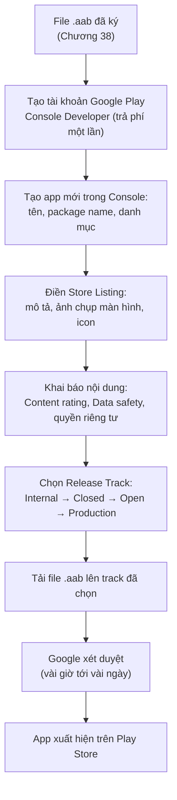
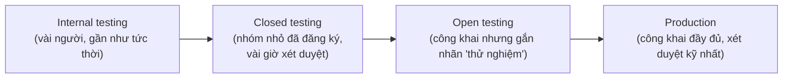

# Chương 39: Đưa ứng dụng lên Google Play Console

## Mục tiêu học

- Nắm được quy trình tổng quát để đưa một app từ file `.aab` (Chương 38) tới tay người dùng thật qua Google Play.
- Chuẩn bị đúng nội dung mô tả cửa hàng (store listing), đúng giới hạn ký tự của Play Console.
- Hiểu khái niệm "release track" (Internal/Closed/Open testing, Production) và vì sao nên đi qua từng bước thay vì phát hành thẳng.

> Code mẫu: `code/ch39-google-play-console/` — chương này không có logic Android chạy trên thiết bị, thay vào đó là cấu trúc quản lý nội dung cửa hàng kèm script tự kiểm tra giới hạn ký tự trước khi đăng.

## 39.1 Toàn cảnh quy trình phát hành



Chương này tập trung vào hai bước dễ chuẩn bị trước và dễ mắc lỗi vặt nhất: **Store Listing** (mục 39.2) và **Release Track** (mục 39.3) — các bước còn lại (tạo tài khoản, khai báo Content rating/Data safety) là các form khai báo tuần tự trên giao diện Console, không có nhiều logic kỹ thuật để trình bày sâu hơn ở đây.

## 39.2 Store Listing — chuẩn bị trước, tránh sửa đi sửa lại trên form

Google Play giới hạn nghiêm ngặt độ dài từng trường:

| Trường | Giới hạn |
|---|---|
| Tiêu đề (Title) | 30 ký tự |
| Mô tả ngắn (Short description) | 80 ký tự |
| Mô tả đầy đủ (Full description) | 4000 ký tự |
| Thông tin phiên bản mới (Release notes) | 500 ký tự mỗi ngôn ngữ |

Thay vì soạn trực tiếp trên form Console (dễ mất nội dung nếu mất kết nối, khó version-control), code mẫu tổ chức nội dung thành file text riêng theo ngôn ngữ, kiểm tra bằng script trước:

```
store-listing/vi-VN/title.txt
store-listing/vi-VN/short_description.txt
store-listing/vi-VN/full_description.txt
release-notes/vi-VN/default.txt
```

```bash
node tools/validate-store-listing.js
```

```
OK       store-listing/vi-VN/title.txt (24/30 ký tự)
OK       store-listing/vi-VN/short_description.txt (77/80 ký tự)
OK       store-listing/vi-VN/full_description.txt (486/4000 ký tự)
OK       release-notes/vi-VN/default.txt (147/500 ký tự)

Tất cả mục đều hợp lệ.
```

Cách làm này còn có lợi ích phụ: nội dung mô tả app được **quản lý phiên bản cùng mã nguồn** (commit vào Git), dễ đối chiếu lịch sử thay đổi, và **tái sử dụng được cho CI/CD** — nhiều đội phát triển dùng công cụ tương tự (phổ biến nhất là Fastlane) để tự động hoá toàn bộ quy trình tải bản build + nội dung mô tả lên Play Console mà không cần thao tác tay trên giao diện web mỗi lần phát hành.

## 39.3 Release Track — vì sao không phát hành thẳng lên Production?



Mỗi track có mức độ xét duyệt và phạm vi tiếp cận khác nhau. Quy trình khuyến nghị: **luôn đi qua Internal testing trước** (phát hiện lỗi hiển nhiên trong vài phút, không cần chờ xét duyệt lâu), rồi Closed/Open testing với nhóm nhỏ người dùng thật trước khi đẩy lên Production. Bỏ qua các bước này và phát hành thẳng Production tăng rủi ro một lỗi nghiêm trọng (crash ngay khi mở app) tới tay hàng loạt người dùng thật trước khi kịp phát hiện.

**Điểm quan trọng liên quan trực tiếp tới Chương 38**: mọi track đều yêu cầu `versionCode` tăng dần — một bản đã tải lên Internal testing với `versionCode 3` thì bản tiếp theo (dù ở track nào) phải có `versionCode` lớn hơn 3, không thể quay lại dùng số cũ.

## Bài tập

1. Chạy `node tools/validate-store-listing.js` trong code mẫu, xác nhận toàn bộ hợp lệ.
2. Cố tình sửa `full_description.txt` dài vượt 4000 ký tự (copy lặp lại nội dung nhiều lần), chạy lại script — xác nhận bắt đúng lỗi trước khi bạn kịp dán nhầm vào Play Console thật.
3. Tự phác thảo (chỉ viết ra giấy/text, không cần Console thật) nội dung Store Listing tiếng Việt cho MỘT trong các app mẫu đã xây trong sách (ví dụ app Room ở Chương 13) — thực hành đúng giới hạn ký tự.

## Lỗi thường gặp

- **Soạn mô tả app trực tiếp trên form Console, không lưu bản nháp**: dễ mất công soạn lại nếu phiên làm việc bị gián đoạn — nên soạn trong file text trước, dán vào sau cùng.
- **Bỏ qua Internal/Closed testing, phát hành thẳng Production**: rủi ro lỗi nghiêm trọng tới tay số đông người dùng ngay từ lần đầu, thay vì phát hiện sớm trong nhóm nhỏ.
- **Quên rằng `versionCode` phải tăng dần XUYÊN SUỐT mọi track**, không riêng Production: tải lên track testing với số cũ hơn bản production hiện tại cũng bị từ chối.
- **Không kiểm tra kỹ Content rating/Data safety trước khi nộp**: khai sai (dù vô ý) thông tin về việc app có thu thập dữ liệu gì có thể khiến app bị gỡ hoặc tài khoản bị cảnh cáo sau khi phát hành — cần khai chính xác dựa trên những gì app THẬT SỰ làm (quyền đã xin ở Chương 26, 35, 37 là manh mối để tự rà soát).

## Tóm tắt & tiếp theo

Bạn đã có bức tranh đầy đủ để đưa một app từ file build tới tay người dùng thật trên Google Play. Chương 40 khép lại sách với việc theo dõi ứng dụng sau khi phát hành — thu thập crash report và số liệu sử dụng cơ bản.
