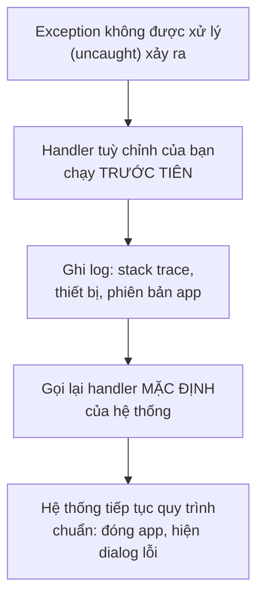
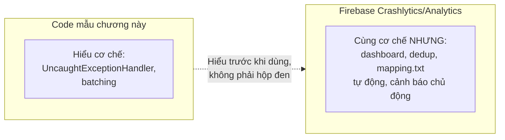

# Chương 40: Theo dõi sau phát hành — Crashlytics, Analytics cơ bản

## Mục tiêu học

- Hiểu cơ chế đứng sau crash reporting: `Thread.UncaughtExceptionHandler`, và vì sao không bao giờ được "nuốt" crash âm thầm.
- Hiểu vì sao SDK analytics luôn **gom sự kiện (batching)** thay vì gửi ngay từng cái một.
- Biết cách đọc lại crash log kèm `mapping.txt` (Chương 27) khi crash xảy ra trên bản release đã làm rối tên.
- Biết Firebase Crashlytics/Analytics là gì, và tại sao thường là lựa chọn thực dụng hơn tự xây khi làm dự án thật.

> Code mẫu: `code/ch40-crash-analytics/` — tự cài đặt cơ chế crash reporting và analytics batching, không phụ thuộc dịch vụ ngoài, để hiểu rõ "hộp đen" trước khi dùng SDK thật.

## 40.1 Vì sao cần theo dõi sau phát hành?

Chương 24-25 đã dạy kiểm thử **trước khi** phát hành (Unit test, Espresso) — nhưng không có bộ test nào bắt được **mọi** tình huống thực tế: thiết bị lạ, phiên bản Android hiếm gặp, dữ liệu người dùng nhập bất thường. Theo dõi sau phát hành là tấm lưới an toàn cuối cùng — biết được app đang crash ở đâu, bao nhiêu người bị ảnh hưởng, ngay cả khi bạn không tự tái hiện được lỗi đó trên máy mình.

## 40.2 Cơ chế crash reporting: `UncaughtExceptionHandler`

```java
Thread.UncaughtExceptionHandler defaultHandler = Thread.getDefaultUncaughtExceptionHandler();

Thread.setDefaultUncaughtExceptionHandler((thread, throwable) -> {
    writeCrashLog(appContext, thread, throwable);   // 1. Ghi lại đầy đủ ngữ cảnh
    defaultHandler.uncaughtException(thread, throwable);  // 2. BẮT BUỘC gọi lại
});
```



Điểm quan trọng nhất, dễ làm sai nhất: **luôn giữ và gọi lại handler mặc định** sau khi ghi log xong. Bỏ qua bước này để "tự xử lý" exception không đúng cách khiến app rơi vào trạng thái treo bất thường, tệ hơn hẳn một crash bình thường — mục tiêu của crash reporting là **quan sát**, không phải **ngăn chặn** crash.

Cài đặt càng sớm càng tốt — trong `Application.onCreate()` (Chương 6), trước cả `MainActivity`:

```java
public class MonitoringApplication extends Application {
    @Override
    public void onCreate() {
        super.onCreate();
        CrashReporter.install(this);
    }
}
```

## 40.3 Đọc lại crash log ở lần chạy tiếp theo

Vì tiến trình đã chết ngay sau khi crash, không thể "gửi lên server ngay lúc đó" một cách đáng tin cậy — cách thực dụng là **ghi xuống đĩa trước** (giống nguyên tắc offline-first ở Chương 23), rồi thử tải lên ở lần khởi động tiếp theo:

```java
List<String> logs = CrashReporter.getPendingCrashLogs(this);
if (!logs.isEmpty()) {
    // Ở app thật: gọi OkHttp/Retrofit (Chương 21-22) tải log lên server,
    // dùng WorkManager (Chương 18) để đảm bảo tải được kể cả khi mất mạng lúc
    // mở lại app — rồi mới CrashReporter.clearCrashLogs() sau khi tải thành công.
}
```

Code mẫu dừng ở bước hiển thị log ngay trong app để bạn tận mắt thấy nó đã được ghi lại đầy đủ — một dịch vụ thật (mục 40.5) tự động hoá toàn bộ phần "tải lên server" này.

## 40.4 Analytics — vì sao luôn gom theo đợt (batching)?

```java
public static void logEvent(String name, String... params) {
    pendingEvents.add(...);   // chỉ THÊM VÀO HÀNG ĐỢI, KHÔNG gửi ngay
}

// Chạy định kỳ, độc lập với logEvent()
scheduler.scheduleWithFixedDelay(AnalyticsLogger::flush, 10, 10, TimeUnit.SECONDS);
```

Gửi một request mạng cho **mỗi** sự kiện (mỗi lần bấm nút, mỗi lần cuộn màn hình) sẽ tốn pin và dữ liệu di động đáng kể nếu người dùng thao tác nhiều — đúng vấn đề đã cảnh báo từ Chương 21 về chi phí một request HTTP. Mọi SDK analytics thật (Firebase Analytics, Amplitude, Mixpanel...) đều **gom nhiều sự kiện lại, gửi định kỳ một lần** — đây là lý do đôi khi bạn thấy sự kiện "xuất hiện trễ vài phút" trên dashboard thật, không phải lỗi của SDK mà là hành vi thiết kế có chủ đích.

## 40.5 Firebase Crashlytics/Analytics — khi nào nên dùng bản thật thay vì tự xây?

Code mẫu chương này giúp hiểu **cơ chế**, nhưng cho dự án thật, hầu như luôn nên dùng dịch vụ đã có sẵn (Firebase Crashlytics/Analytics là lựa chọn phổ biến nhất, miễn phí cho quy mô vừa) thay vì tự xây toàn bộ, vì những lý do tự xây khó tái tạo đầy đủ:

- **Dashboard trực quan**: biểu đồ, lọc theo phiên bản/thiết bị, không phải tự đọc log thô.
- **Tự động dedup**: hàng nghìn người dùng gặp CÙNG một lỗi được gộp thành một "issue" duy nhất, không phải hàng nghìn dòng log riêng lẻ.
- **Tích hợp sẵn `mapping.txt`**: tự động dịch ngược tên đã bị R8 làm rối (Chương 27) khi hiển thị crash từ bản release, không cần tự quản lý thủ công.
- **Cảnh báo chủ động**: gửi thông báo khi tỷ lệ crash tăng đột biến, không cần tự mở app kiểm tra.



Xem `README.md` của code mẫu để biết các bước cụ thể tích hợp Firebase thật khi cần.

## Bài tập

1. Chạy code mẫu, gây crash thử, xác nhận log được ghi lại đầy đủ ở lần mở app tiếp theo.
2. Bấm nút ghi sự kiện nhiều lần liên tiếp trong vài giây, quan sát Logcat xác nhận chúng được gộp thành một đợt gửi duy nhất.
3. Đọc kỹ `CrashReporter.install()`, giải thích bằng lời tại sao dòng gọi lại `defaultHandler.uncaughtException(...)` là bắt buộc, dựa trên mục 40.2.

## Lỗi thường gặp

- **Không gọi lại handler mặc định sau khi ghi log**: app rơi vào trạng thái treo/lỗi khó hiểu thay vì đóng gọn gàng như một crash bình thường.
- **Gửi một request mạng cho mỗi sự kiện analytics**: tốn pin/dữ liệu di động không cần thiết — luôn gom theo đợt như mục 40.4.
- **Cài đặt crash reporting trễ (ví dụ trong `MainActivity.onCreate()` thay vì `Application.onCreate()`)**: bỏ lỡ những crash xảy ra sớm hơn trong quá trình khởi động app.
- **Quên lưu giữ `mapping.txt` (Chương 27) của mỗi bản release đã phát hành**: dù dùng Crashlytics thật, không có mapping đúng thì vẫn không dịch ngược được tên đã bị làm rối trong crash log.

## Lời kết

Bạn đã đi trọn hành trình từ dòng lệnh cài đặt Android Studio đầu tiên (Chương 2) tới việc theo dõi một ứng dụng đã phát hành thật (chương này) — 40 chương, mỗi chương kèm một project chạy được, cùng xây dựng dần một mô hình phát triển Android hoàn chỉnh: từ nền tảng, lưu trữ, xử lý nền, mạng, kiểm thử, kiến trúc, tới giao tiếp phần cứng và xuất bản. Phụ lục cuối sách tổng hợp lại các lỗi thường gặp xuyên suốt các chương, cùng danh sách tài liệu tham khảo để tiếp tục học sâu hơn từng chủ đề riêng lẻ.
